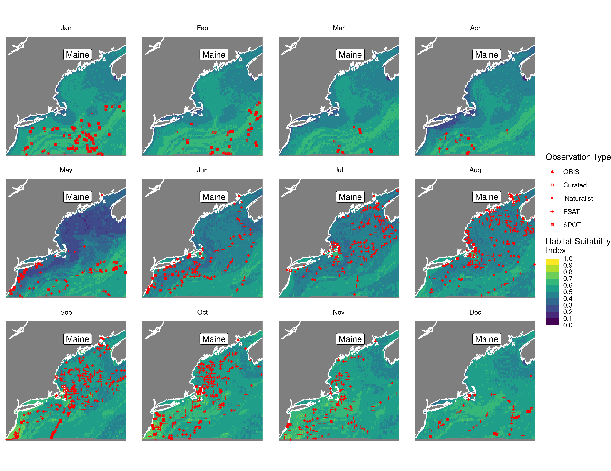
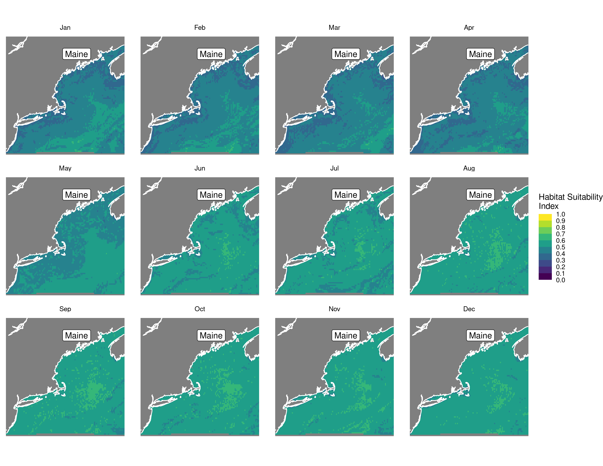
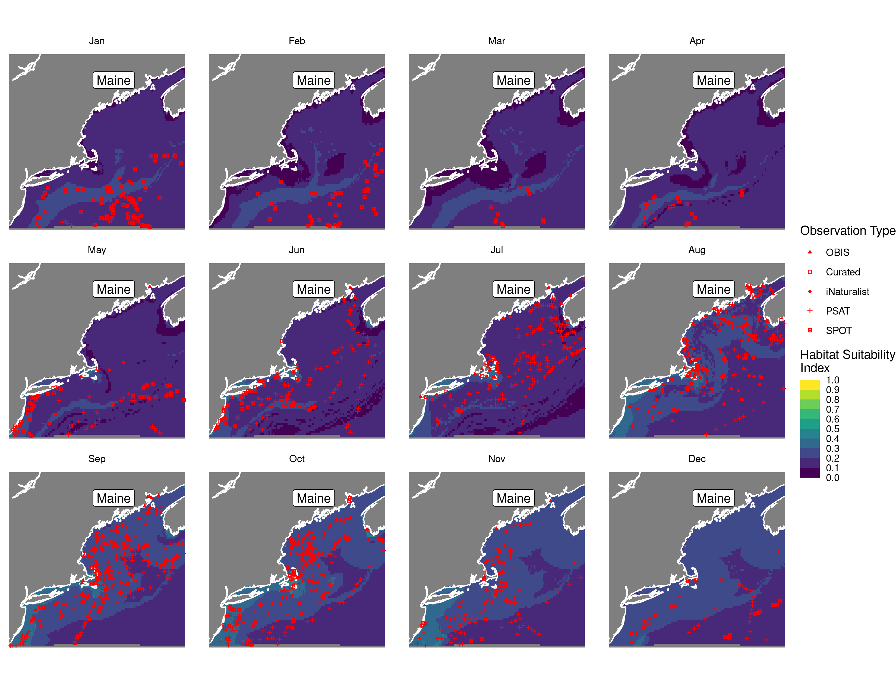
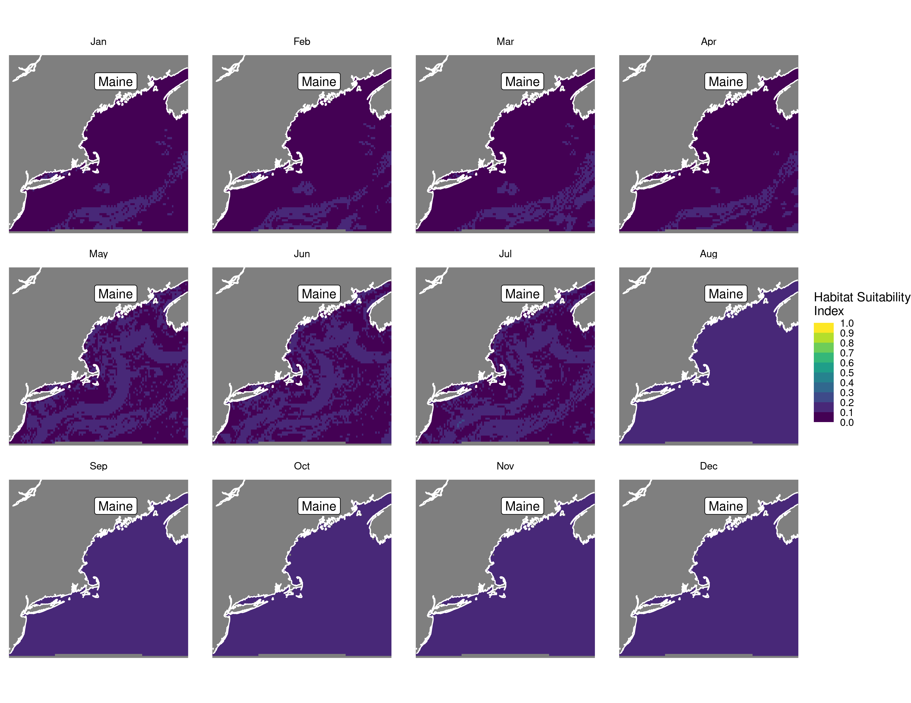
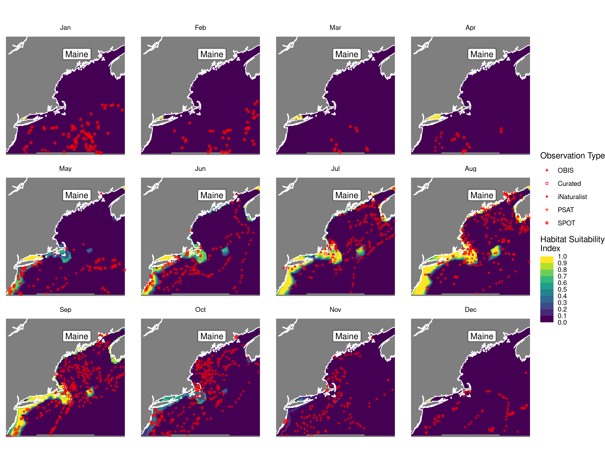

Habitat Suitability Report
================

## Inputs

- Species: White shark (Carcharodon carcharias)
- Thinning: Thinned satellite data (PSAT and SPOT)
- Ratio: All pseudo-absence/background points
- Spatial extent: Full extent
- Covariates used: all covariates (u and v become vel_mag)
- Metrics: evaluated using all metrics

## Nowcast and Forecast Maps

Random Forest Nowcast and Forecast

| Nowcast | Forecast: RCP 8.5 2075 |
|:--:|:--:|
|  |  |

Boosted Trees Nowcast and Forecast

| Nowcast | Forecast: RCP 8.5 2075 |
|:--:|:--:|
|  |  |

Maxnet Trees Nowcast and Forecast

| Nowcast | Forecast: RCP 8.5 2075 |
|:--:|:--:|
|  |  |

GAM Nowcast and Forecast

| Nowcast | Forecast: RCP 8.5 2075 |
|:--:|:--:|
|  |  |

GLM Nowcast and Forecast

| Nowcast | Forecast: RCP 8.5 2075 |
|:--:|:--:|
|  |  |

## Metrics

| model_type |  accuracy |   roc_auc | boyce_cont | brier_class |   tss_max |
|:-----------|----------:|----------:|-----------:|------------:|----------:|
| rf         | 0.9529042 | 0.9932958 |  0.8928289 |   0.0389165 | 0.9437991 |
| bt         | 0.7723705 | 0.7775029 |  0.9407843 |   0.1491431 | 0.4401200 |
| maxnet     | 0.6522763 | 0.7686104 |  0.9734419 |   0.2108896 | 0.4408749 |
| gam        | 0.8092622 | 0.7887438 |  0.8935306 |   0.1418070 | 0.4446497 |
| glm        | 0.7708006 | 0.7392123 |  0.8371589 |   0.1537939 | 0.4287330 |

Metrics by model type

## Variable Importance

## Partial Dependence

