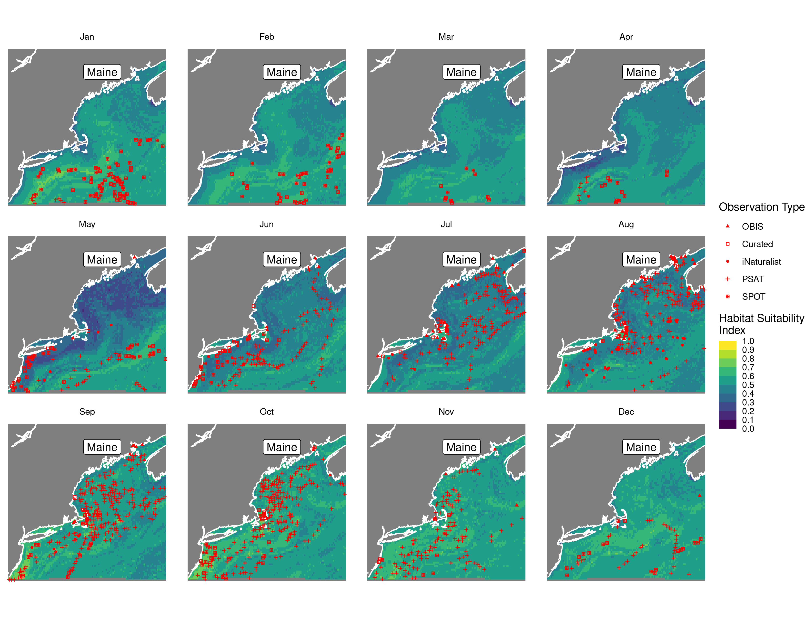
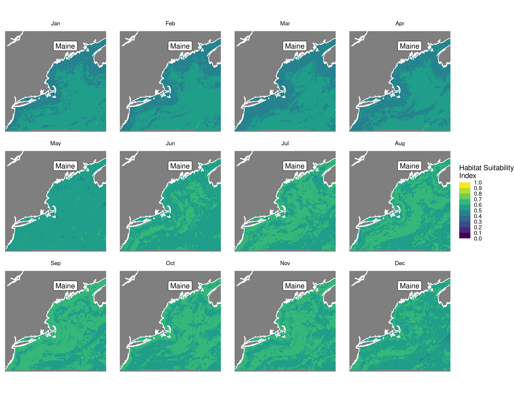
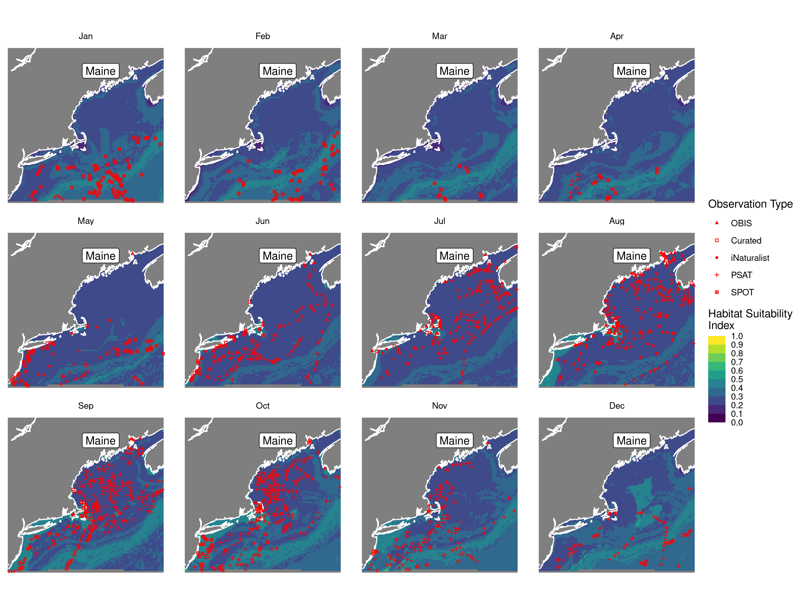
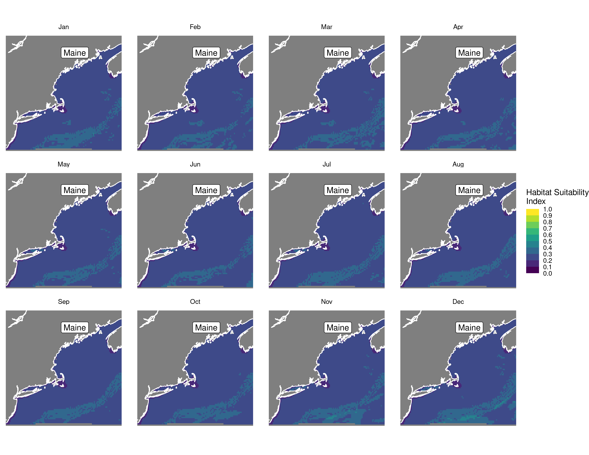
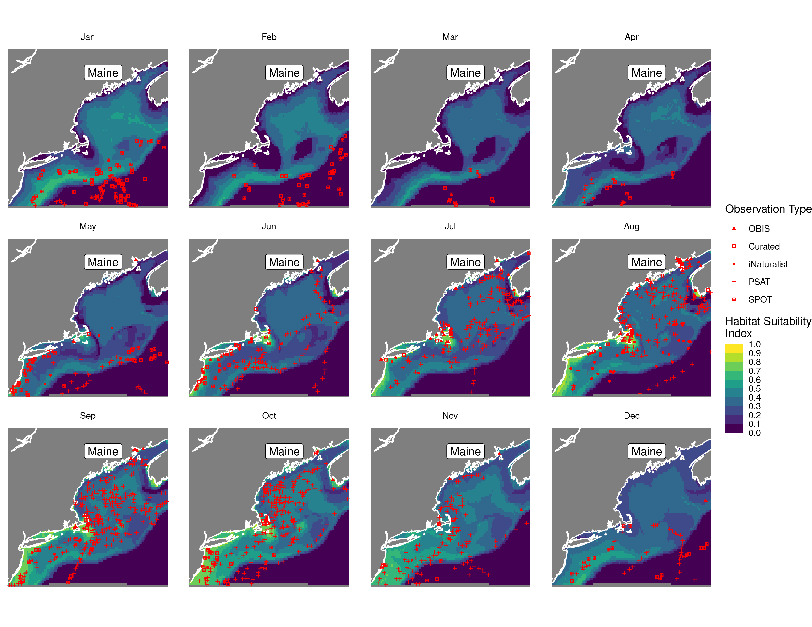
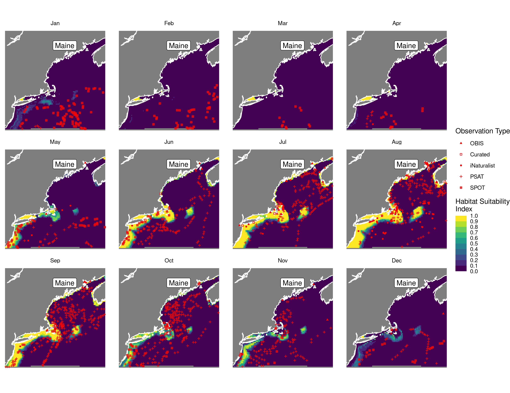
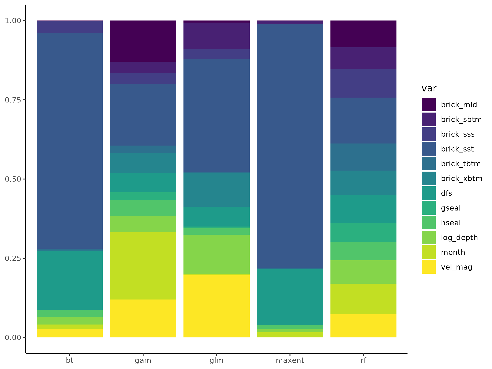
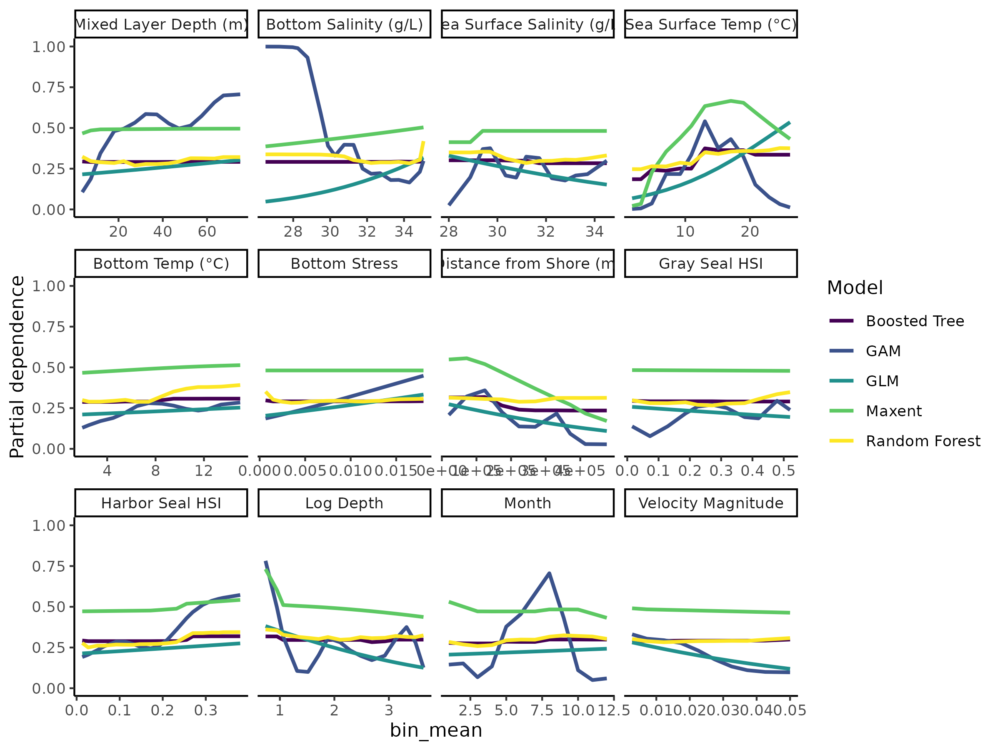

Habitat Suitability Report
================

## Inputs

- Species: White shark (Carcharodon carcharias)
- Thinning: Thinned satellite data (PSAT and SPOT)
- Ratio: All pseudo-absence/background points
- Spatial extent: Full extent
- Covariates used: all covariates (u and v become vel_mag) and seals
- Metrics: evaluated using all metrics

## Nowcast and Forecast Maps

Random Forest Nowcast and Forecast

| Nowcast | Forecast: RCP 8.5 2075 |
|:--:|:--:|
|  |  |

Boosted Trees Nowcast and Forecast

| Nowcast | Forecast: RCP 8.5 2075 |
|:--:|:--:|
|  |  |

Maxnet Trees Nowcast and Forecast

| Nowcast | Forecast: RCP 8.5 2075 |
|:--:|:--:|
|  |  |

GAM Nowcast and Forecast

| Nowcast | Forecast: RCP 8.5 2075 |
|:--:|:--:|
|  |  |

GLM Nowcast and Forecast

| Nowcast | Forecast: RCP 8.5 2075 |
|:--:|:--:|
|  |  |

## Metrics

| model_type |  accuracy |   roc_auc | boyce_cont | brier_class |   tss_max |
|:-----------|----------:|----------:|-----------:|------------:|----------:|
| rf         | 0.9620553 | 0.9967312 |  0.8727632 |   0.0346382 | 0.9663055 |
| bt         | 0.7810277 | 0.8089263 |  0.9063580 |   0.1497183 | 0.4785935 |
| maxnet     | 0.6577075 | 0.7767563 |  0.9738516 |   0.2121656 | 0.4368016 |
| gam        | 0.8245059 | 0.8119079 |  0.9645829 |   0.1325892 | 0.4713682 |
| glm        | 0.7675889 | 0.7267606 |  0.8011322 |   0.1550165 | 0.4345361 |

Metrics by model type

## Variable Importance

## Partial Dependence

