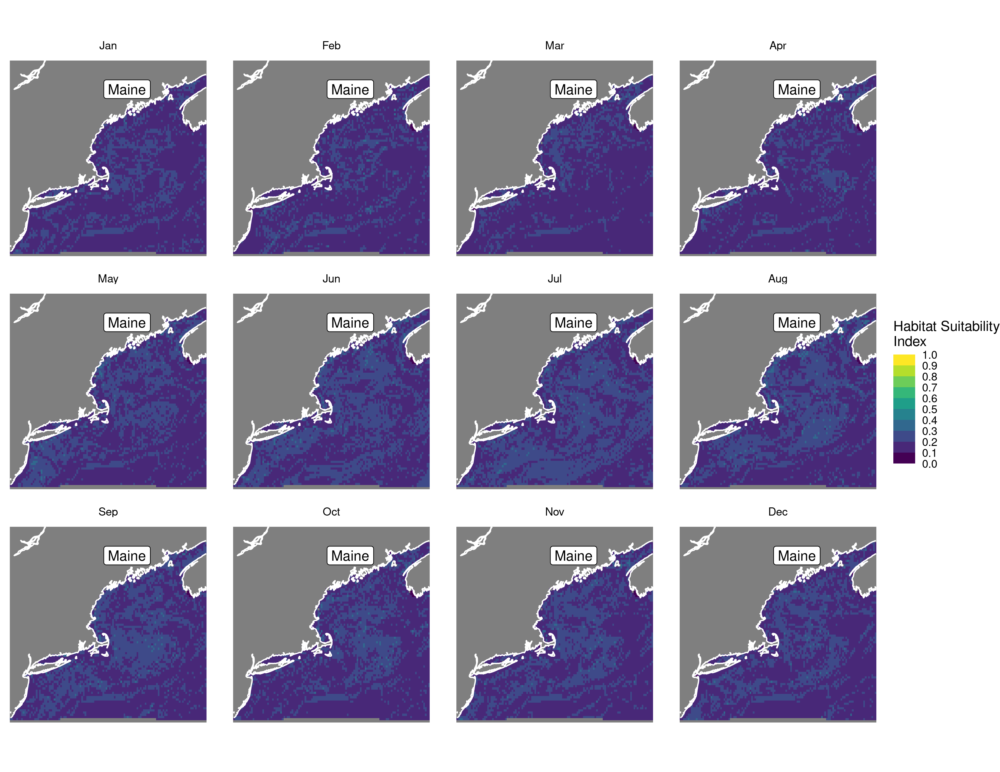
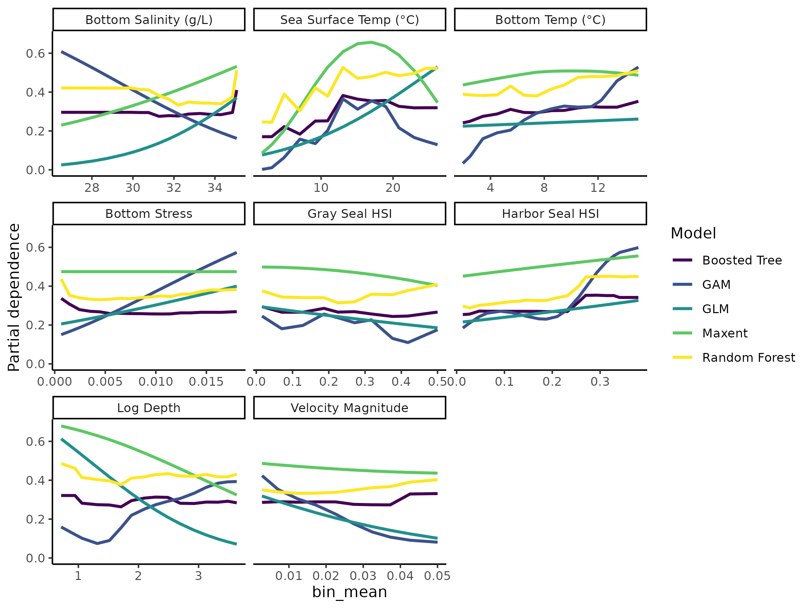

Habitat Suitability Report
================

## Inputs

- Species: White shark (Carcharodon carcharias)
- Thinning: Thinned satellite data (PSAT and SPOT)
- Ratio: All pseudo-absence/background points
- Spatial extent: Full extent
- Covariates used: non-seal (sst, tbtm, log depth, sbtm, seals, vel_mag,
  xbtm)
- Metrics: evaluated using true skill staistic (tss) and area under the
  receiver operator curve (roc_auc)

## Nowcast and Forecast Maps

Random Forest Nowcast and Forecast

| Nowcast | Forecast: RCP 8.5 2075 |
|:--:|:--:|
|  |  |

Boosted Trees Nowcast and Forecast

| Nowcast | Forecast: RCP 8.5 2075 |
|:--:|:--:|
|  |  |

Maxnet Trees Nowcast and Forecast

| Nowcast | Forecast: RCP 8.5 2075 |
|:--:|:--:|
|  |  |

GAM Nowcast and Forecast

| Nowcast | Forecast: RCP 8.5 2075 |
|:--:|:--:|
|  |  |

GLM Nowcast and Forecast

| Nowcast | Forecast: RCP 8.5 2075 |
|:--:|:--:|
|  |  |

## Metrics

| model_type |   roc_auc |   tss_max |
|:-----------|----------:|----------:|
| rf         | 0.9942992 | 0.9734777 |
| bt         | 0.9064858 | 0.6519655 |
| maxnet     | 0.7752000 | 0.4344830 |
| gam        | 0.7703216 | 0.4009232 |
| glm        | 0.7487733 | 0.4405312 |

Metrics by model type

## Variable Importance

## Partial Dependence

