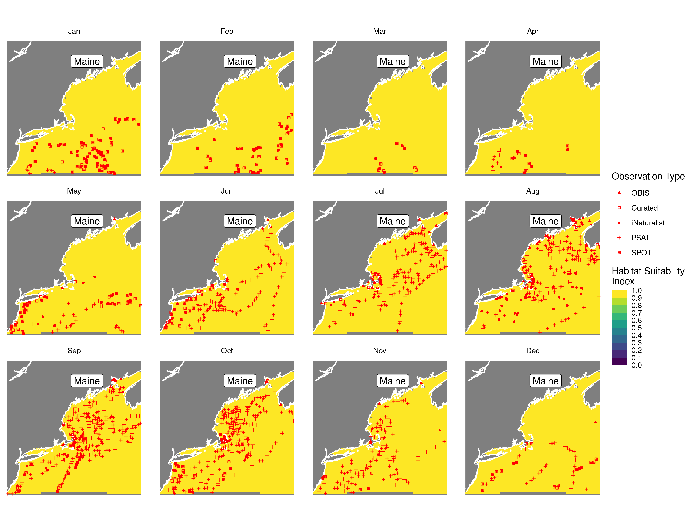

Habitat Suitability Report
================

## Inputs

- Species: White shark (Carcharodon carcharias)
- Thinning: Thinned satellite data (PSAT and SPOT)
- Ratio: All pseudo-absence/background points
- Spatial extent: Full extent
- Covariates used: shark specific v2 (sst, tbtm, sbtm, log depth, and
  seals)
- Metrics: evaluated using all metrics

## Nowcast and Forecast Maps

Random Forest Nowcast and Forecast

| Nowcast | Forecast: RCP 8.5 2075 |
|:--:|:--:|
|  |  |

Boosted Trees Nowcast and Forecast

| Nowcast | Forecast: RCP 8.5 2075 |
|:--:|:--:|
|  |  |

Maxnet Trees Nowcast and Forecast

| Nowcast | Forecast: RCP 8.5 2075 |
|:--:|:--:|
|  |  |

GAM Nowcast and Forecast

| Nowcast | Forecast: RCP 8.5 2075 |
|:--:|:--:|
|  |  |

GLM Nowcast and Forecast

| Nowcast | Forecast: RCP 8.5 2075 |
|:--:|:--:|
|  |  |

## Metrics

| model_type |  accuracy |   roc_auc | boyce_cont | brier_class |   tss_max |
|:-----------|----------:|----------:|-----------:|------------:|----------:|
| rf         | 0.9604743 | 0.9951483 |  0.9053800 |   0.0353645 | 0.9637352 |
| bt         | 0.7715415 | 0.7525420 |  0.9275646 |   0.1556556 | 0.4109174 |
| maxnet     | 0.6355731 | 0.7632434 |  0.9093326 |   0.2261026 | 0.4388330 |
| gam        | 0.7826087 | 0.7680828 |  0.9125098 |   0.1469018 | 0.4374575 |
| glm        | 0.7691700 | 0.7318924 |  0.7810708 |   0.1560249 | 0.4244250 |

Metrics by model type

## Variable Importance

## Partial Dependence

