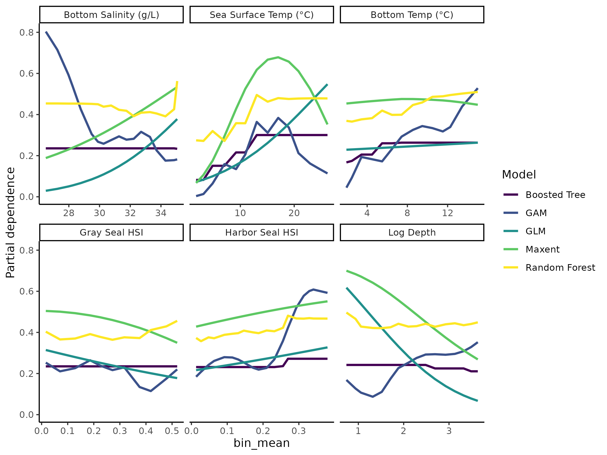

Habitat Suitability Report
================

## Inputs

- Species: White shark (Carcharodon carcharias)
- Thinning: Thinned satellite data (PSAT and SPOT)
- Ratio: All pseudo-absence/background points
- Spatial extent: Full extent
- Covariates used: shark specific v2 (sst, tbtm, sbtm, log depth, and
  seals)
- Metrics: evaluated using all metrics

## Nowcast and Forecast Maps

Random Forest Nowcast and Forecast

| Nowcast | Forecast: RCP 8.5 2075 |
|:--:|:--:|
|  |  |

Boosted Trees Nowcast and Forecast

| Nowcast | Forecast: RCP 8.5 2075 |
|:--:|:--:|
|  |  |

Maxnet Trees Nowcast and Forecast

| Nowcast | Forecast: RCP 8.5 2075 |
|:--:|:--:|
|  |  |

GAM Nowcast and Forecast

| Nowcast | Forecast: RCP 8.5 2075 |
|:--:|:--:|
|  |  |

GLM Nowcast and Forecast

| Nowcast | Forecast: RCP 8.5 2075 |
|:--:|:--:|
|  |  |

## Metrics

| model_type |  accuracy |   roc_auc | boyce_cont | brier_class |   tss_max |
|:-----------|----------:|----------:|-----------:|------------:|----------:|
| rf         | 0.9557312 | 0.9930707 |  0.9422816 |   0.0371454 | 0.9637352 |
| bt         | 0.7786561 | 0.7848112 |  0.9809479 |   0.1466113 | 0.4580840 |
| maxnet     | 0.6505929 | 0.7678523 |  0.9918636 |   0.2284544 | 0.4350396 |
| gam        | 0.7881423 | 0.7699653 |  0.9312995 |   0.1460316 | 0.4204081 |
| glm        | 0.7675889 | 0.7180658 |  0.8544578 |   0.1577842 | 0.4050570 |

Metrics by model type

## Variable Importance

## Partial Dependence

