Habitat Suitability Report
================

## Inputs

- Species: White shark (Carcharodon carcharias)
- Thinning: Thinned satellite data (PSAT and SPOT)
- Ratio: All pseudo-absence/background points
- Spatial extent: Full extent
- Covariates used: shark specific v3 (sst, depth, month, and seals)
- Metrics: evaluated using true skill staistic (tss) and area under the
  receiver operator curve (roc_auc)
- Observations: All observations

## Nowcast and Forecast Maps

Random Forest Nowcast and Forecast

| Nowcast | Forecast: RCP 8.5 2075 |
|:--:|:--:|
| 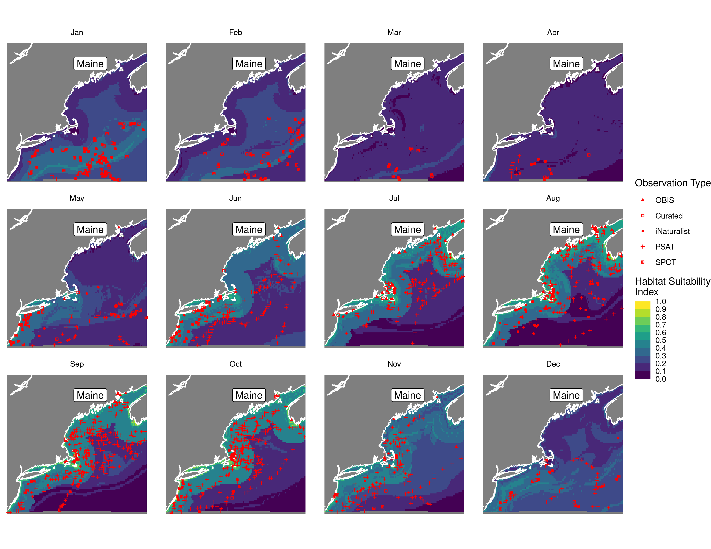 | 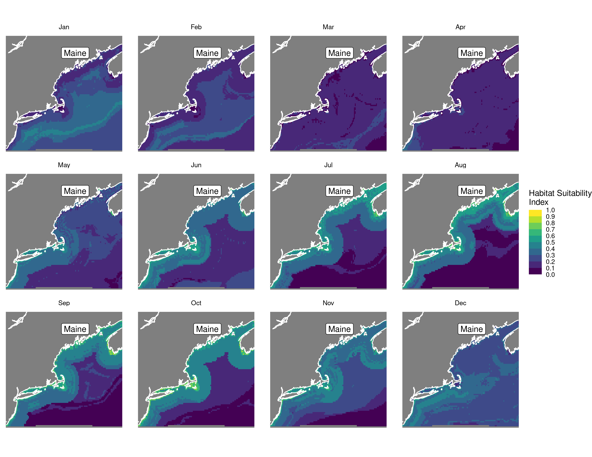 |

Boosted Trees Nowcast and Forecast

| Nowcast | Forecast: RCP 8.5 2075 |
|:--:|:--:|
| 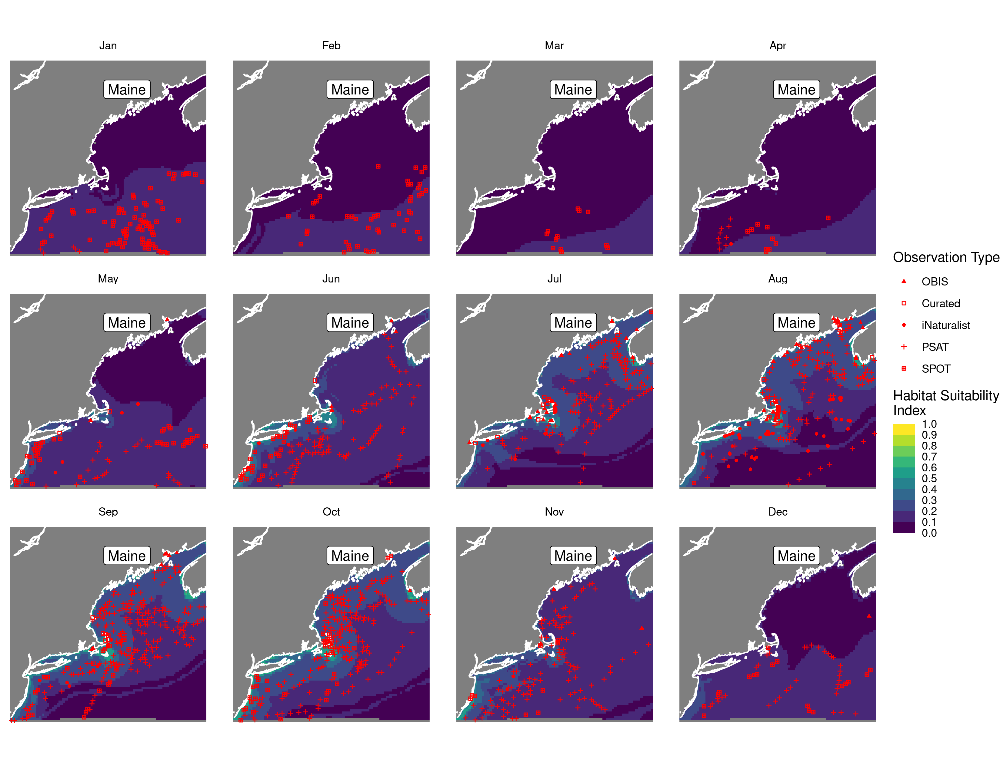 | 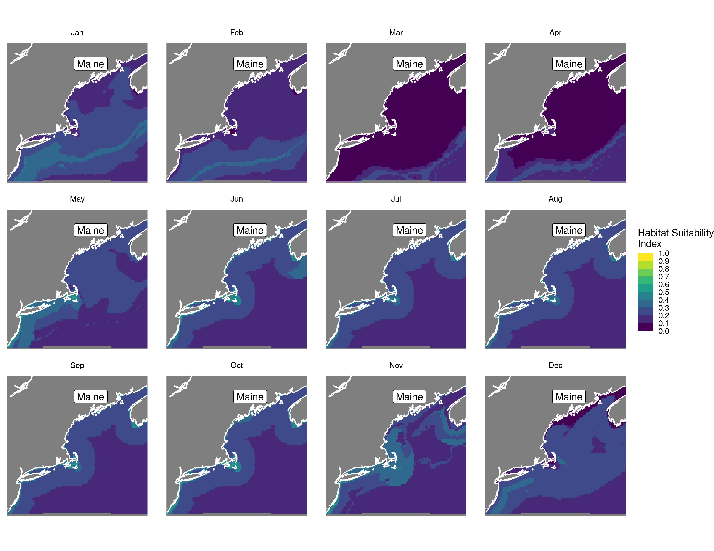 |

Maxnet Trees Nowcast and Forecast

| Nowcast | Forecast: RCP 8.5 2075 |
|:--:|:--:|
| 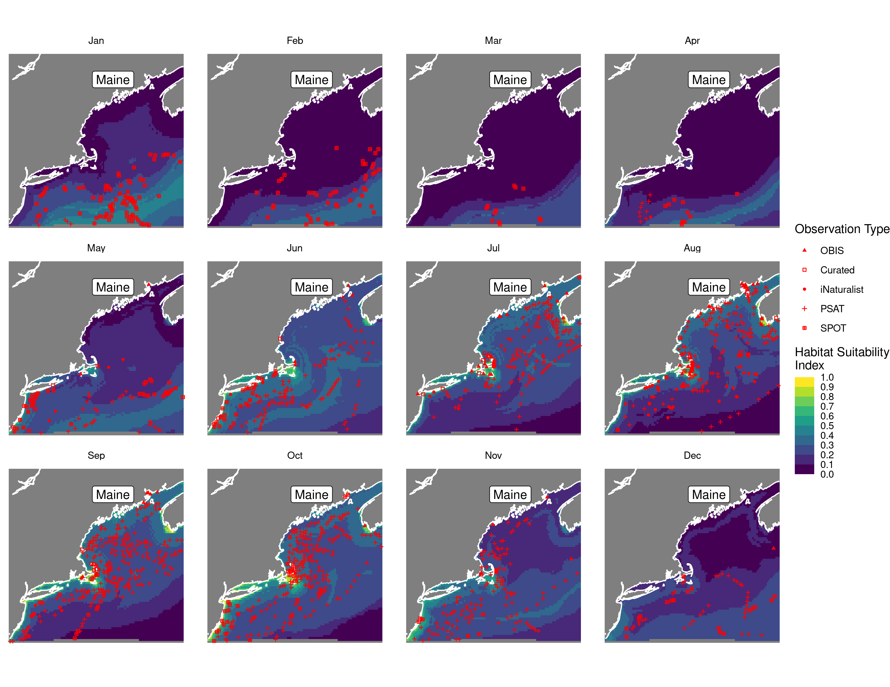 | 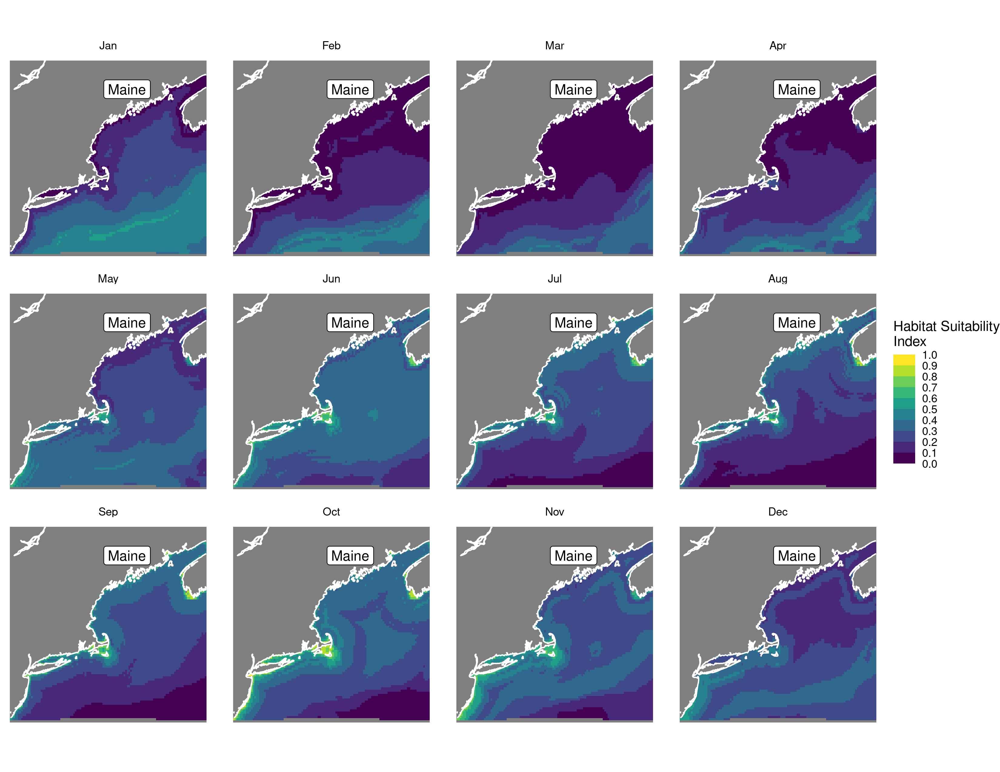 |

GAM Nowcast and Forecast

| Nowcast | Forecast: RCP 8.5 2075 |
|:--:|:--:|
| 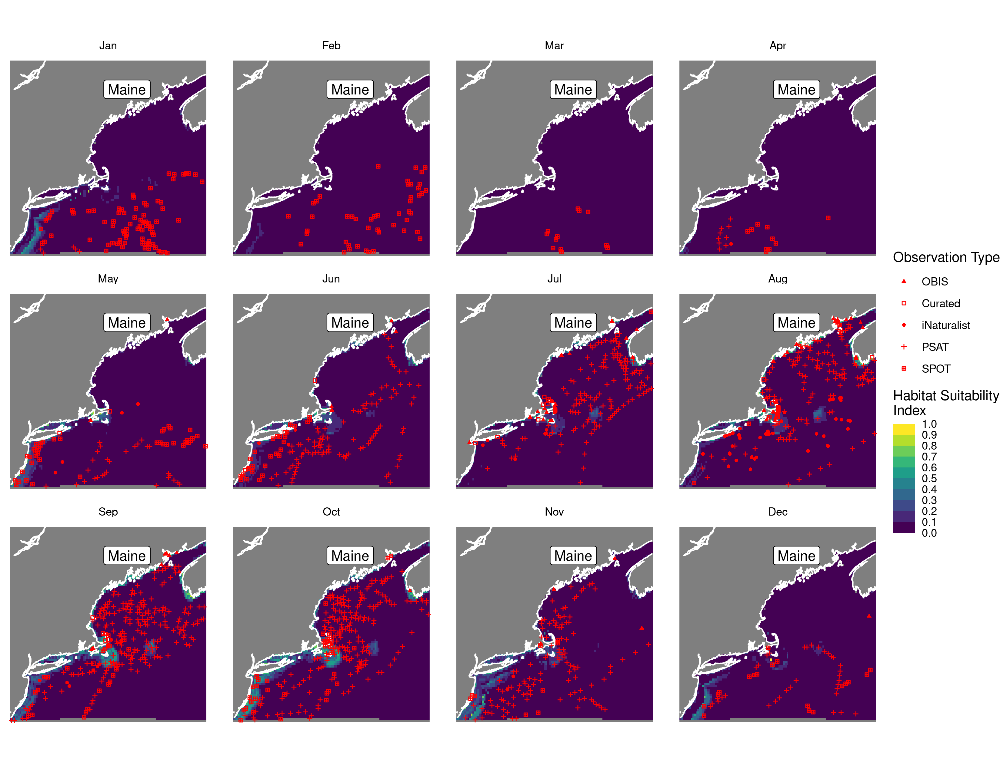 | 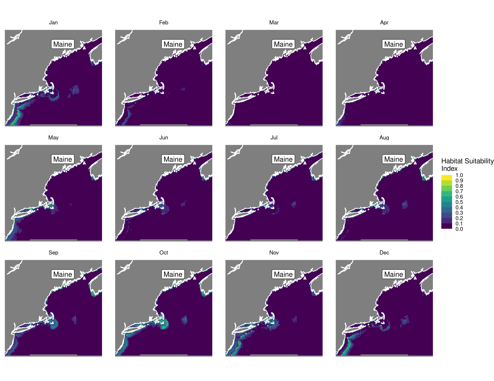 |

GLM Nowcast and Forecast

| Nowcast | Forecast: RCP 8.5 2075 |
|:--:|:--:|
| 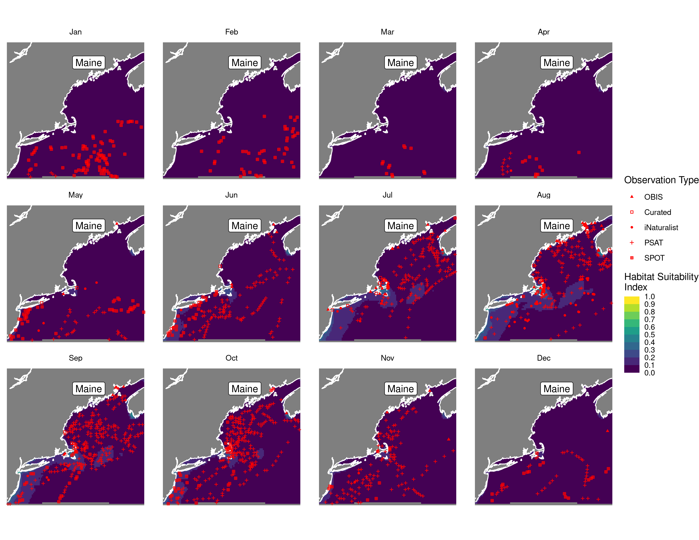 | 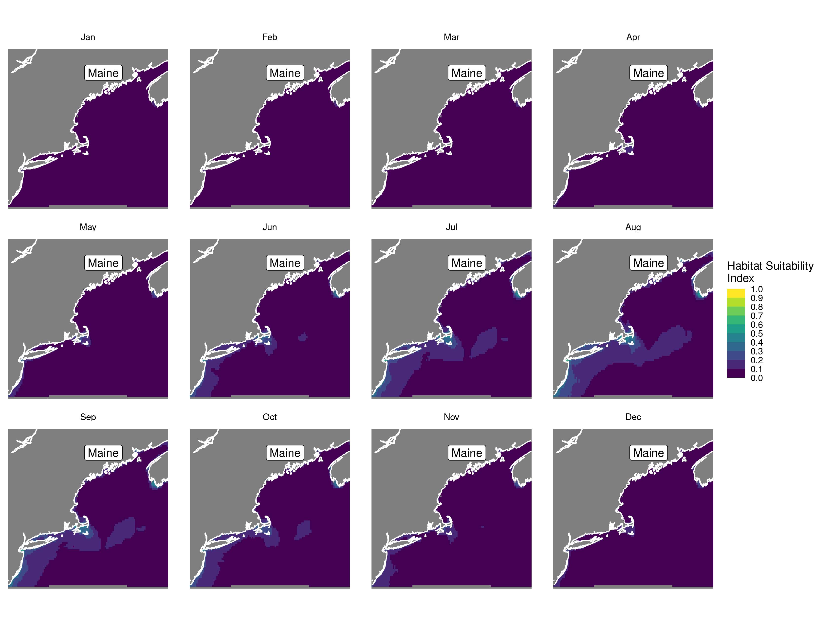 |

## Metrics

| model_type |   roc_auc |   tss_max |
|:-----------|----------:|----------:|
| rf         | 0.9321508 | 0.6848617 |
| bt         | 0.8450234 | 0.5436628 |
| maxnet     | 0.7980809 | 0.5190206 |
| gam        | 0.8075781 | 0.4800398 |
| glm        | 0.7449929 | 0.4499707 |

Metrics by model type

## Variable Importance

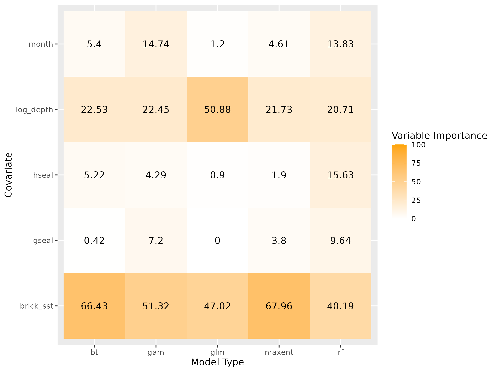

## Partial Dependence

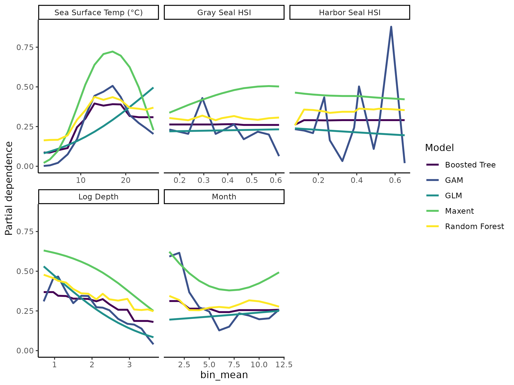
