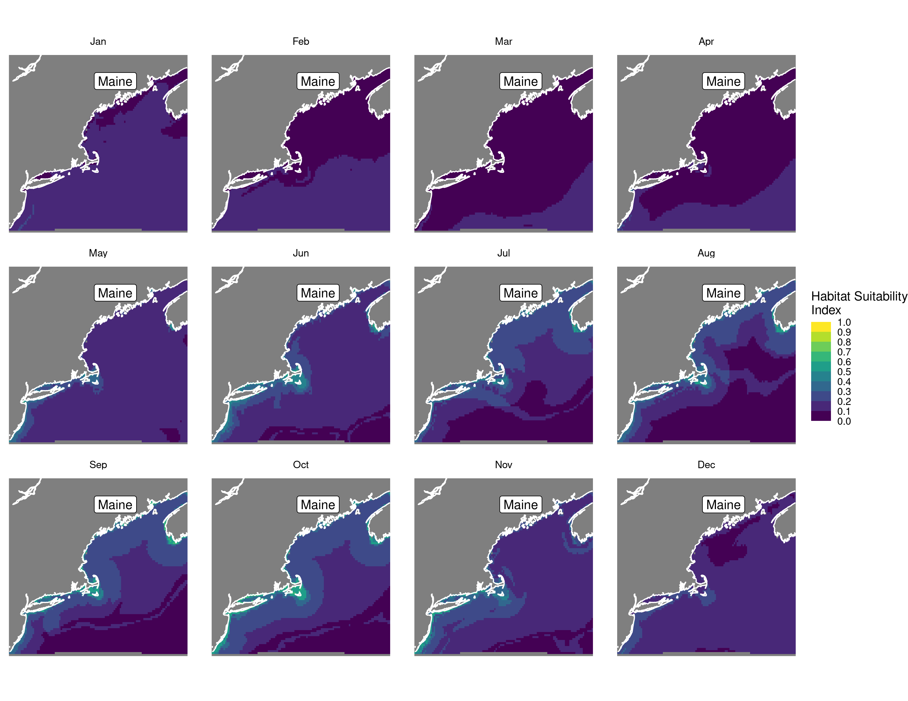
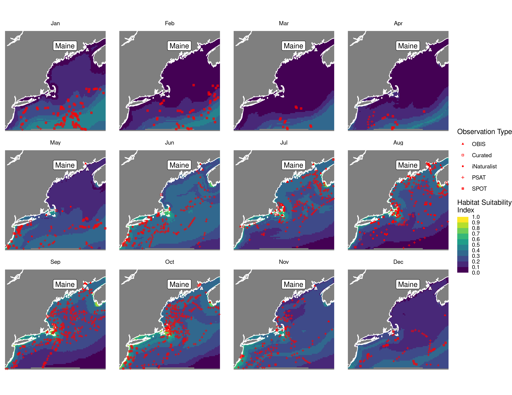
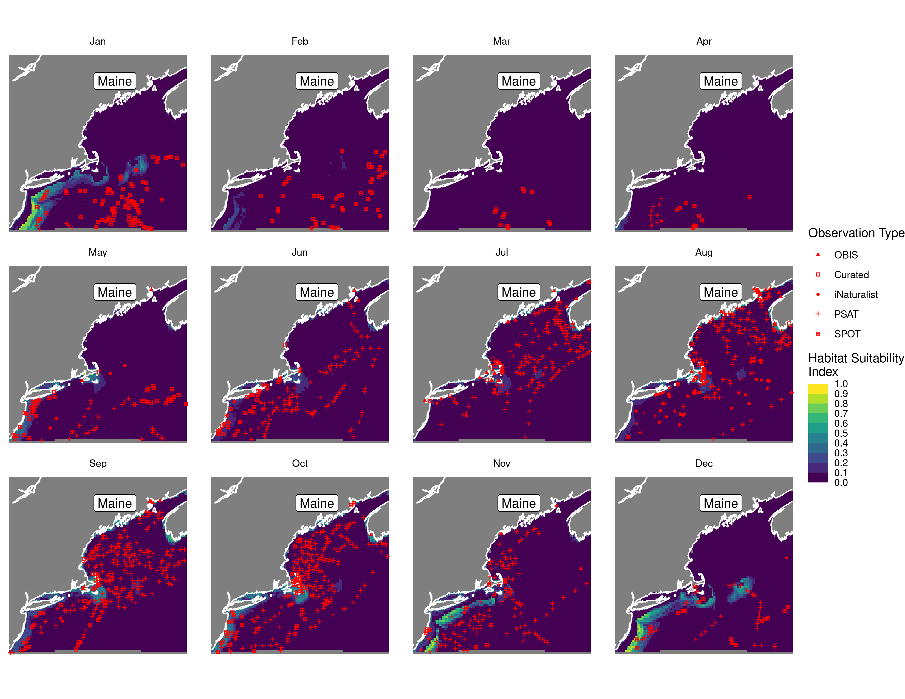
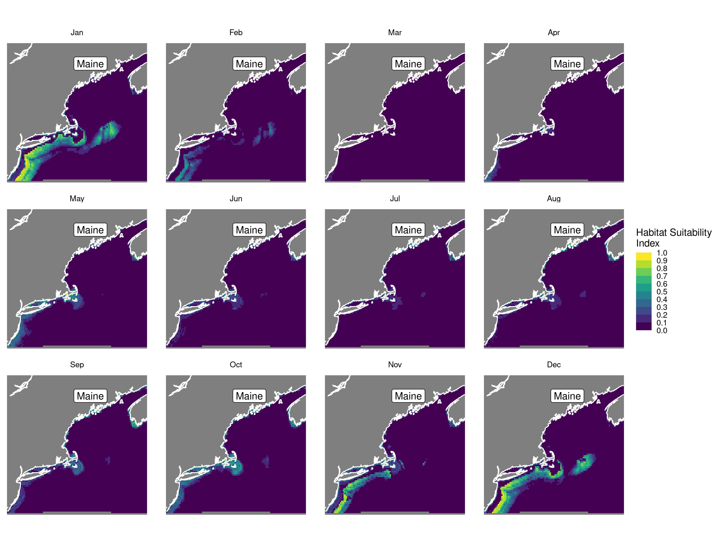
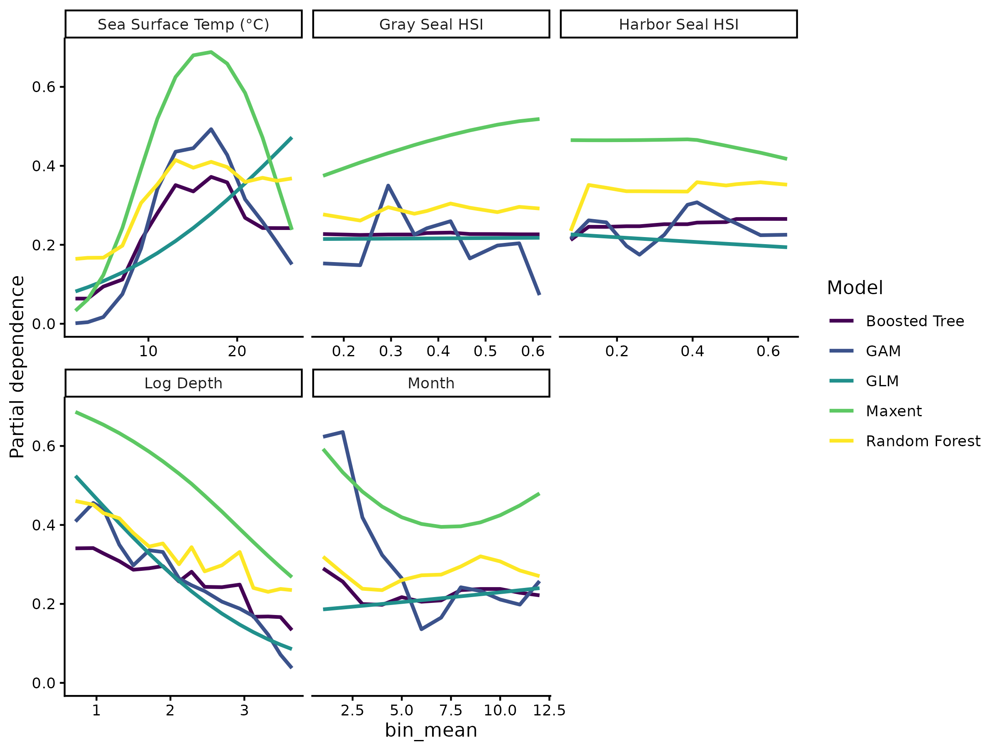

Habitat Suitability Report
================

## Inputs

- Species: White shark (Carcharodon carcharias)
- Thinning: Thinned satellite data (PSAT and SPOT)
- Ratio: All pseudo-absence/background points
- Spatial extent: Full extent
- Covariates used:
- Metrics: evaluated using true skill staistic (tss) and area under the
  receiver operator curve (roc_auc)

## Nowcast and Forecast Maps

Random Forest Nowcast and Forecast

| Nowcast | Forecast: RCP 8.5 2075 |
|:--:|:--:|
|  |  |

Boosted Trees Nowcast and Forecast

| Nowcast | Forecast: RCP 8.5 2075 |
|:--:|:--:|
|  |  |

Maxnet Trees Nowcast and Forecast

| Nowcast | Forecast: RCP 8.5 2075 |
|:--:|:--:|
|  |  |

GAM Nowcast and Forecast

| Nowcast | Forecast: RCP 8.5 2075 |
|:--:|:--:|
|  |  |

GLM Nowcast and Forecast

| Nowcast | Forecast: RCP 8.5 2075 |
|:--:|:--:|
|  |  |

## Metrics

| model_type |   roc_auc |   tss_max |
|:-----------|----------:|----------:|
| rf         | 0.9281297 | 0.6723180 |
| bt         | 0.8120550 | 0.4881697 |
| maxnet     | 0.7919108 | 0.4822975 |
| gam        | 0.7998338 | 0.4718047 |
| glm        | 0.7310854 | 0.4204170 |

Metrics by model type

## Variable Importance

## Partial Dependence

