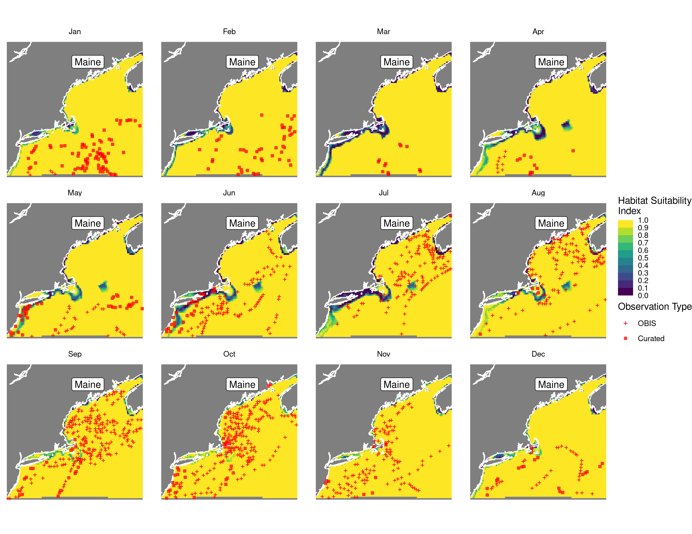

Habitat Suitability Report
================

## Inputs

- Species: White shark (Carcharodon carcharias)
- Thinning: Thinned satellite data (PSAT and SPOT)
- Ratio: All pseudo-absence/background points
- Spatial extent: Full extent
- Covariates used: all covariates (u and v become vel_mag)
- Metrics: evaluated using true skill staistic (tss) and area under the
  receiver operator curve (roc_auc)
- Observations: Satellite observations (PSAT, SPOT)

## Nowcast and Forecast Maps

Random Forest Nowcast and Forecast

| Nowcast | Forecast: RCP 8.5 2075 |
|:--:|:--:|
|  |  |

Boosted Trees Nowcast and Forecast

| Nowcast | Forecast: RCP 8.5 2075 |
|:--:|:--:|
|  |  |

Maxnet Trees Nowcast and Forecast

| Nowcast | Forecast: RCP 8.5 2075 |
|:--:|:--:|
|  |  |

GAM Nowcast and Forecast

| Nowcast | Forecast: RCP 8.5 2075 |
|:--:|:--:|
|  |  |

GLM Nowcast and Forecast

| Nowcast | Forecast: RCP 8.5 2075 |
|:--:|:--:|
|  |  |

## Metrics

| model_type |   roc_auc |   tss_max |
|:-----------|----------:|----------:|
| rf         | 0.9975167 | 0.9582335 |
| bt         | 0.8440094 | 0.5431909 |
| maxnet     | 0.8098059 | 0.5144288 |
| gam        | 0.8290879 | 0.5466118 |
| glm        | 0.7317957 | 0.4599797 |

Metrics by model type

## Variable Importance

## Partial Dependence

