Habitat Suitability Report
================

## Inputs

- Species: White shark (Carcharodon carcharias)
- Thinning: Thinned satellite data (PSAT and SPOT)
- Ratio: All pseudo-absence/background points
- Spatial extent: Full extent
- Covariates used: shark specific v3 (sst, depth, month, and seals)
- Metrics: evaluated using true skill staistic (tss) and area under the
  receiver operator curve (roc_auc)
- Observations: Satellite observations (PSAT, SPOT)

## Nowcast and Forecast Maps

Random Forest Nowcast and Forecast

| Nowcast | Forecast: RCP 8.5 2075 |
|:--:|:--:|
| 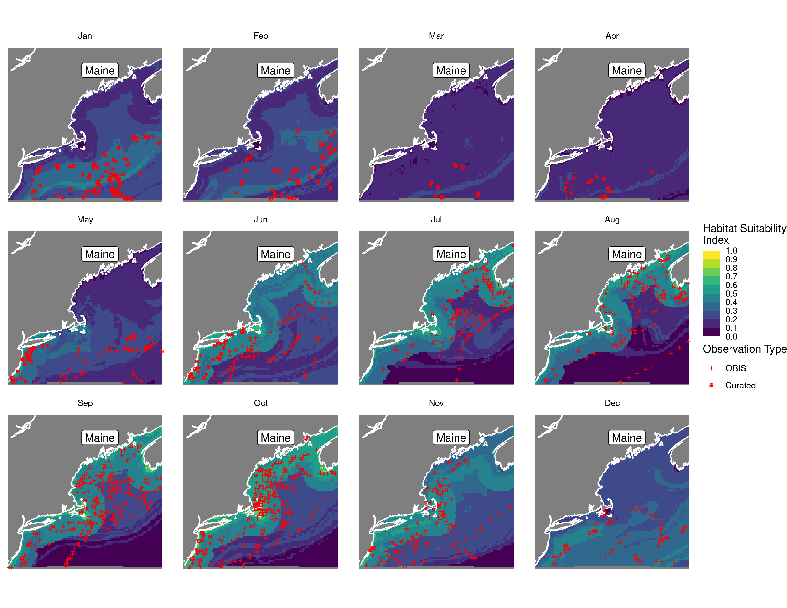 | 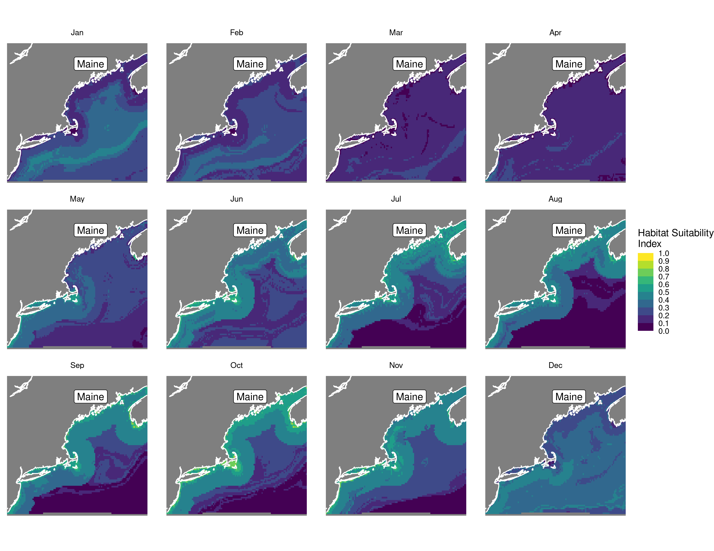 |

Boosted Trees Nowcast and Forecast

| Nowcast | Forecast: RCP 8.5 2075 |
|:--:|:--:|
| 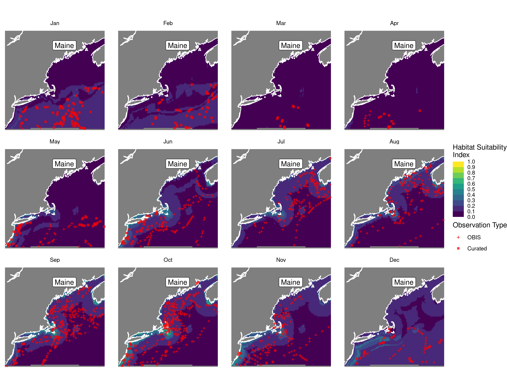 | 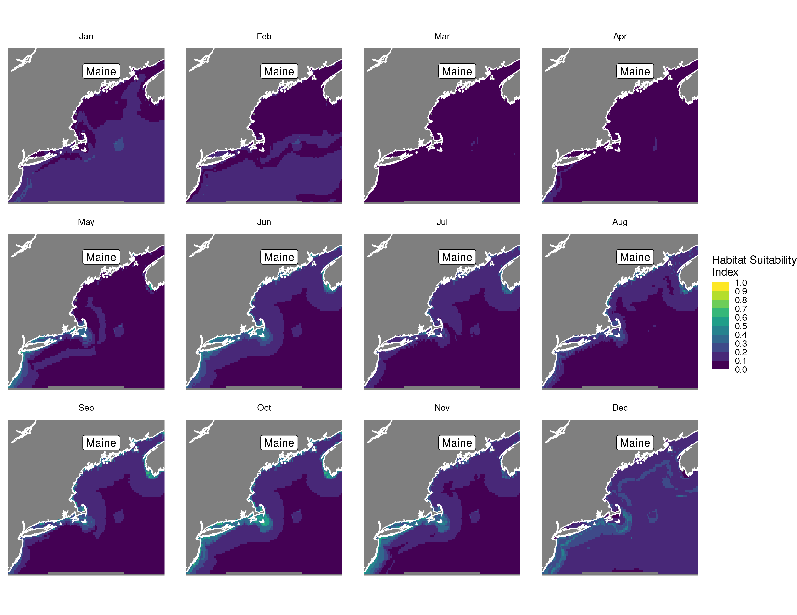 |

Maxnet Trees Nowcast and Forecast

| Nowcast | Forecast: RCP 8.5 2075 |
|:--:|:--:|
| 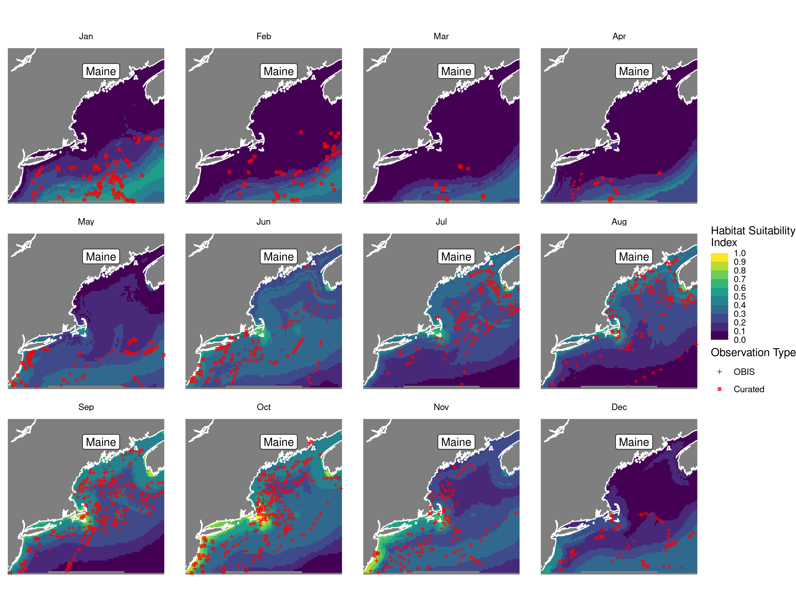 | 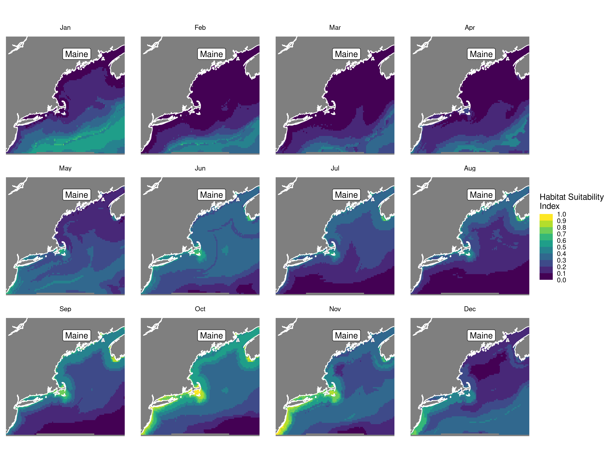 |

GAM Nowcast and Forecast

| Nowcast | Forecast: RCP 8.5 2075 |
|:--:|:--:|
| 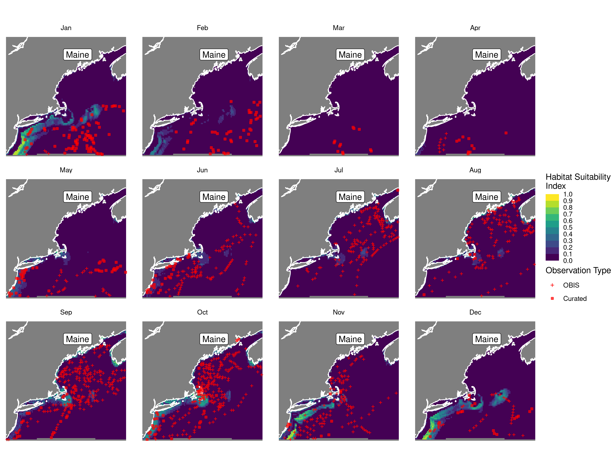 | 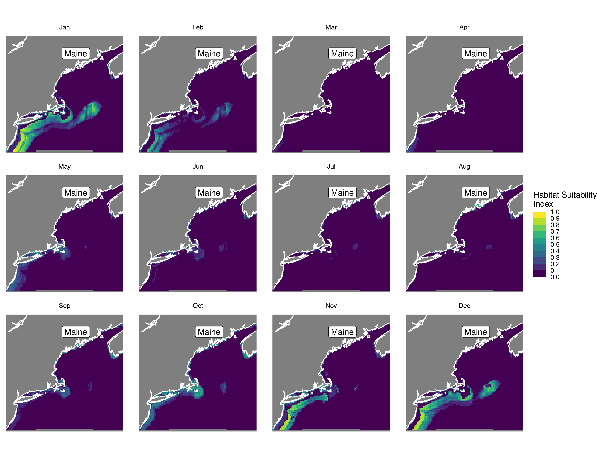 |

GLM Nowcast and Forecast

| Nowcast | Forecast: RCP 8.5 2075 |
|:--:|:--:|
| 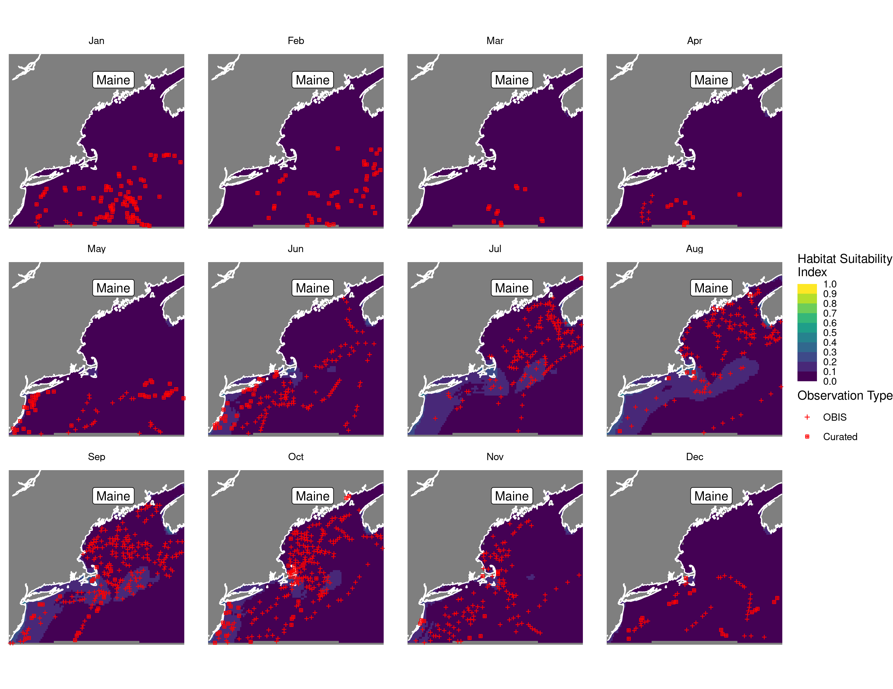 | 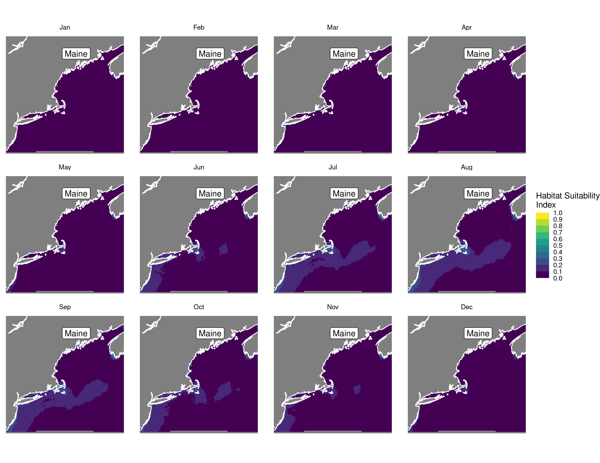 |

## Metrics

| model_type |   roc_auc |   tss_max |
|:-----------|----------:|----------:|
| rf         | 0.9403725 | 0.7361926 |
| bt         | 0.8609163 | 0.5789197 |
| maxnet     | 0.8162750 | 0.4994854 |
| gam        | 0.8154533 | 0.4884004 |
| glm        | 0.7496091 | 0.4737214 |

Metrics by model type

## Variable Importance

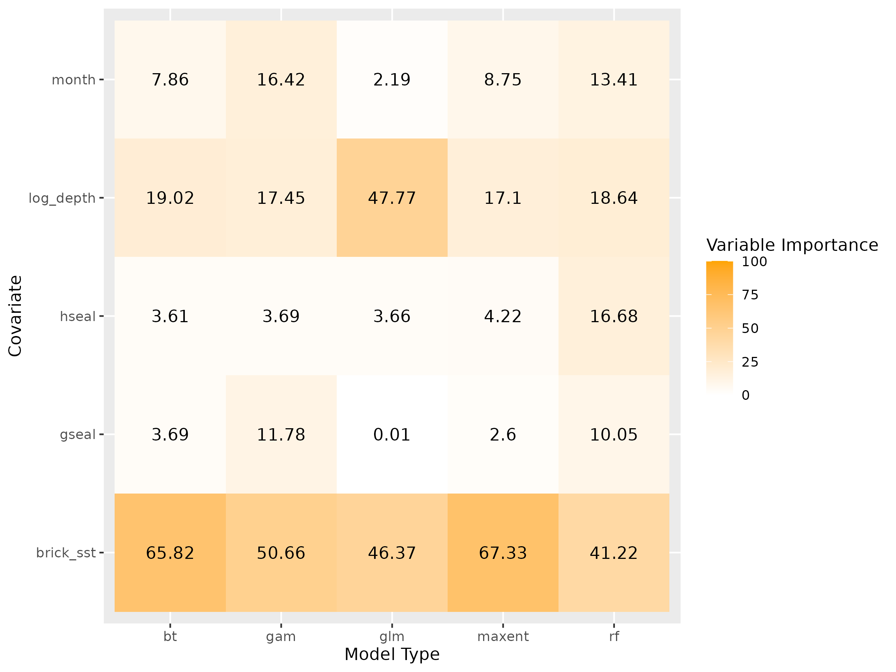

## Partial Dependence

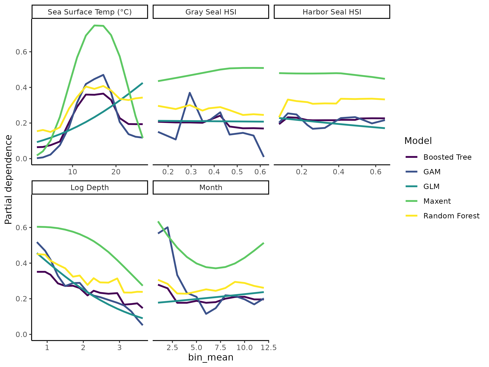
