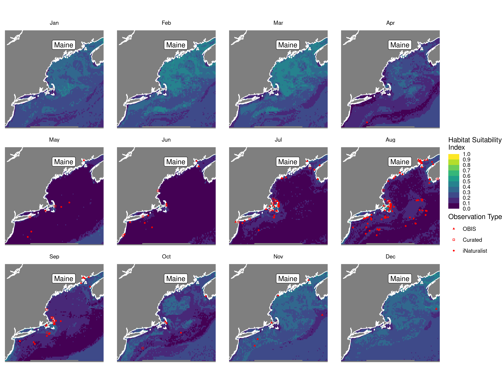
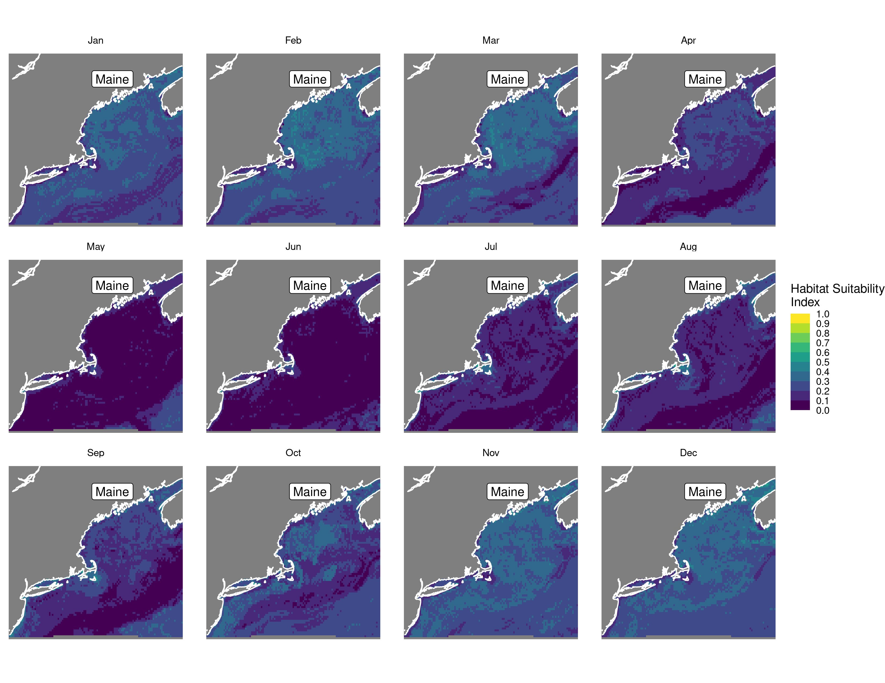
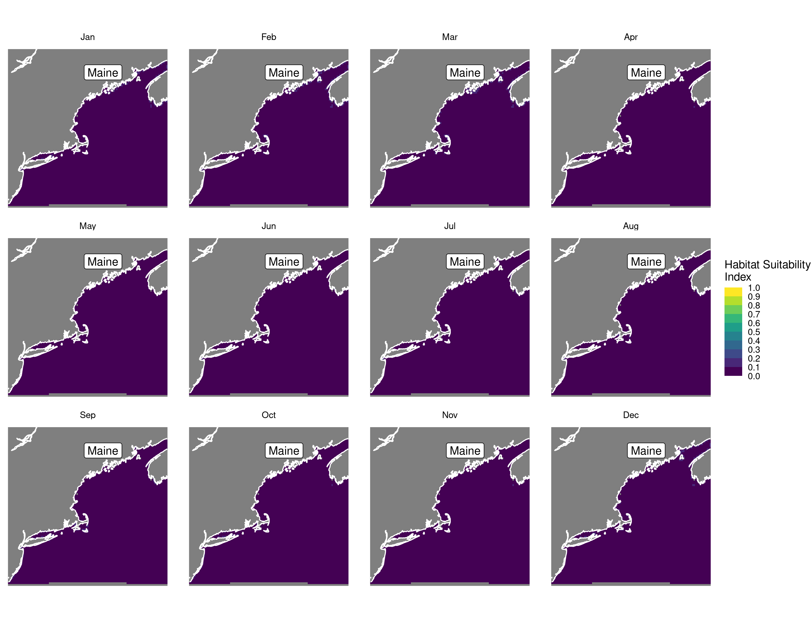
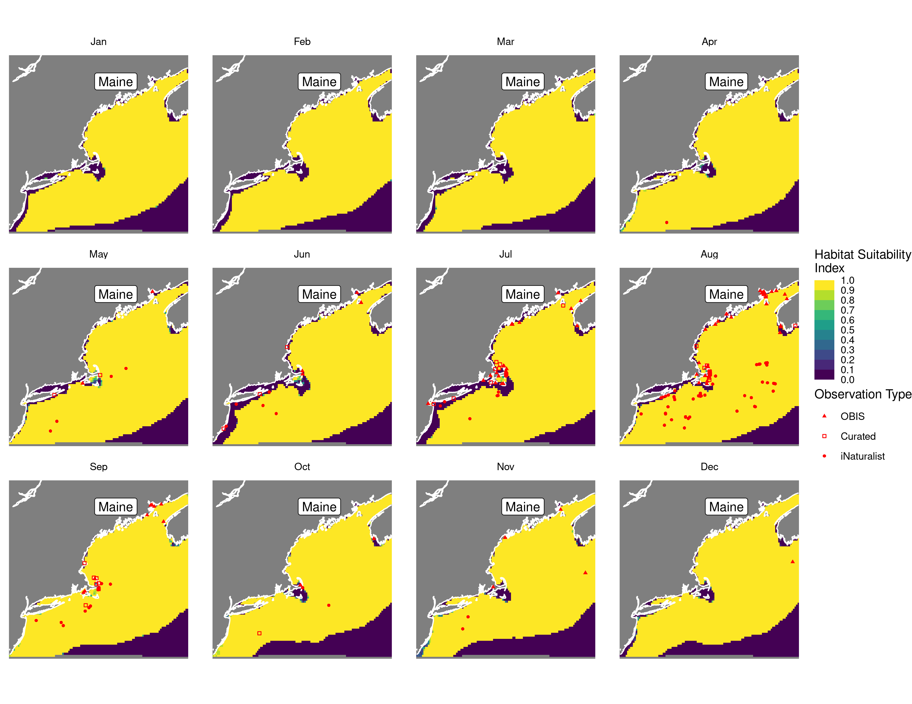
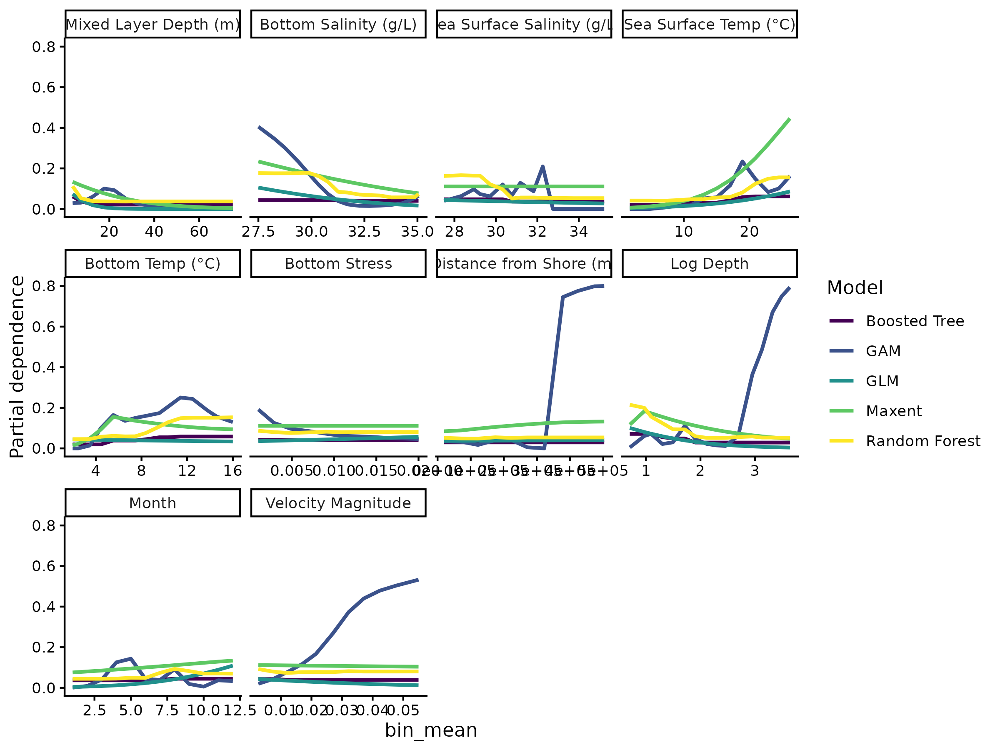

Habitat Suitability Report
================

## Inputs

- Species: White shark (Carcharodon carcharias)
- Thinning: Thinned satellite data (PSAT and SPOT)
- Ratio: All pseudo-absence/background points
- Spatial extent: Full extent
- Covariates used: all covariates (u and v become vel_mag)
- Metrics: evaluated using true skill staistic (tss) and area under the
  receiver operator curve (roc_auc)
- Observations: Visual observations (OBIS, iNaturalist, curated lit.)

## Nowcast and Forecast Maps

Random Forest Nowcast and Forecast

| Nowcast | Forecast: RCP 8.5 2075 |
|:--:|:--:|
|  |  |

Boosted Trees Nowcast and Forecast

| Nowcast | Forecast: RCP 8.5 2075 |
|:--:|:--:|
|  |  |

Maxnet Trees Nowcast and Forecast

| Nowcast | Forecast: RCP 8.5 2075 |
|:--:|:--:|
|  |  |

GAM Nowcast and Forecast

| Nowcast | Forecast: RCP 8.5 2075 |
|:--:|:--:|
|  |  |

GLM Nowcast and Forecast

| Nowcast | Forecast: RCP 8.5 2075 |
|:--:|:--:|
|  |  |

## Metrics

| model_type |   roc_auc |   tss_max | percent_deviance_explained |
|:-----------|----------:|----------:|---------------------------:|
| rf         | 0.9884447 | 0.9363473 |                  0.7764905 |
| bt         | 0.9366706 | 0.7649573 |                  0.4455934 |
| maxnet     | 0.9455409 | 0.8184885 |                         NA |
| gam        | 0.9539193 | 0.7726046 |                  0.5114693 |
| glm        | 0.9400585 | 0.7911606 |                  0.4073420 |

Metrics by model type

## Variable Importance

## Partial Dependence

