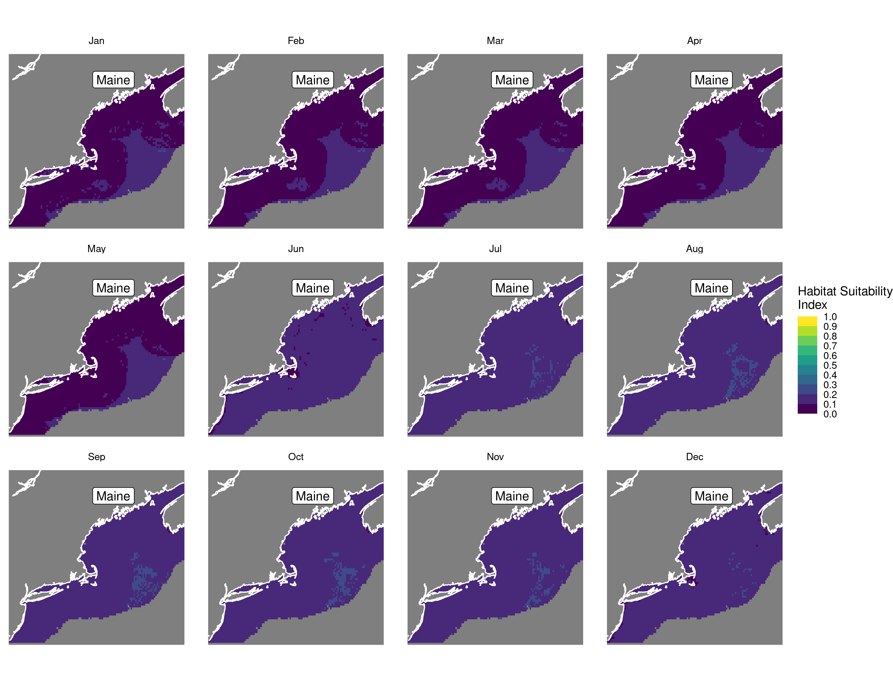
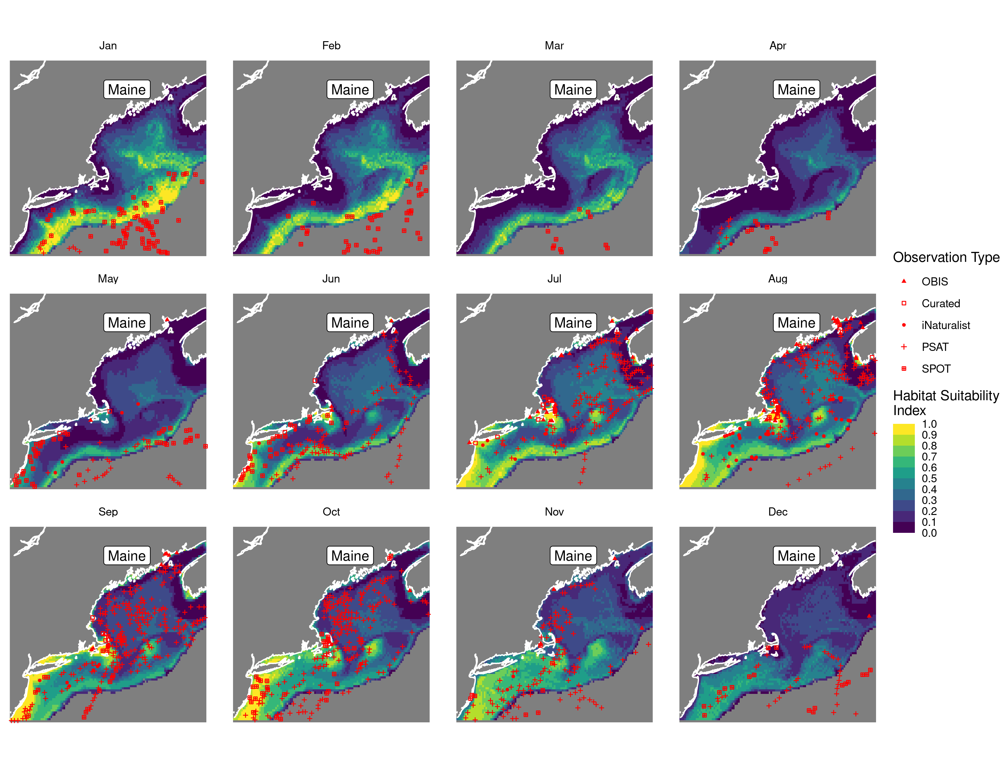
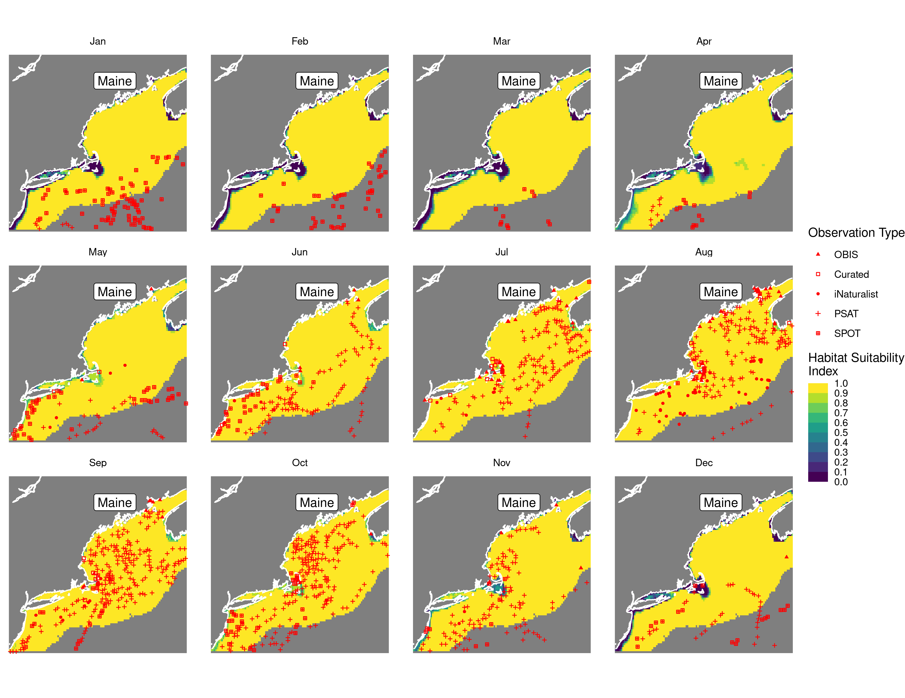
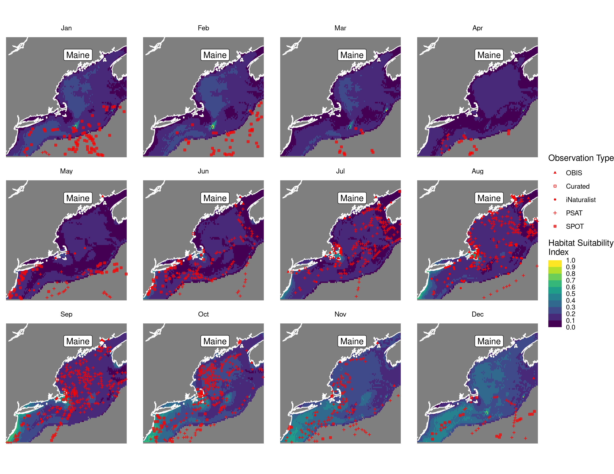
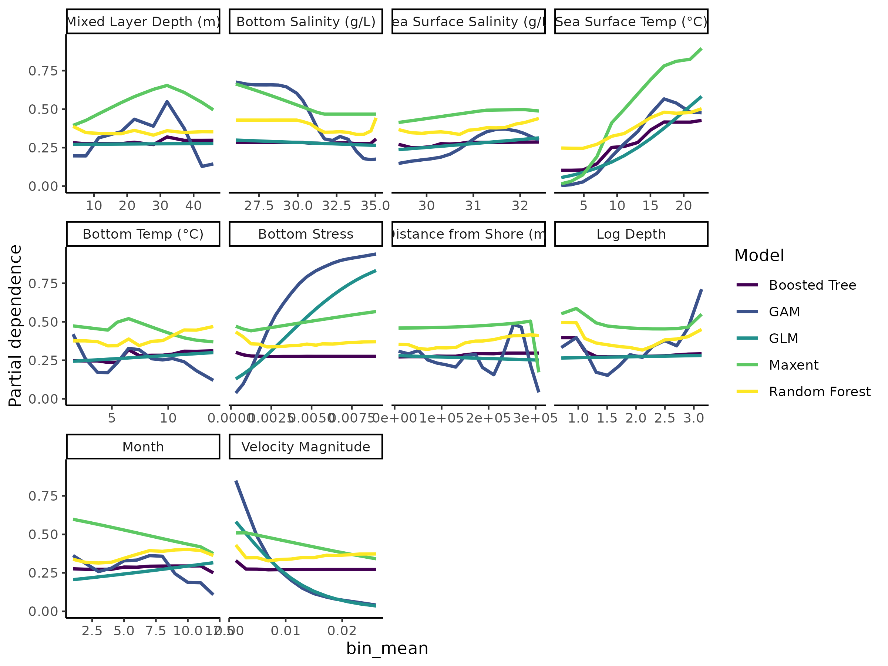

Habitat Suitability Report
================

## Inputs

- Species: White shark (Carcharodon carcharias)
- Thinning: Thinned satellite data (PSAT and SPOT)
- Ratio: All pseudo-absence/background points
- Spatial extent: Cropped to 750 m isobath
- Covariates used: all covariates (u and v become vel_mag)
- Metrics: evaluated using all metrics

## Nowcast and Forecast Maps

Random Forest Nowcast and Forecast

| Nowcast | Forecast: RCP 8.5 2075 |
|:--:|:--:|
|  |  |

Boosted Trees Nowcast and Forecast

| Nowcast | Forecast: RCP 8.5 2075 |
|:--:|:--:|
|  |  |

Maxnet Trees Nowcast and Forecast

| Nowcast | Forecast: RCP 8.5 2075 |
|:--:|:--:|
|  |  |

GAM Nowcast and Forecast

| Nowcast | Forecast: RCP 8.5 2075 |
|:--:|:--:|
|  |  |

GLM Nowcast and Forecast

| Nowcast | Forecast: RCP 8.5 2075 |
|:--:|:--:|
|  |  |

## Metrics

| model_type |  accuracy |   roc_auc | boyce_cont | brier_class |   tss_max |
|:-----------|----------:|----------:|-----------:|------------:|----------:|
| rf         | 0.9492988 | 0.9898947 |  0.8809066 |   0.0434714 | 0.9582045 |
| bt         | 0.7745415 | 0.7992323 |  0.9247897 |   0.1552787 | 0.4556101 |
| maxnet     | 0.6245955 | 0.7537525 |  0.9872913 |   0.2134857 | 0.3882610 |
| gam        | 0.7335491 | 0.7615714 |  0.9586848 |   0.1636149 | 0.4346412 |
| glm        | 0.7087379 | 0.6953122 |  0.6308764 |   0.1801140 | 0.3775278 |

Metrics by model type

## Variable Importance

## Partial Dependence

