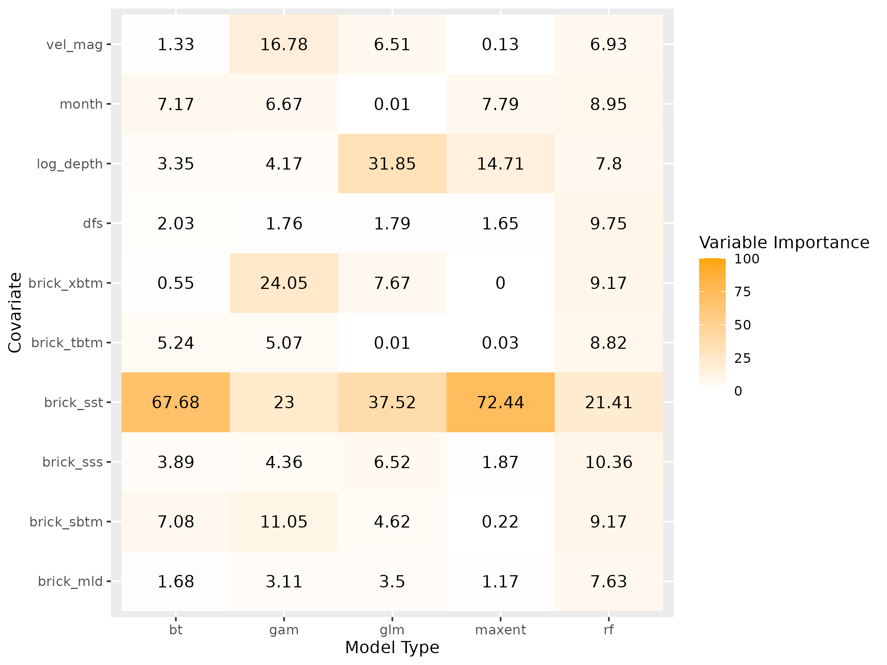

Habitat Suitability Report
================

## Inputs

- Species: White shark (Carcharodon carcharias)
- Thinning: Thinned satellite data (PSAT and SPOT)
- Ratio: All pseudo-absence/background points
- Spatial extent: Cropped to 750 m isobath
- Covariates used: all covariates (u and v become vel_mag)
- Metrics: evaluated using true skill staistic (tss) and area under the
  receiver operator curve (roc_auc)
- Observations: All observations

## Nowcast and Forecast Maps

Random Forest Nowcast and Forecast

| Nowcast | Forecast: RCP 8.5 2075 |
|:--:|:--:|
|  |  |

Boosted Trees Nowcast and Forecast

| Nowcast | Forecast: RCP 8.5 2075 |
|:--:|:--:|
|  |  |

Maxnet Trees Nowcast and Forecast

| Nowcast | Forecast: RCP 8.5 2075 |
|:--:|:--:|
|  |  |

GAM Nowcast and Forecast

| Nowcast | Forecast: RCP 8.5 2075 |
|:--:|:--:|
|  |  |

GLM Nowcast and Forecast

| Nowcast | Forecast: RCP 8.5 2075 |
|:--:|:--:|
|  |  |

## Metrics

| model_type |   roc_auc |   tss_max | percent_deviance_explained |
|:-----------|----------:|----------:|---------------------------:|
| rf         | 0.9889193 | 0.9130269 |                  0.6525011 |
| bt         | 0.8647815 | 0.5624627 |                  0.2999789 |
| maxnet     | 0.8062536 | 0.5072830 |                         NA |
| gam        | 0.8378284 | 0.5844090 |                  0.2609385 |
| glm        | 0.7459768 | 0.4683557 |                  0.1177774 |

Metrics by model type

## Variable Importance

## Partial Dependence

