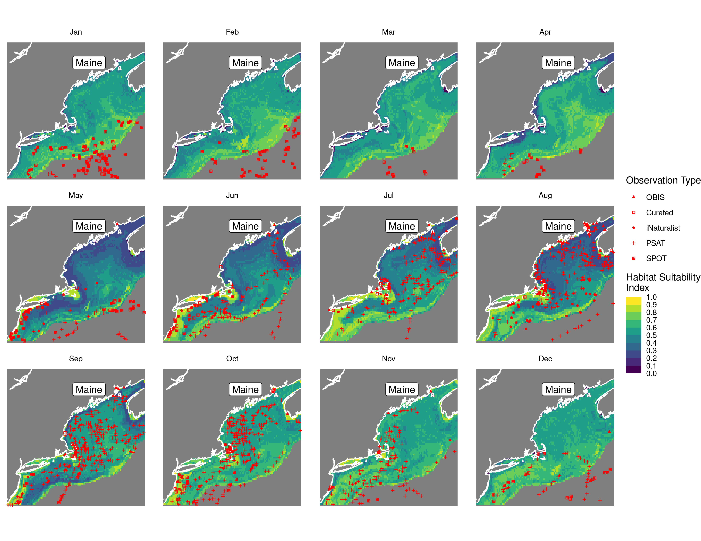
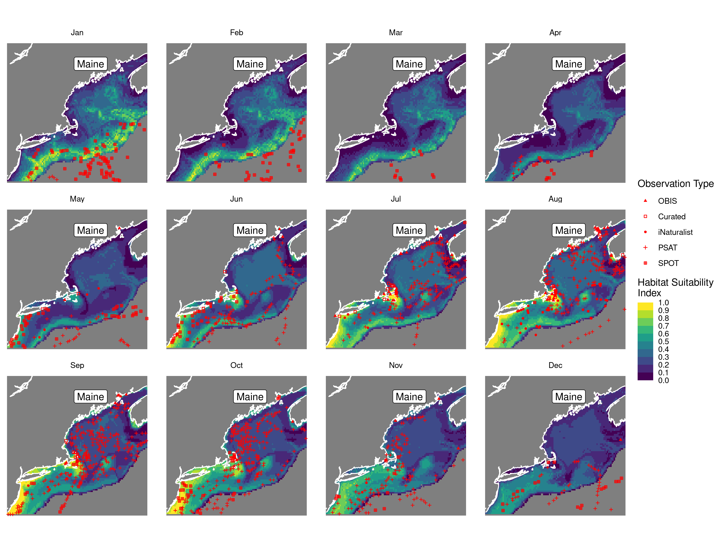
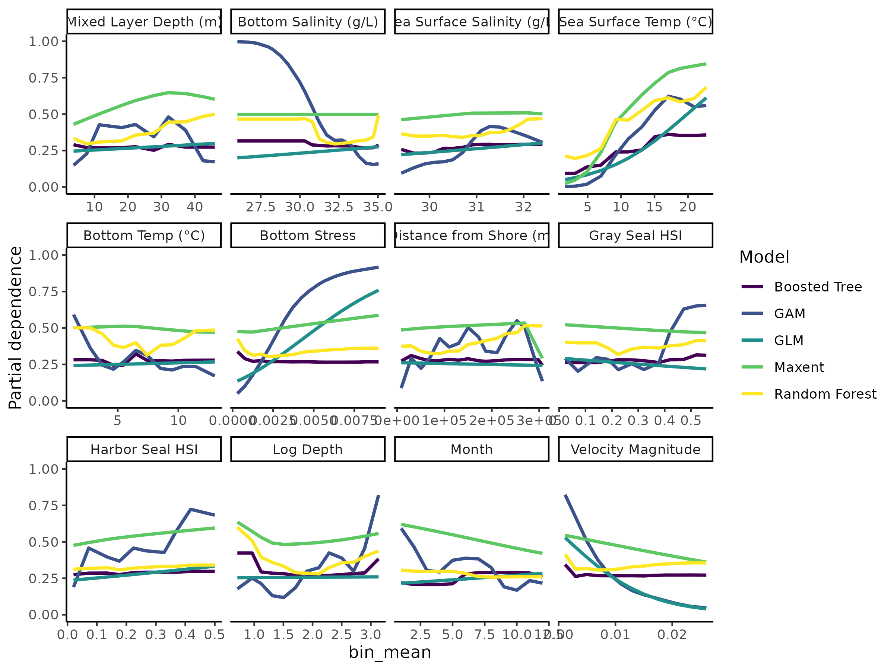

Habitat Suitability Report
================

## Inputs

- Species: White shark (Carcharodon carcharias)
- Thinning: Thinned satellite data (PSAT and SPOT)
- Ratio: All pseudo-absence/background points
- Spatial extent: Cropped to 750 m isobath
- Covariates used: all covariates (u and v become vel_mag) and seals
- Metrics: evaluated using all metrics

## Nowcast and Forecast Maps

Random Forest Nowcast and Forecast

| Nowcast | Forecast: RCP 8.5 2075 |
|:--:|:--:|
|  |  |

Boosted Trees Nowcast and Forecast

| Nowcast | Forecast: RCP 8.5 2075 |
|:--:|:--:|
|  |  |

Maxnet Trees Nowcast and Forecast

| Nowcast | Forecast: RCP 8.5 2075 |
|:--:|:--:|
|  |  |

GAM Nowcast and Forecast

| Nowcast | Forecast: RCP 8.5 2075 |
|:--:|:--:|
|  |  |

GLM Nowcast and Forecast

| Nowcast | Forecast: RCP 8.5 2075 |
|:--:|:--:|
|  |  |

## Metrics

| model_type |  accuracy |   roc_auc | boyce_cont | brier_class |   tss_max |
|:-----------|----------:|----------:|-----------:|------------:|----------:|
| rf         | 0.9573304 | 0.9923065 |  0.8280958 |   0.0347832 | 0.9732101 |
| bt         | 0.8161926 | 0.8810836 |  0.9060248 |   0.1315639 | 0.6426528 |
| maxnet     | 0.6006565 | 0.7363656 |  0.9493787 |   0.2276272 | 0.3980232 |
| gam        | 0.7680525 | 0.7739727 |  0.9712828 |   0.1583010 | 0.3956743 |
| glm        | 0.7231947 | 0.7124310 |  0.7741528 |   0.1754086 | 0.3776151 |

Metrics by model type

## Variable Importance

## Partial Dependence

