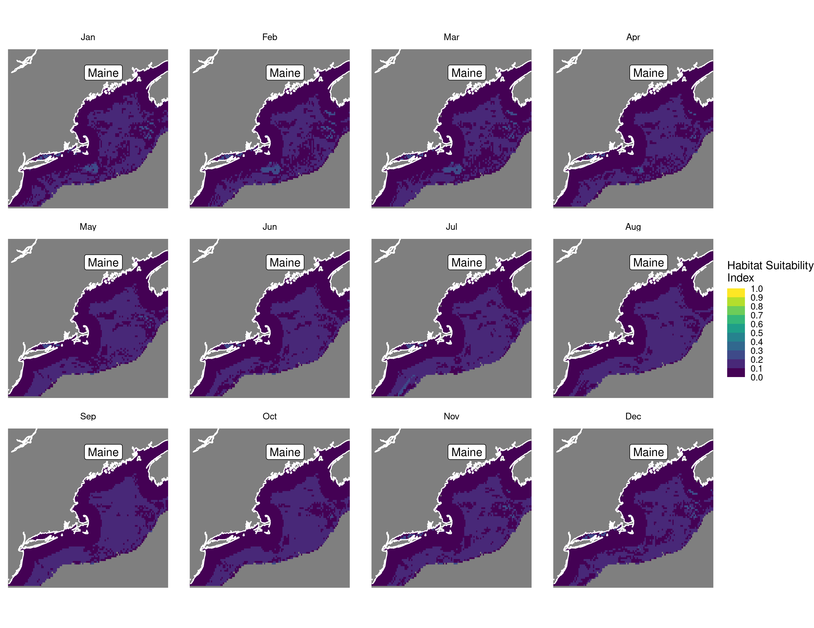
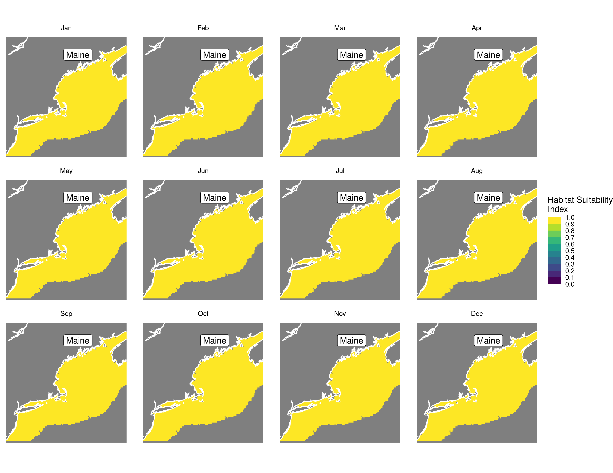

Habitat Suitability Report
================

## Inputs

- Species: White shark (Carcharodon carcharias)
- Thinning: Thinned satellite data (PSAT and SPOT)
- Ratio: All pseudo-absence/background points
- Spatial extent: Cropped to 750 m isobath
- Covariates used: non-seal (sst, tbtm, log depth, sbtm, seals, vel_mag,
  xbtm)
- Metrics: evaluated using all metrics

## Nowcast and Forecast Maps

Random Forest Nowcast and Forecast

| Nowcast | Forecast: RCP 8.5 2075 |
|:--:|:--:|
|  |  |

Boosted Trees Nowcast and Forecast

| Nowcast | Forecast: RCP 8.5 2075 |
|:--:|:--:|
|  |  |

Maxnet Trees Nowcast and Forecast

| Nowcast | Forecast: RCP 8.5 2075 |
|:--:|:--:|
|  |  |

GAM Nowcast and Forecast

| Nowcast | Forecast: RCP 8.5 2075 |
|:--:|:--:|
|  |  |

GLM Nowcast and Forecast

| Nowcast | Forecast: RCP 8.5 2075 |
|:--:|:--:|
|  |  |

## Metrics

| model_type |  accuracy |   roc_auc | boyce_cont | brier_class |   tss_max |
|:-----------|----------:|----------:|-----------:|------------:|----------:|
| rf         | 0.9675889 | 0.9929945 |  0.8306062 |   0.0315119 | 0.9679683 |
| bt         | 0.8197628 | 0.8387121 |  0.9450878 |   0.1323777 | 0.5075976 |
| maxnet     | 0.6411067 | 0.7619866 |  0.9359977 |   0.2256542 | 0.4483415 |
| gam        | 0.7905138 | 0.7676591 |  0.9311707 |   0.1468715 | 0.4120944 |
| glm        | 0.7620553 | 0.7255304 |  0.6686995 |   0.1570495 | 0.4296294 |

Metrics by model type

## Variable Importance

## Partial Dependence

