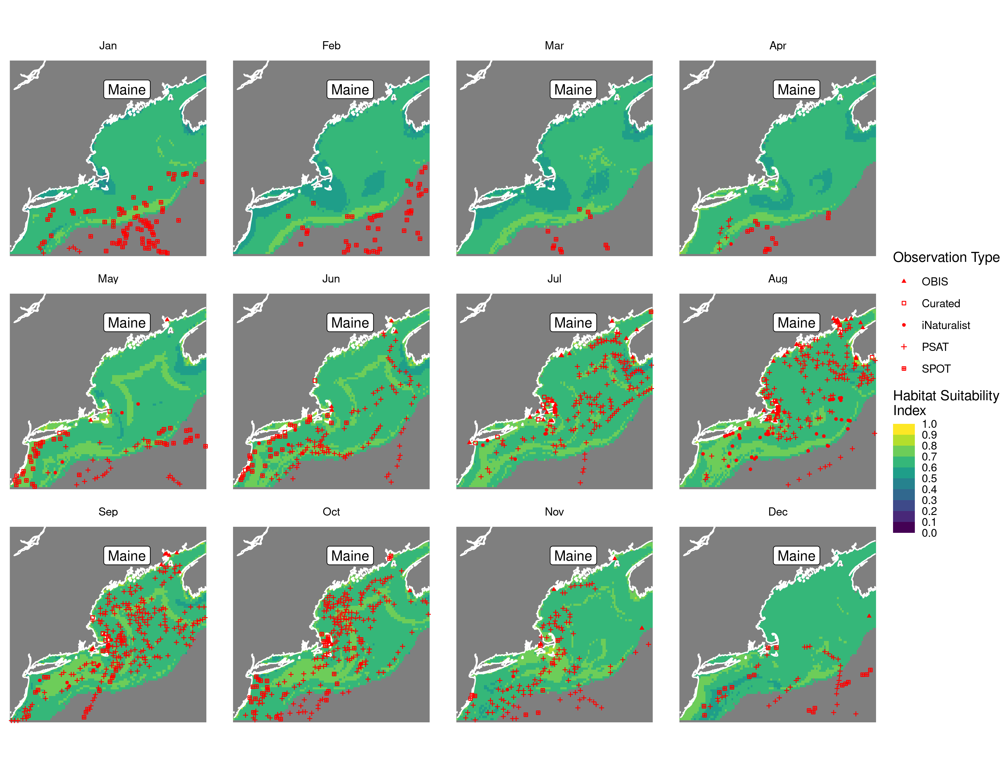
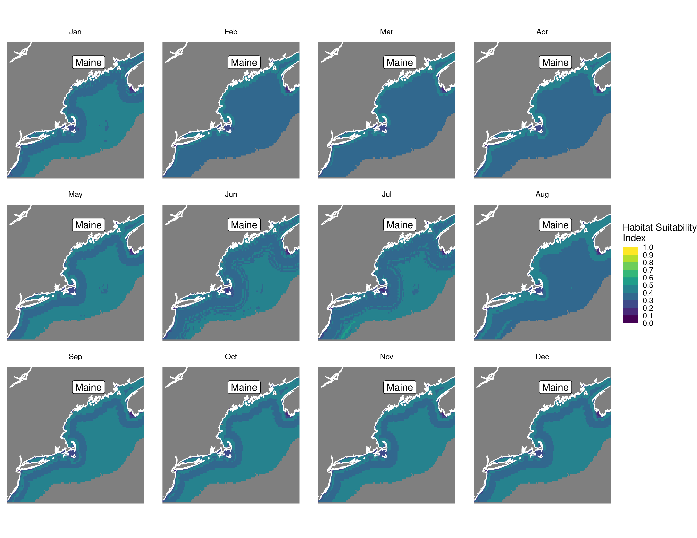
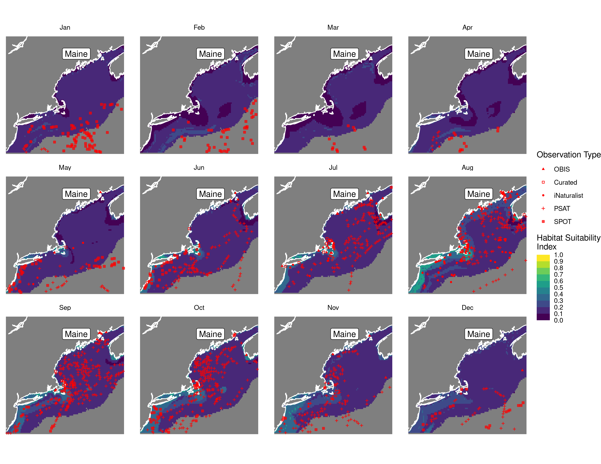
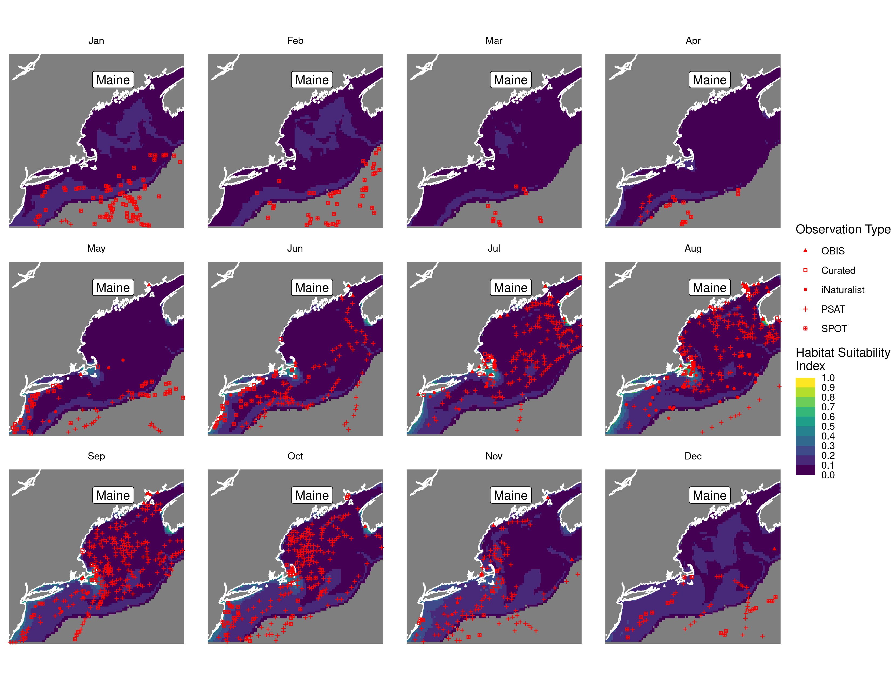
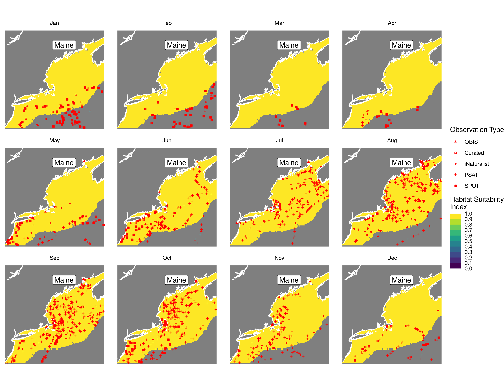
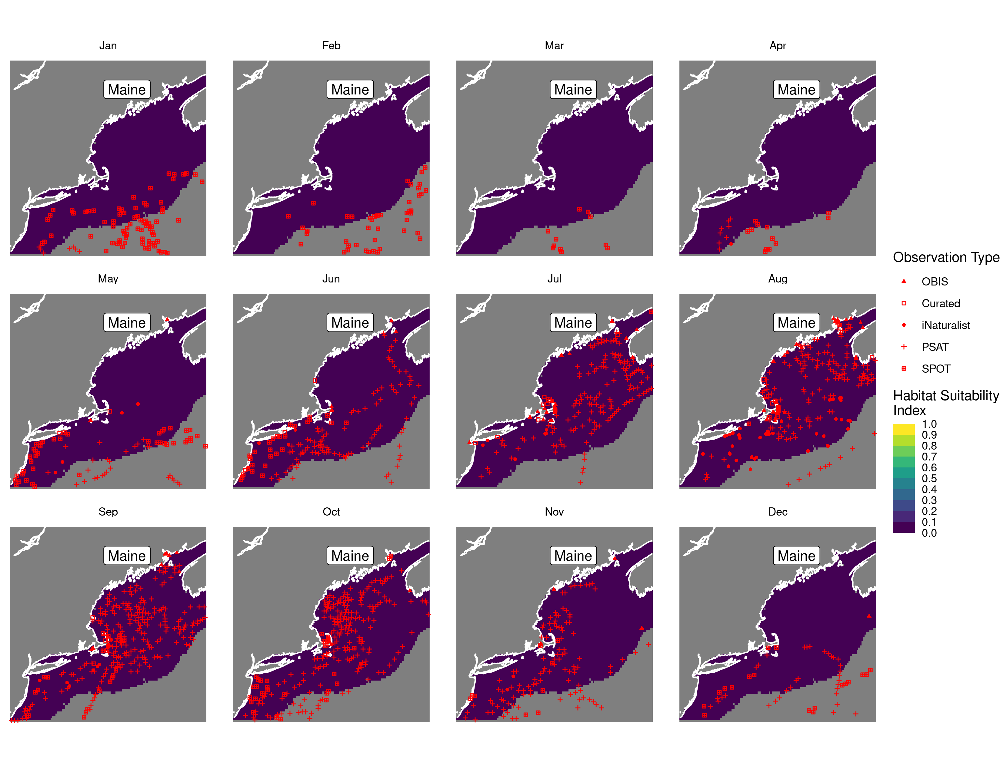
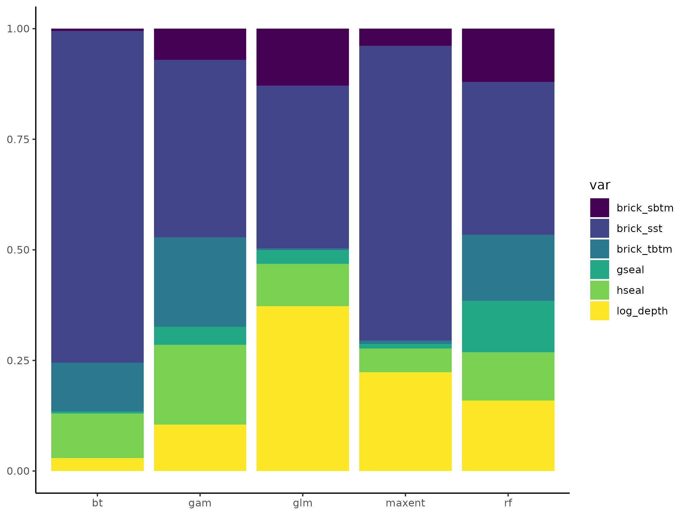
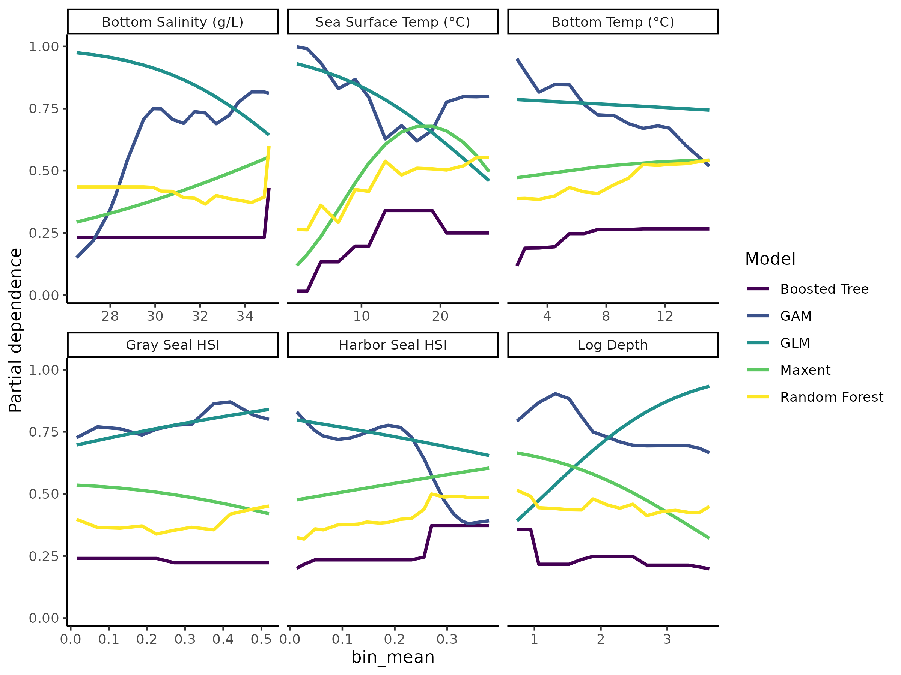

Habitat Suitability Report
================

## Inputs

- Species: White shark (Carcharodon carcharias)
- Thinning: Thinned satellite data (PSAT and SPOT)
- Ratio: All pseudo-absence/background points
- Spatial extent: Cropped to 750 m isobath
- Covariates used: shark specific v2 (sst, tbtm, sbtm, log depth, and
  seals)
- Metrics: evaluated using all metrics

## Nowcast and Forecast Maps

Random Forest Nowcast and Forecast

| Nowcast | Forecast: RCP 8.5 2075 |
|:--:|:--:|
|  |  |

Boosted Trees Nowcast and Forecast

| Nowcast | Forecast: RCP 8.5 2075 |
|:--:|:--:|
|  |  |

Maxnet Trees Nowcast and Forecast

| Nowcast | Forecast: RCP 8.5 2075 |
|:--:|:--:|
|  |  |

GAM Nowcast and Forecast

| Nowcast | Forecast: RCP 8.5 2075 |
|:--:|:--:|
|  |  |

GLM Nowcast and Forecast

| Nowcast | Forecast: RCP 8.5 2075 |
|:--:|:--:|
|  |  |

## Metrics

| model_type |  accuracy |   roc_auc | boyce_cont | brier_class |   tss_max |
|:-----------|----------:|----------:|-----------:|------------:|----------:|
| rf         | 0.9533597 | 0.9951181 |  0.9544225 |   0.0357286 | 0.9646428 |
| bt         | 0.7810277 | 0.7823366 |  0.9616458 |   0.1458609 | 0.4590908 |
| maxnet     | 0.6592885 | 0.7617952 |  0.9384233 |   0.2292104 | 0.4554144 |
| gam        | 0.7865613 | 0.7748986 |  0.9111825 |   0.1457023 | 0.4449628 |
| glm        | 0.7723320 | 0.7219035 |  0.8424471 |   0.1584055 | 0.4165969 |

Metrics by model type

## Variable Importance

## Partial Dependence

