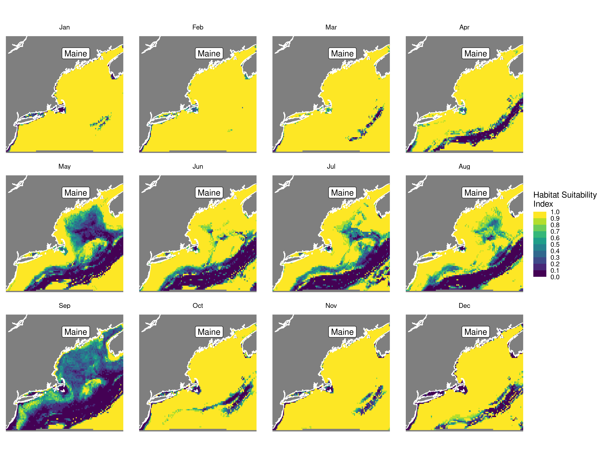

Habitat Suitability Report
================

## Inputs

- Species: Gray seal (Halichoerus grypus)
- Thinning: Thinned observations
- Ratio: All pseudo-absence/background points
- Spatial extent: Full extent
- Covariates used: all covariates (u and v become vel_mag)
- Metrics: evaluated using true skill statistic (tss)

## Nowcast and Forecast Maps

Random Forest Nowcast and Forecast

| Nowcast | Forecast: RCP 8.5 2075 |
|:--:|:--:|
|  |  |

Boosted Trees Nowcast and Forecast

| Nowcast | Forecast: RCP 8.5 2075 |
|:--:|:--:|
|  |  |

Maxnet Trees Nowcast and Forecast

| Nowcast | Forecast: RCP 8.5 2075 |
|:--:|:--:|
|  |  |

GAM Nowcast and Forecast

| Nowcast | Forecast: RCP 8.5 2075 |
|:--:|:--:|
|  |  |

GLM Nowcast and Forecast

| Nowcast | Forecast: RCP 8.5 2075 |
|:--:|:--:|
|  |  |

## Metrics

| model_type |   tss_max |
|:-----------|----------:|
| rf         | 0.9925023 |
| bt         | 0.9542708 |
| maxnet     | 0.7640177 |
| gam        | 0.7808874 |
| glm        | 0.6618621 |

Metrics by model type

## Variable Importance

## Partial Dependence

