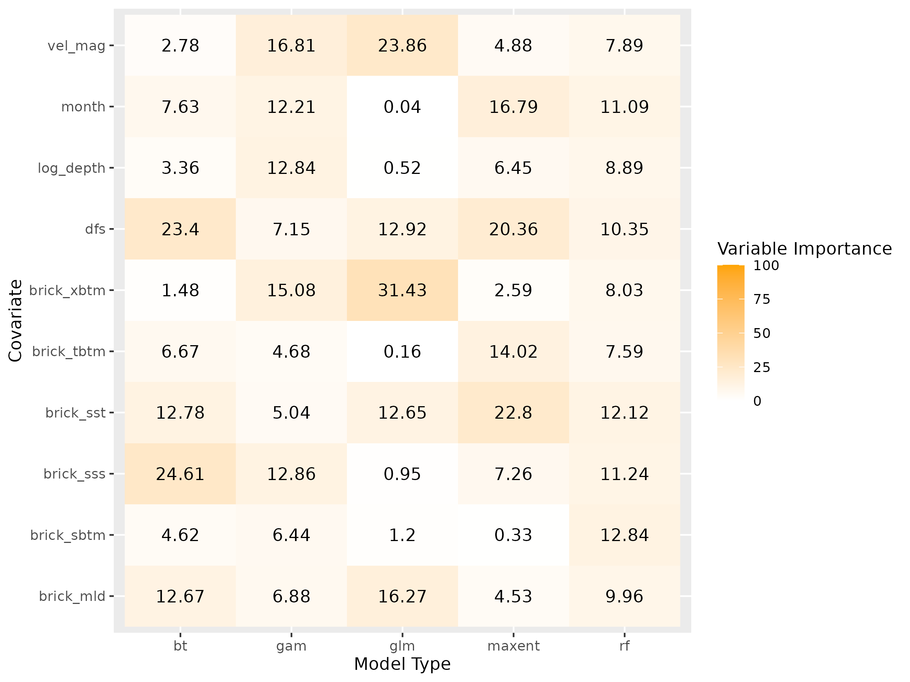
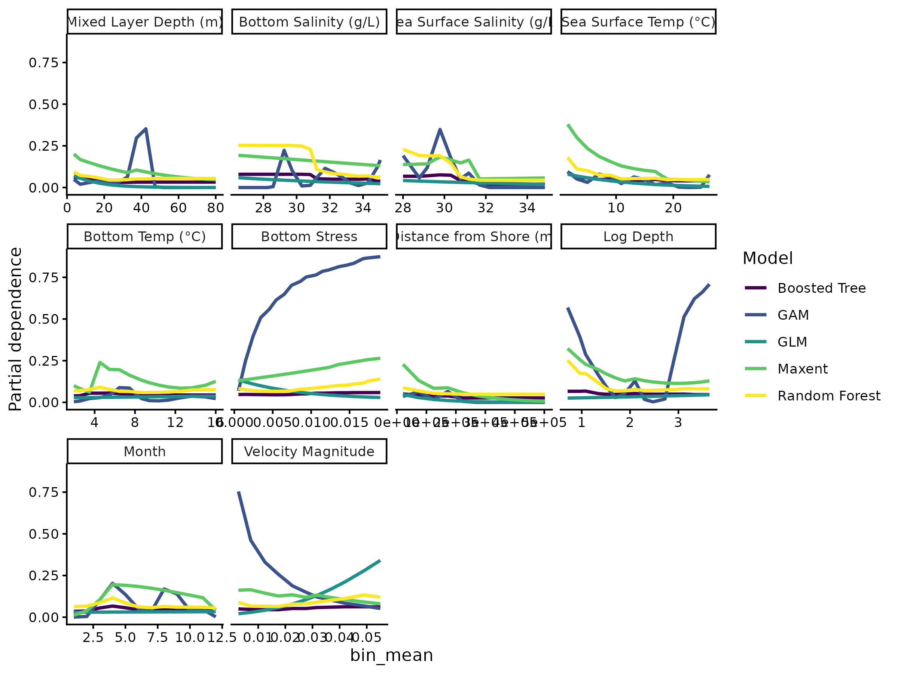

Habitat Suitability Report
================

## Inputs

- Species: Gray seal (Halichoerus grypus)
- Thinning: Thinned observations
- Ratio: All pseudo-absence/background points
- Spatial extent: Full extent
- Covariates used: all covariates (u and v become vel_mag)
- Metrics: evaluated using true skill staistic (tss) and area under the
  receiver operator curve (roc_auc)
- Observations:

## Nowcast and Forecast Maps

Random Forest Nowcast and Forecast

| Nowcast | Forecast: RCP 8.5 2075 |
|:--:|:--:|
|  |  |

Boosted Trees Nowcast and Forecast

| Nowcast | Forecast: RCP 8.5 2075 |
|:--:|:--:|
|  |  |

Maxnet Trees Nowcast and Forecast

| Nowcast | Forecast: RCP 8.5 2075 |
|:--:|:--:|
|  |  |

GAM Nowcast and Forecast

| Nowcast | Forecast: RCP 8.5 2075 |
|:--:|:--:|
|  |  |

GLM Nowcast and Forecast

| Nowcast | Forecast: RCP 8.5 2075 |
|:--:|:--:|
|  |  |

## Metrics

| model_type |   roc_auc |   tss_max | percent_deviance_explained |
|:-----------|----------:|----------:|---------------------------:|
| rf         | 0.9982945 | 0.9822097 |                  0.7096832 |
| bt         | 0.9616774 | 0.7862493 |                  0.5088437 |
| maxnet     | 0.9102796 | 0.7312734 |                         NA |
| gam        | 0.8255083 | 0.5385233 |                 -0.2949016 |
| glm        | 0.8317616 | 0.5901552 |                  0.1677956 |

Metrics by model type

## Variable Importance

## Partial Dependence

