Habitat Suitability Report
================

## Inputs

- Species: Gray seal (Halichoerus grypus)
- Thinning: Thinned observations
- Ratio: All pseudo-absence/background points
- Spatial extent: Full extent
- Covariates used: seal specific v2 (sss, dfs, month, mld)
- Metrics: evaluated using true skill staistic (tss) and area under the
  receiver operator curve (roc_auc)
- Observations:

## Nowcast and Forecast Maps

Random Forest Nowcast and Forecast

| Nowcast | Forecast: RCP 8.5 2075 |
|:--:|:--:|
|  | 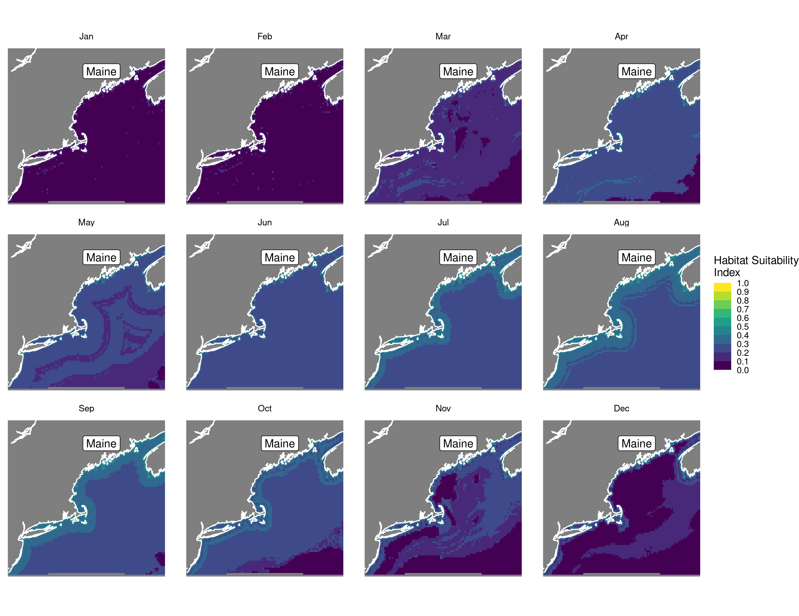 |

Boosted Trees Nowcast and Forecast

| Nowcast | Forecast: RCP 8.5 2075 |
|:--:|:--:|
| 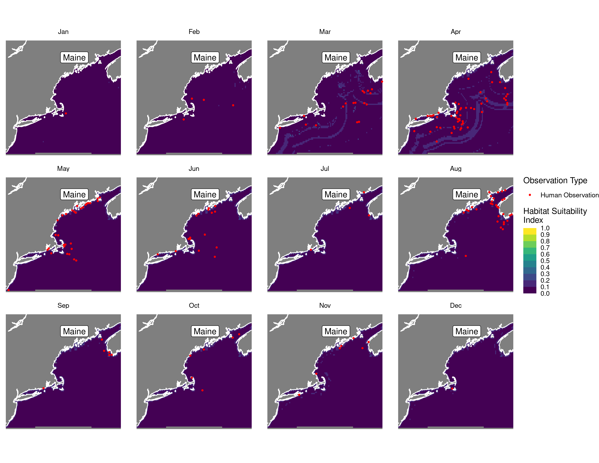 | 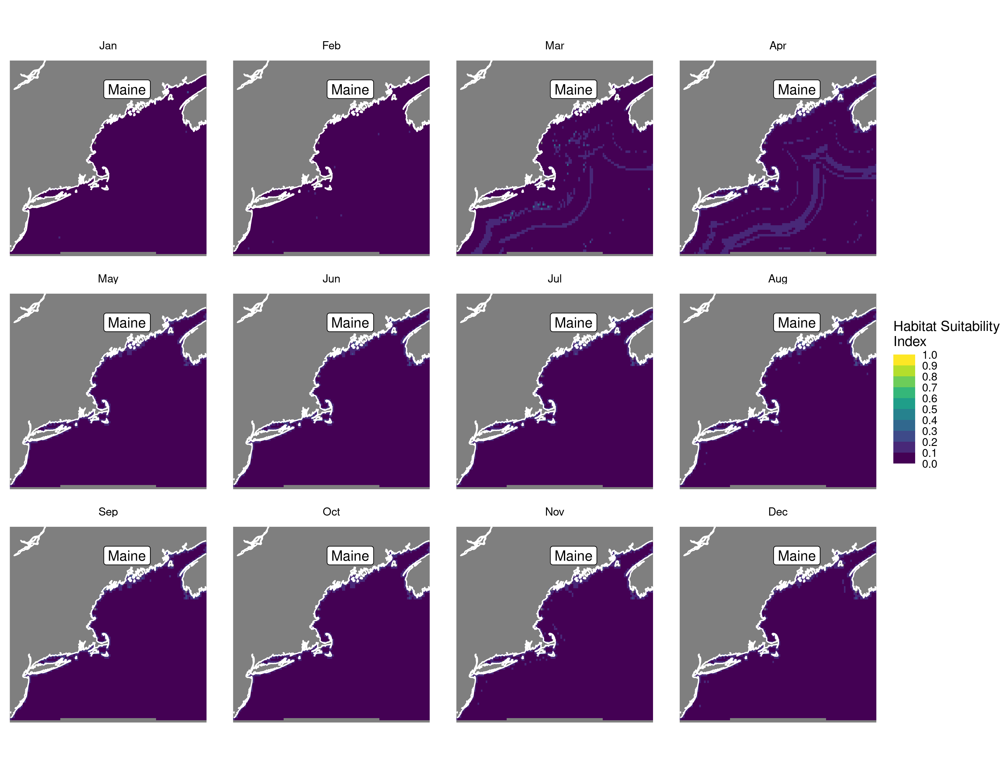 |

Maxnet Trees Nowcast and Forecast

| Nowcast | Forecast: RCP 8.5 2075 |
|:--:|:--:|
| 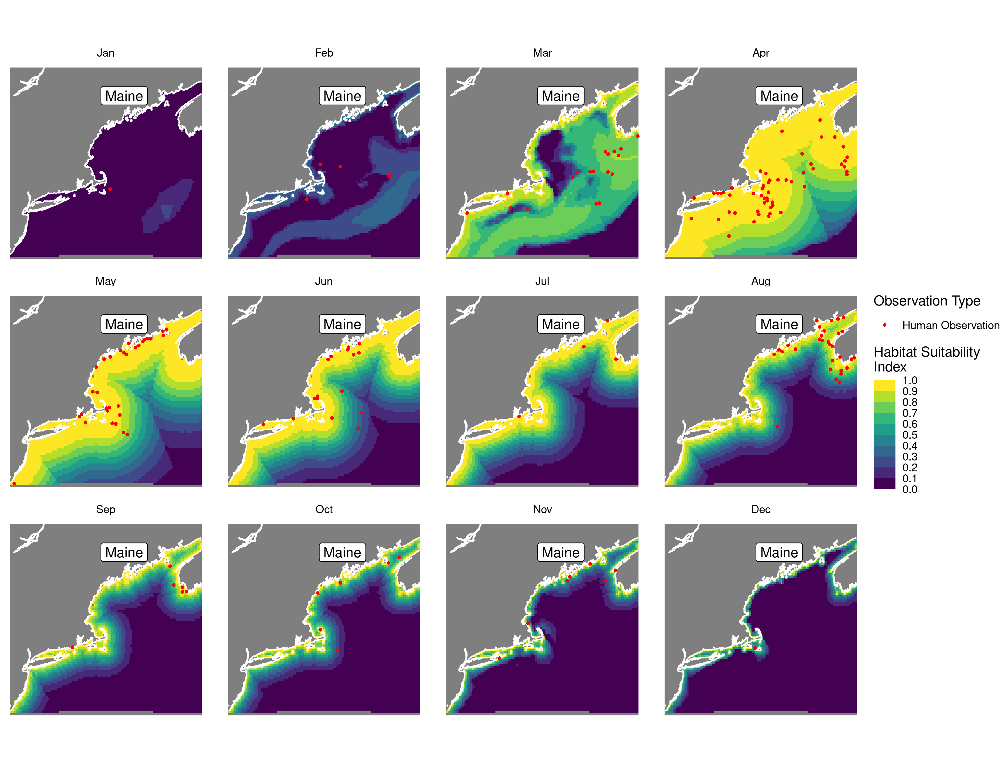 | 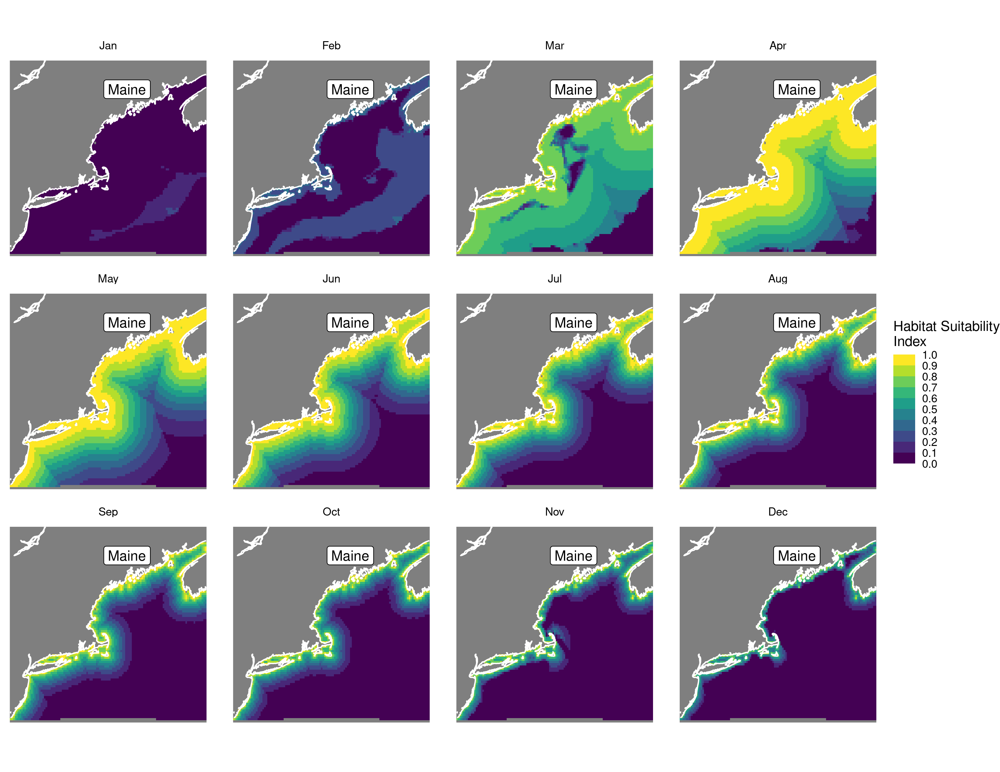 |

GAM Nowcast and Forecast

| Nowcast | Forecast: RCP 8.5 2075 |
|:--:|:--:|
| 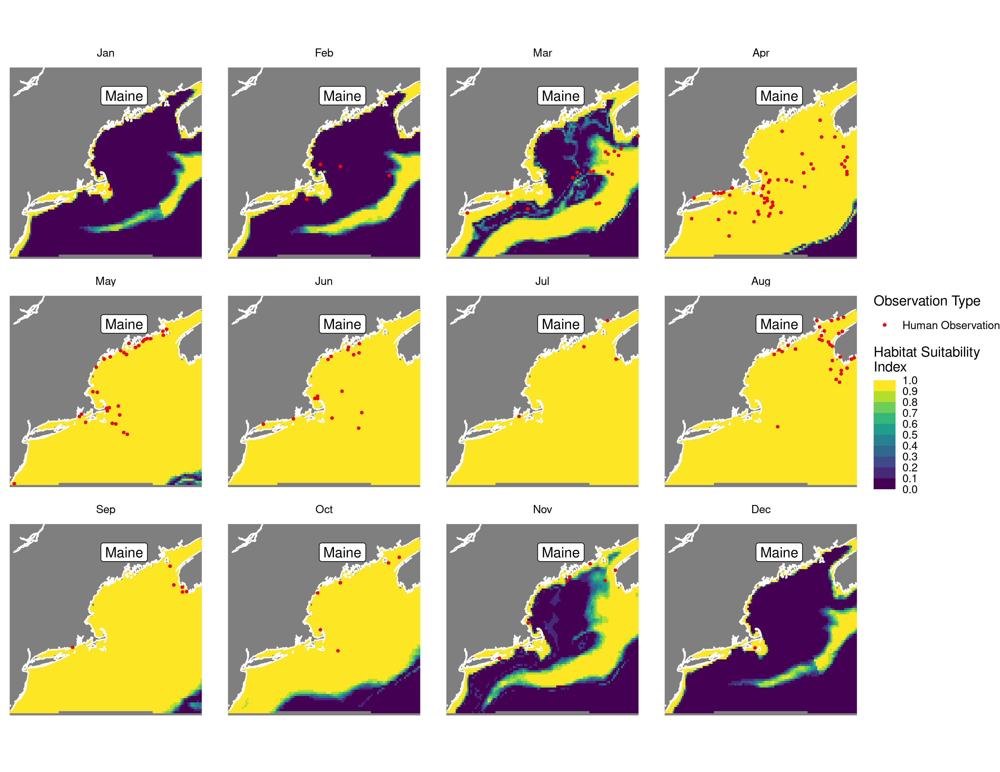 | 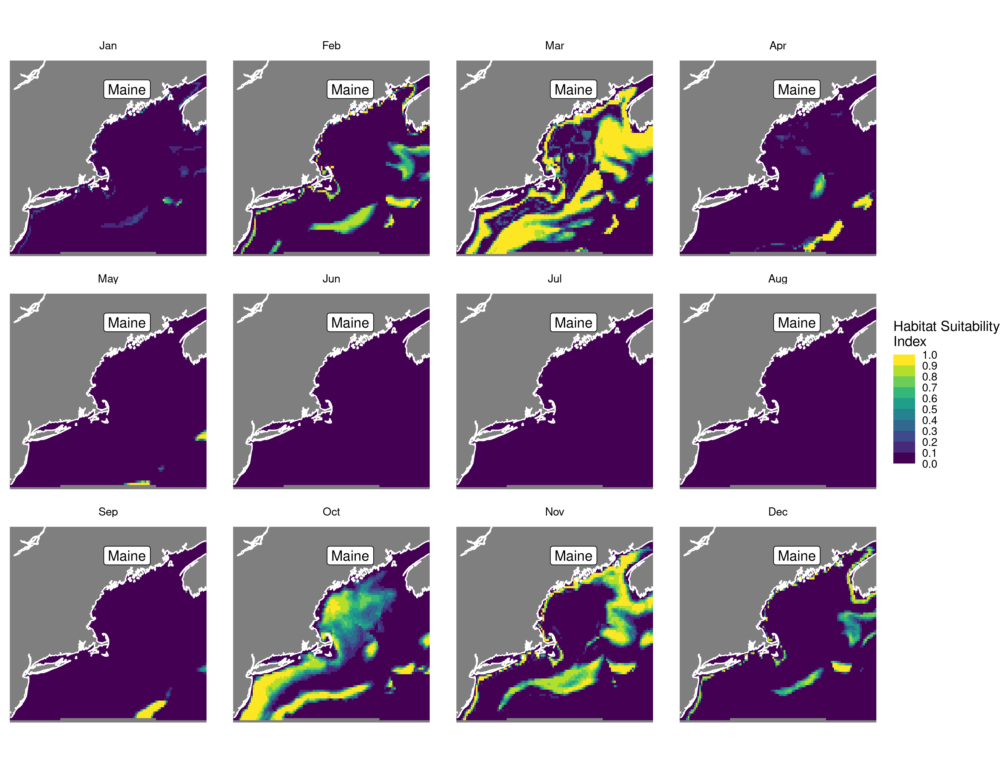 |

GLM Nowcast and Forecast

| Nowcast | Forecast: RCP 8.5 2075 |
|:--:|:--:|
| 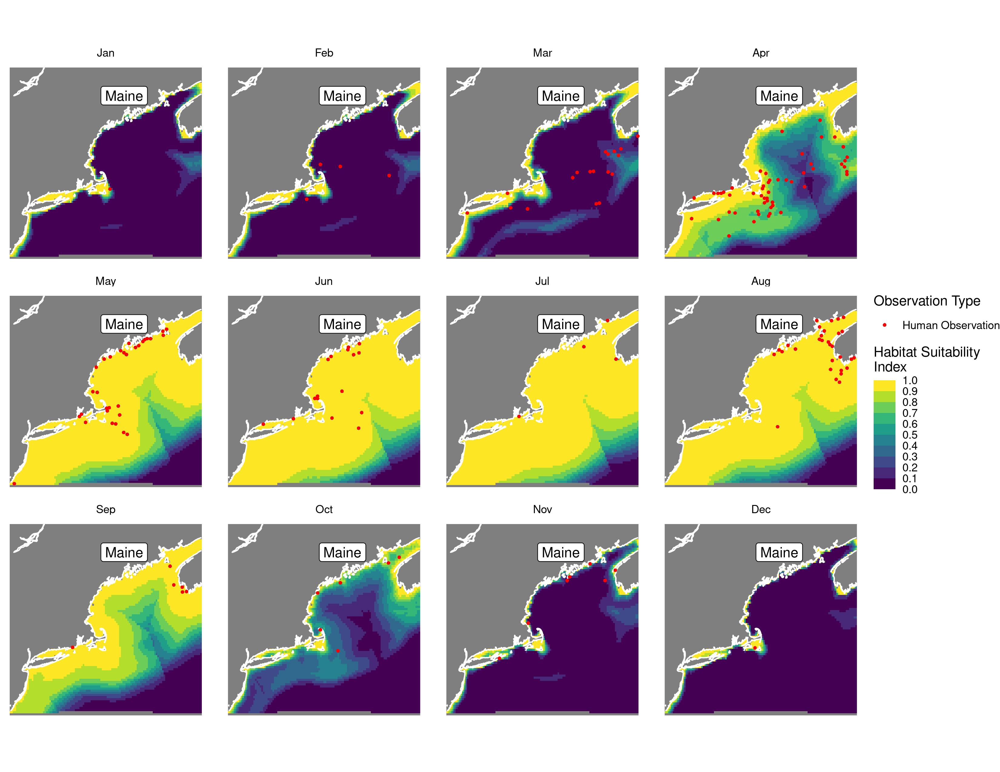 | 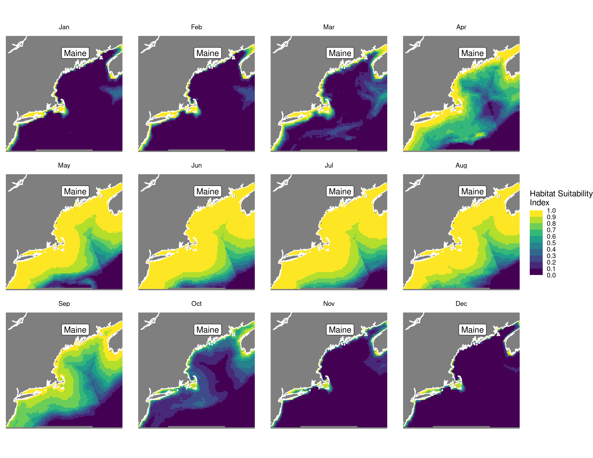 |

## Metrics

| model_type |   roc_auc |   tss_max | percent_deviance_explained |
|:-----------|----------:|----------:|---------------------------:|
| rf         | 0.9517820 | 0.7553459 |                  0.5121988 |
| bt         | 0.8737683 | 0.5990566 |                  0.3317698 |
| maxnet     | 0.8530660 | 0.5420335 |                         NA |
| gam        | 0.8510482 | 0.6380503 |                  0.2070794 |
| glm        | 0.7640461 | 0.4072327 |                  0.0963984 |

Metrics by model type

## Variable Importance

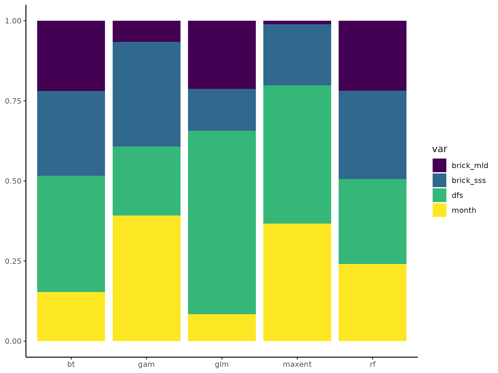

## Partial Dependence

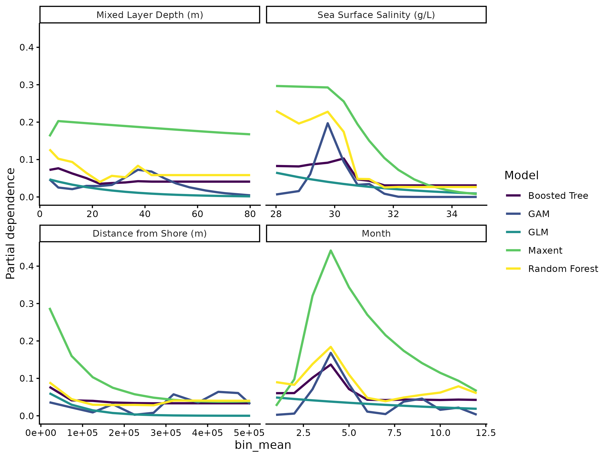
