Habitat Suitability Report
================

## Inputs

- Species: Harbor seal (Phoca vitulina)
- Thinning: Thinned observations
- Ratio: All pseudo-absence/background points
- Spatial extent: Full extent
- Covariates used: all covariates (u and v become vel_mag)
- Metrics: evaluated using all metrics

## Nowcast and Forecast Maps

Random Forest Nowcast and Forecast

| Nowcast | Forecast: RCP 8.5 2075 |
|:--:|:--:|
| 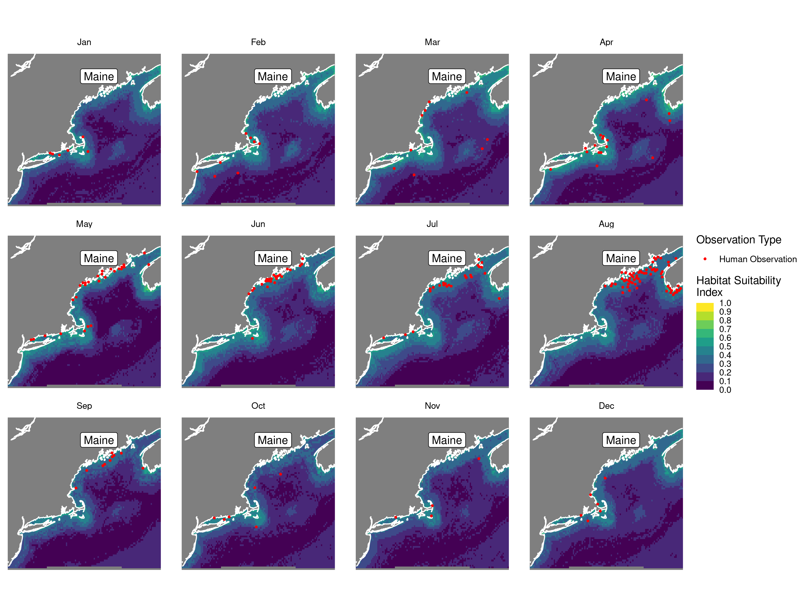 | 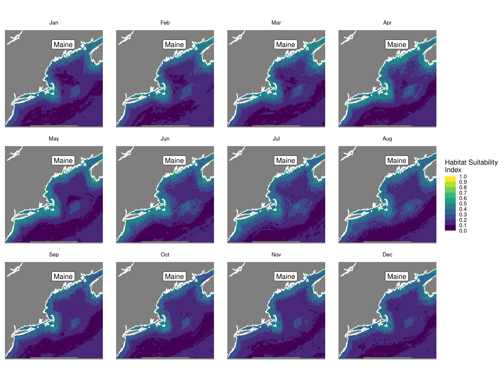 |

Boosted Trees Nowcast and Forecast

| Nowcast | Forecast: RCP 8.5 2075 |
|:--:|:--:|
| 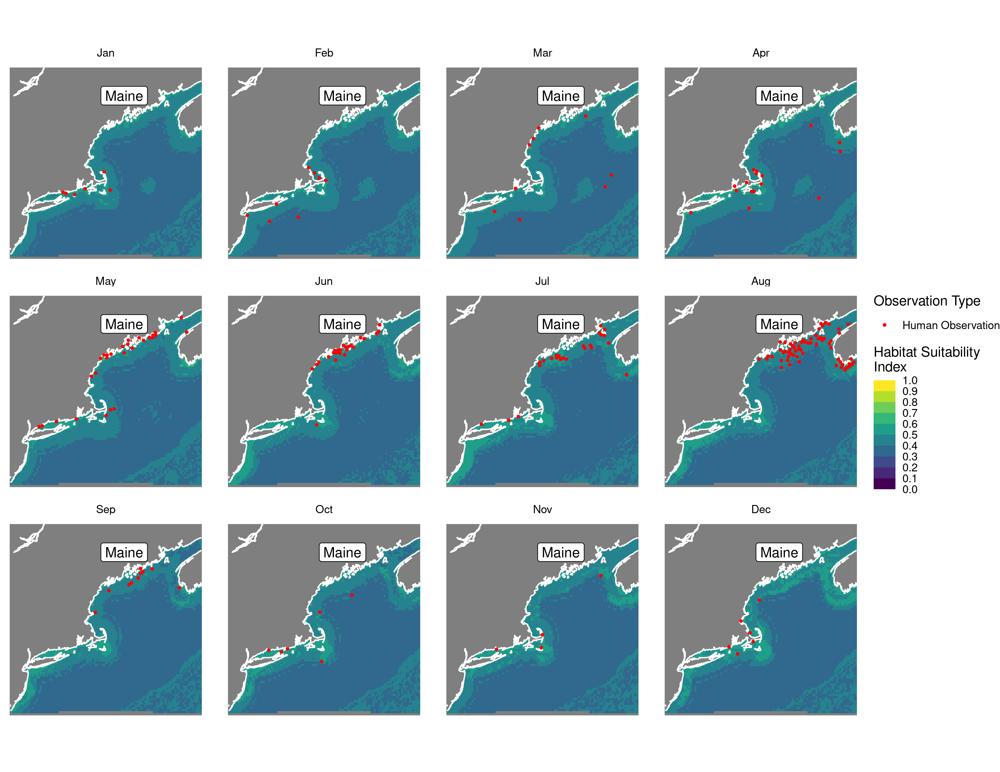 | 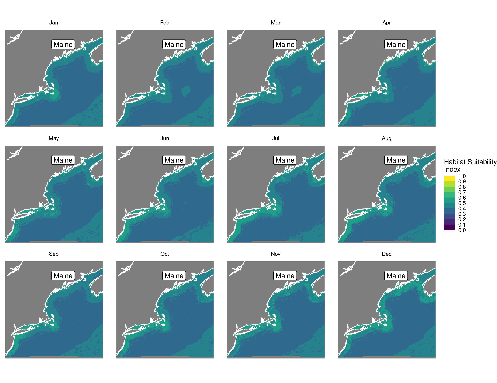 |

Maxnet Trees Nowcast and Forecast

| Nowcast | Forecast: RCP 8.5 2075 |
|:--:|:--:|
| 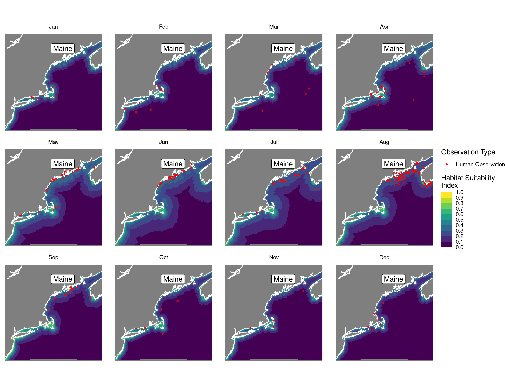 | 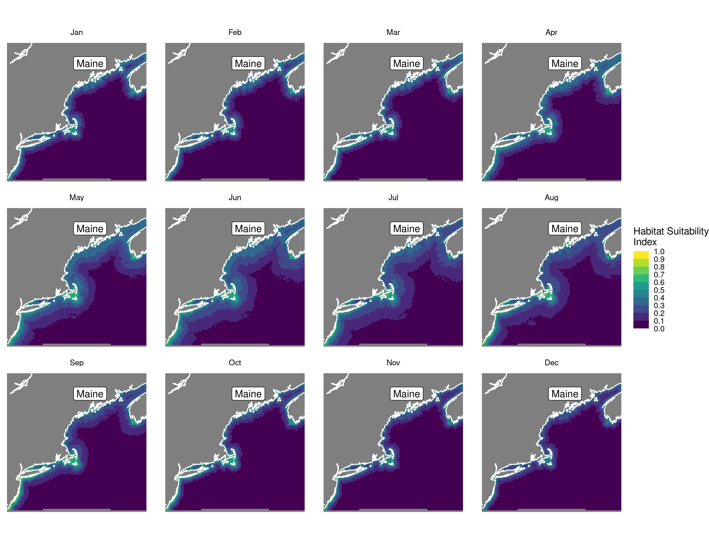 |

GAM Nowcast and Forecast

| Nowcast | Forecast: RCP 8.5 2075 |
|:--:|:--:|
| 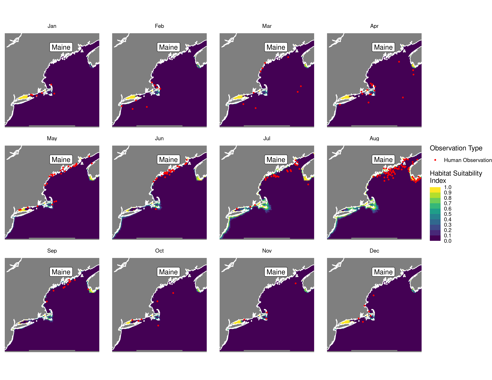 | 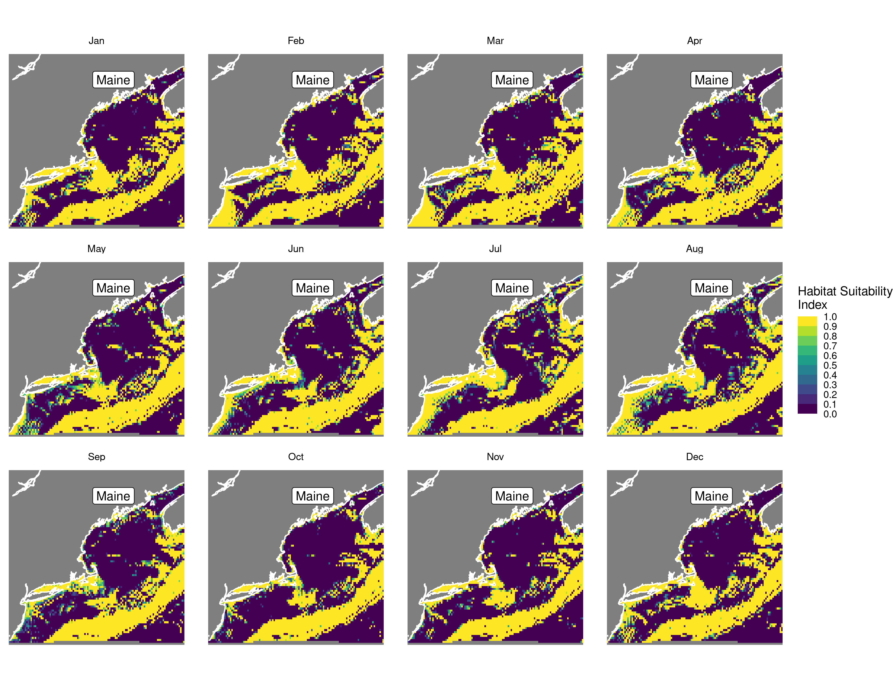 |

GLM Nowcast and Forecast

| Nowcast | Forecast: RCP 8.5 2075 |
|:--:|:--:|
| 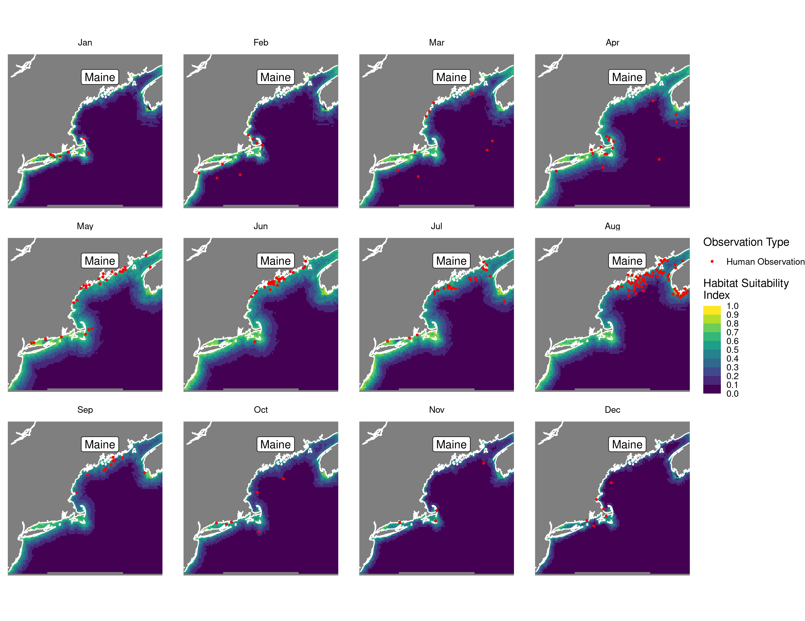 | 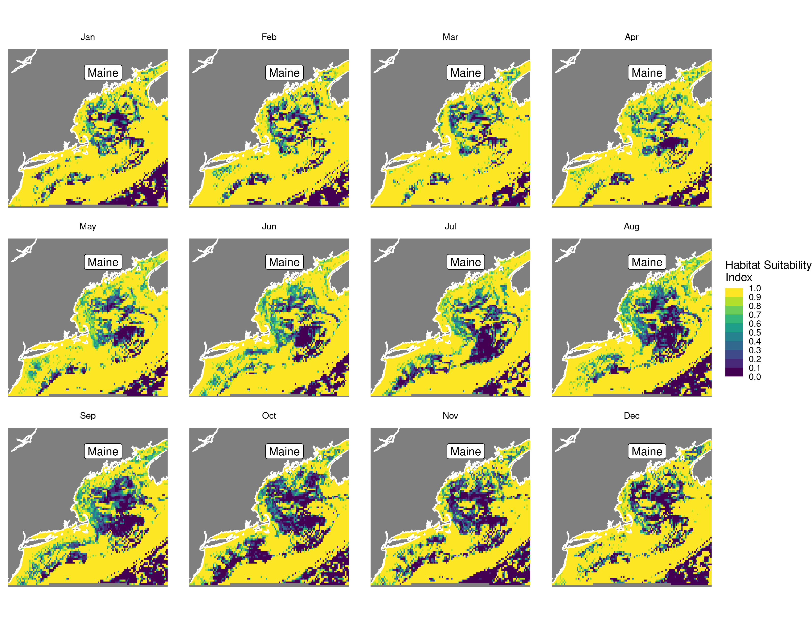 |

## Metrics

| model_type |  accuracy |   roc_auc | boyce_cont | brier_class |   tss_max |
|:-----------|----------:|----------:|-----------:|------------:|----------:|
| rf         | 0.8750000 | 0.9438098 |  0.9354546 |   0.0926611 | 0.8020994 |
| bt         | 0.8583333 | 0.9299166 |  0.8328331 |   0.1696655 | 0.7388083 |
| maxnet     | 0.8500000 | 0.9252856 |  0.8970645 |   0.1130460 | 0.7134918 |
| gam        | 0.8750000 | 0.9272924 |  0.8928042 |   0.0918569 | 0.8119790 |
| glm        | 0.8250000 | 0.9163322 |  0.7761717 |   0.1187291 | 0.7298549 |

Metrics by model type

## Variable Importance

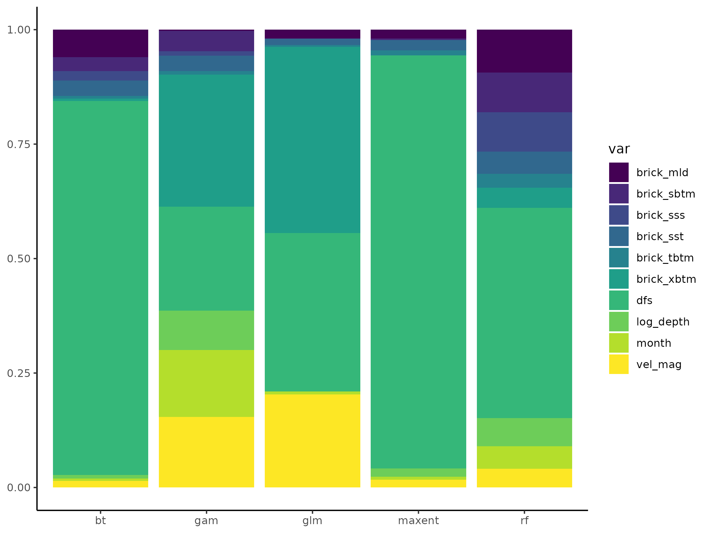

## Partial Dependence

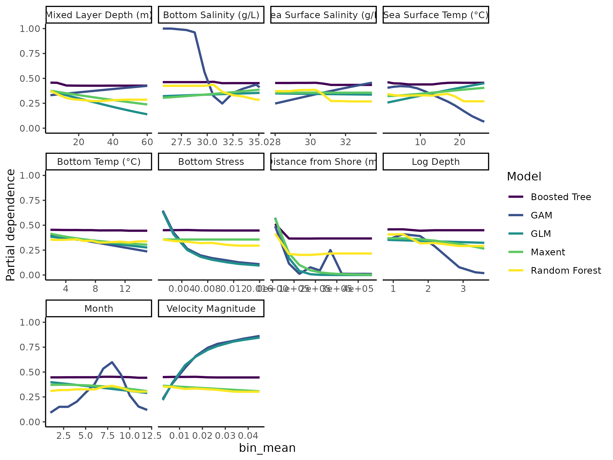
