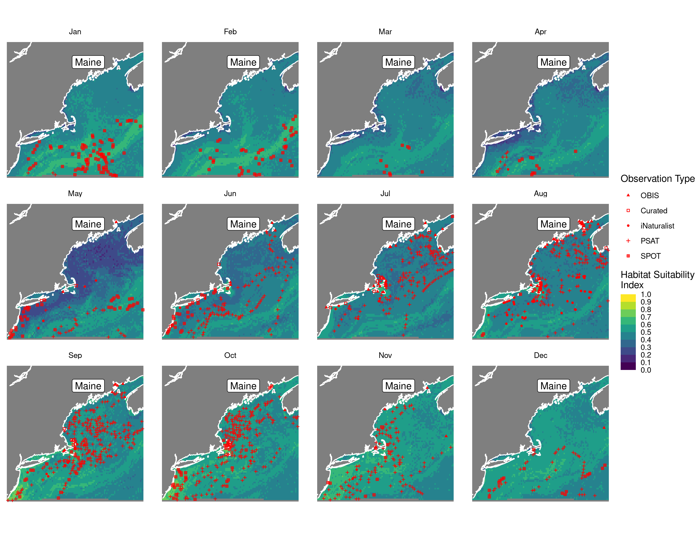
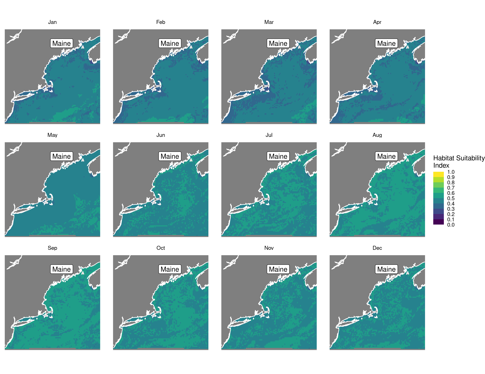
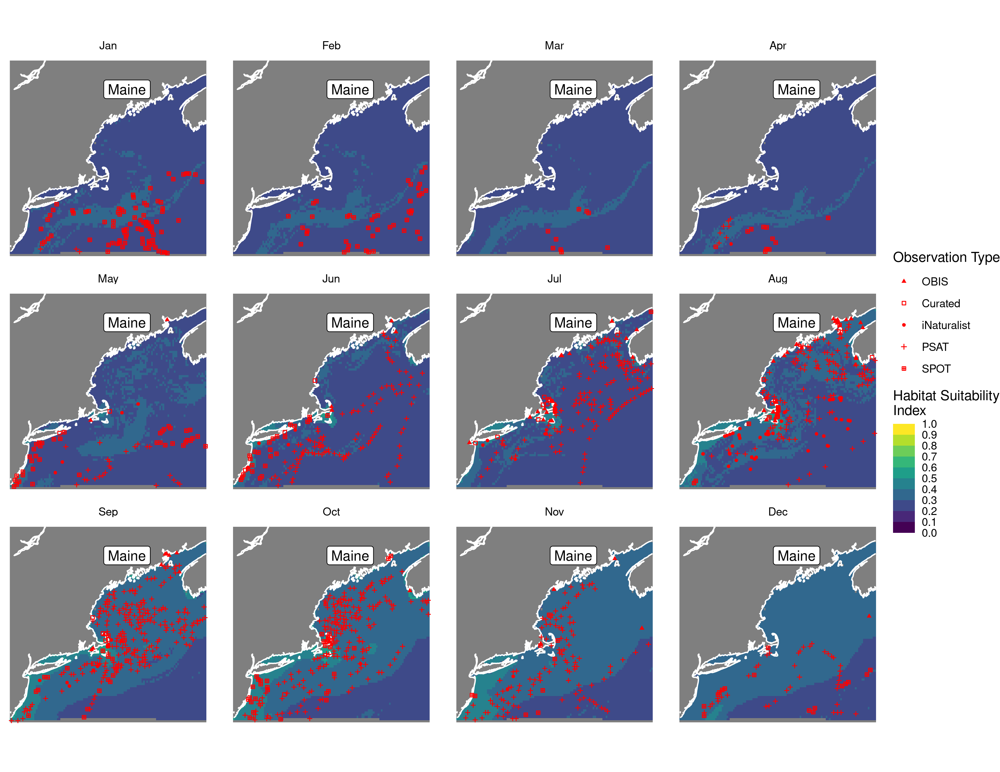
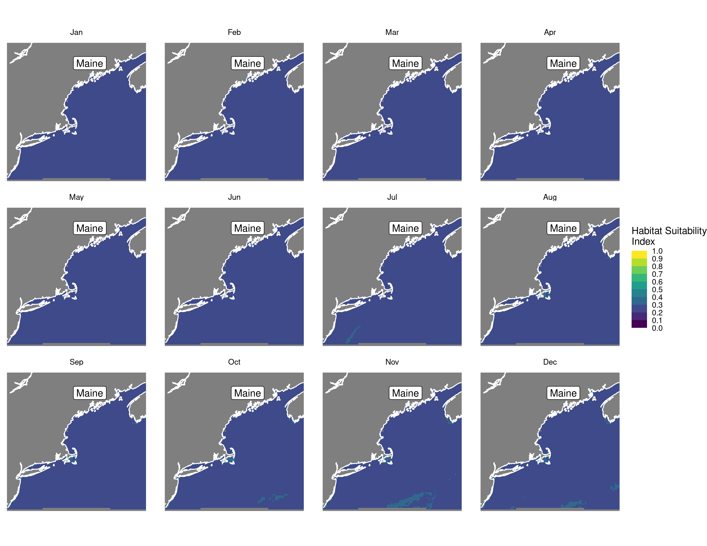
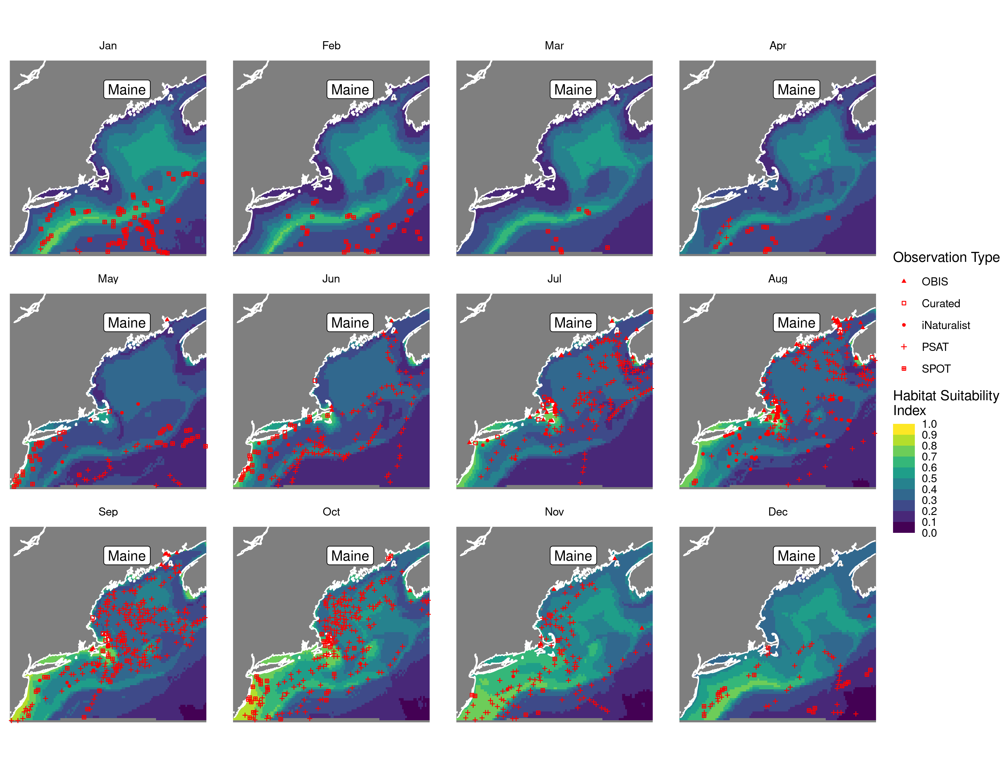
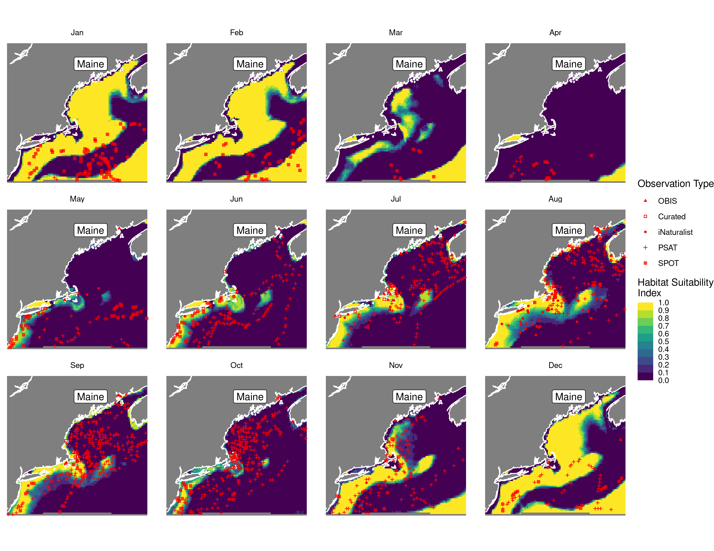
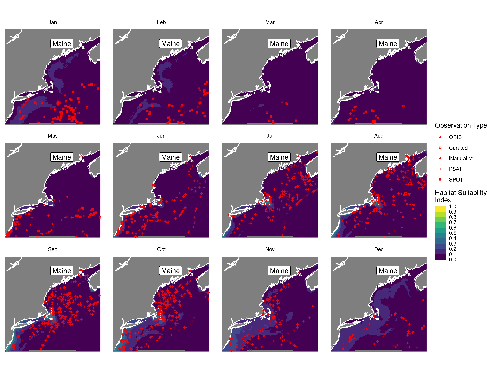
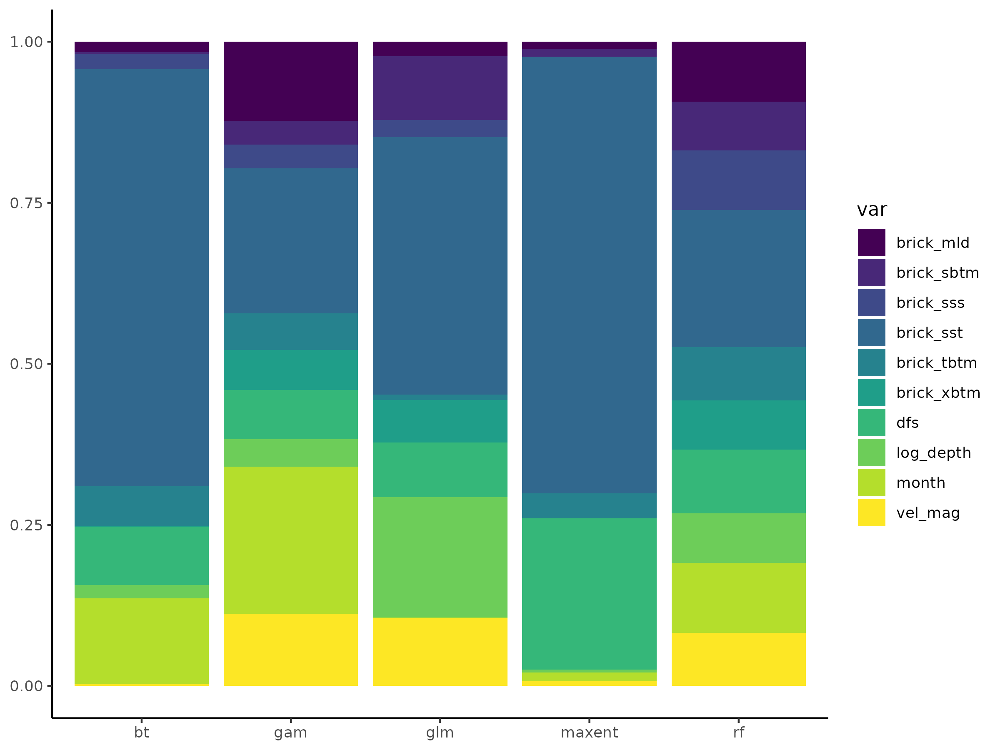
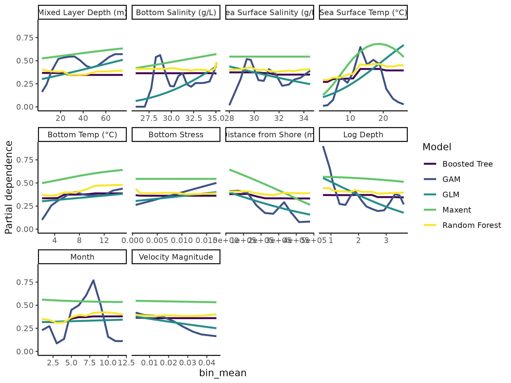

Habitat Suitability Report
================

## Inputs

- Species: White shark (Carcharodon carcharias)
- Thinning: Thinned satellite data (PSAT and SPOT)
- Ratio: 1:2 observation:pseudo-absence ratio
- Spatial extent: Full extent
- Covariates used: all covariates (u and v become vel_mag)
- Metrics: evaluated using all metrics

## Nowcast and Forecast Maps

Random Forest Nowcast and Forecast

| Nowcast | Forecast: RCP 8.5 2075 |
|:--:|:--:|
|  |  |

Boosted Trees Nowcast and Forecast

| Nowcast | Forecast: RCP 8.5 2075 |
|:--:|:--:|
|  |  |

Maxnet Trees Nowcast and Forecast

| Nowcast | Forecast: RCP 8.5 2075 |
|:--:|:--:|
|  |  |

GAM Nowcast and Forecast

| Nowcast | Forecast: RCP 8.5 2075 |
|:--:|:--:|
|  |  |

GLM Nowcast and Forecast

| Nowcast | Forecast: RCP 8.5 2075 |
|:--:|:--:|
|  |  |

## Metrics

| model_type |  accuracy |   roc_auc | boyce_cont | brier_class |   tss_max |
|:-----------|----------:|----------:|-----------:|------------:|----------:|
| rf         | 0.9269406 | 0.9878554 |  0.9116002 |   0.0615591 | 0.9075342 |
| bt         | 0.7226027 | 0.7697416 |  0.7185047 |   0.1895655 | 0.4246575 |
| maxnet     | 0.6643836 | 0.7634641 |  0.9512421 |   0.2148328 | 0.4452055 |
| gam        | 0.7488584 | 0.7902573 |  0.9813550 |   0.1714463 | 0.4383562 |
| glm        | 0.6906393 | 0.7203978 |  0.8137043 |   0.1905822 | 0.4315068 |

Metrics by model type

## Variable Importance

## Partial Dependence

