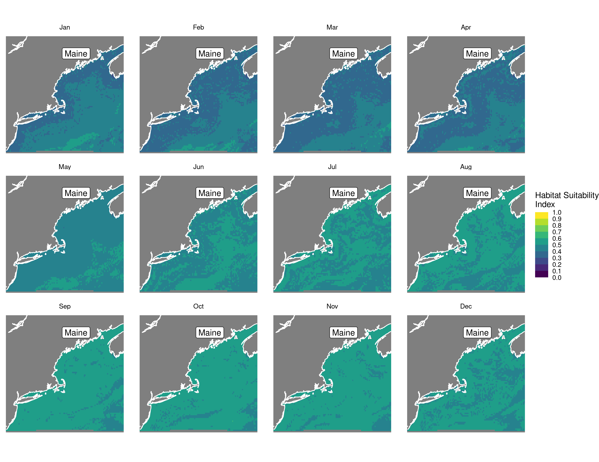
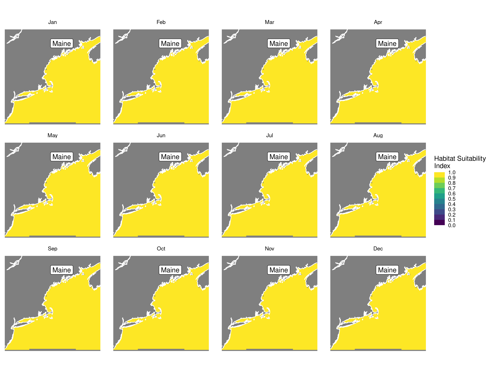
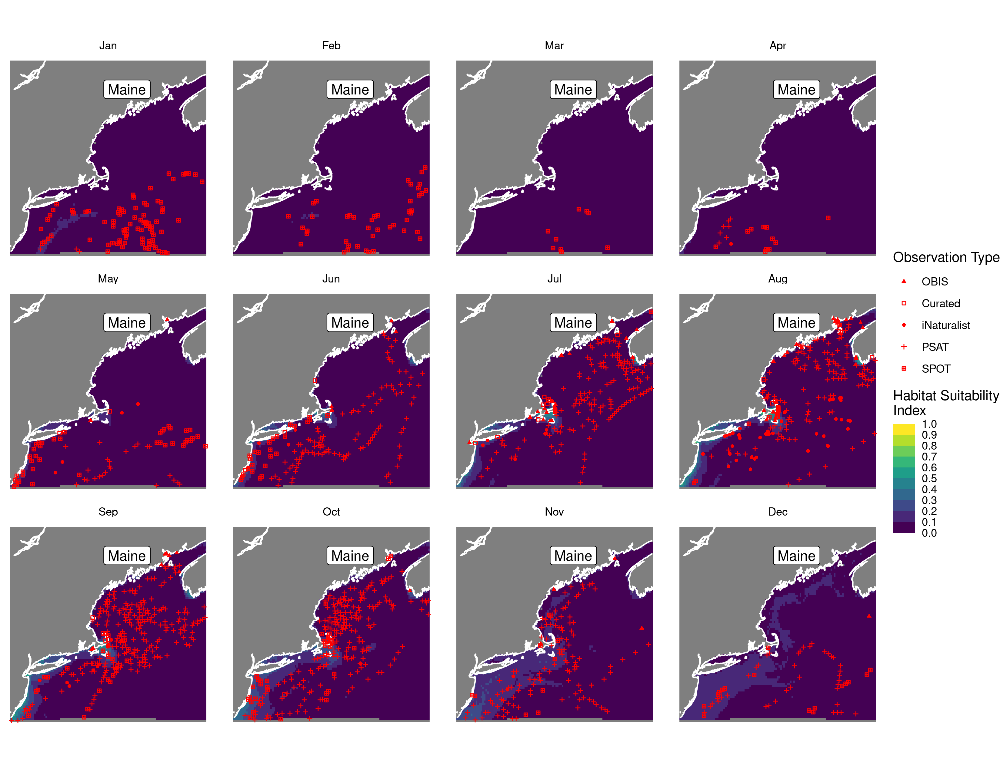

Habitat Suitability Report
================

## Inputs

- Species: White shark (Carcharodon carcharias)
- Thinning: Thinned satellite data (PSAT and SPOT)
- Ratio: 1:2 observation:pseudo-absence ratio
- Spatial extent: Full extent
- Covariates used: all covariates (u and v become vel_mag) and seals
- Metrics: evaluated using all metrics

## Nowcast and Forecast Maps

Random Forest Nowcast and Forecast

| Nowcast | Forecast: RCP 8.5 2075 |
|:--:|:--:|
|  |  |

Boosted Trees Nowcast and Forecast

| Nowcast | Forecast: RCP 8.5 2075 |
|:--:|:--:|
|  |  |

Maxnet Trees Nowcast and Forecast

| Nowcast | Forecast: RCP 8.5 2075 |
|:--:|:--:|
|  |  |

GAM Nowcast and Forecast

| Nowcast | Forecast: RCP 8.5 2075 |
|:--:|:--:|
|  |  |

GLM Nowcast and Forecast

| Nowcast | Forecast: RCP 8.5 2075 |
|:--:|:--:|
|  |  |

## Metrics

| model_type |  accuracy |   roc_auc | boyce_cont | brier_class |   tss_max |
|:-----------|----------:|----------:|-----------:|------------:|----------:|
| rf         | 0.9459770 | 0.9915581 |  0.9387047 |   0.0534311 | 0.9325243 |
| bt         | 0.7816092 | 0.8292168 |  0.9825062 |   0.1573482 | 0.4939147 |
| maxnet     | 0.6551724 | 0.7778911 |  0.9844714 |   0.2055581 | 0.4419387 |
| gam        | 0.7724138 | 0.8198024 |  0.9764347 |   0.1573985 | 0.4871492 |
| glm        | 0.6977011 | 0.7183324 |  0.8770003 |   0.1918719 | 0.4095432 |

Metrics by model type

## Variable Importance

## Partial Dependence

