Habitat Suitability Report
================

## Inputs

- Species: White shark (Carcharodon carcharias)
- Thinning: Thinned satellite data (PSAT and SPOT)
- Ratio: 1:2 observation:pseudo-absence ratio
- Spatial extent: Full extent
- Covariates used: all covariates (u and v become vel_mag) and seals
- Metrics: evaluated using area under the receiver operator curve
  (roc_auc)

## Nowcast and Forecast Maps

Random Forest Nowcast and Forecast

| Nowcast | Forecast: RCP 8.5 2075 |
|:--:|:--:|
| 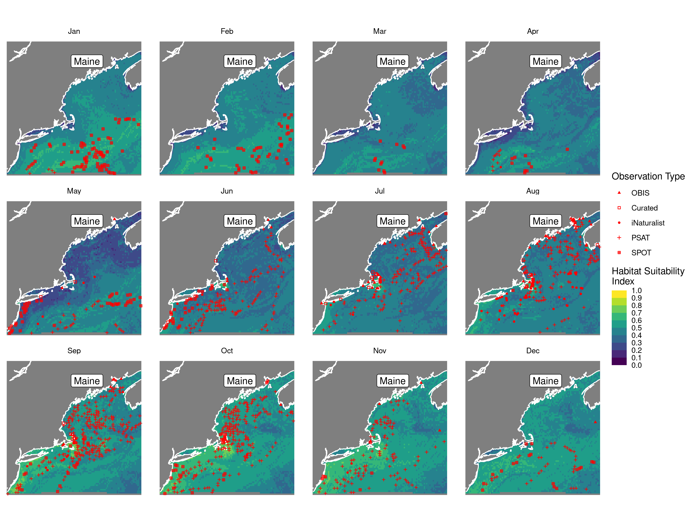 | 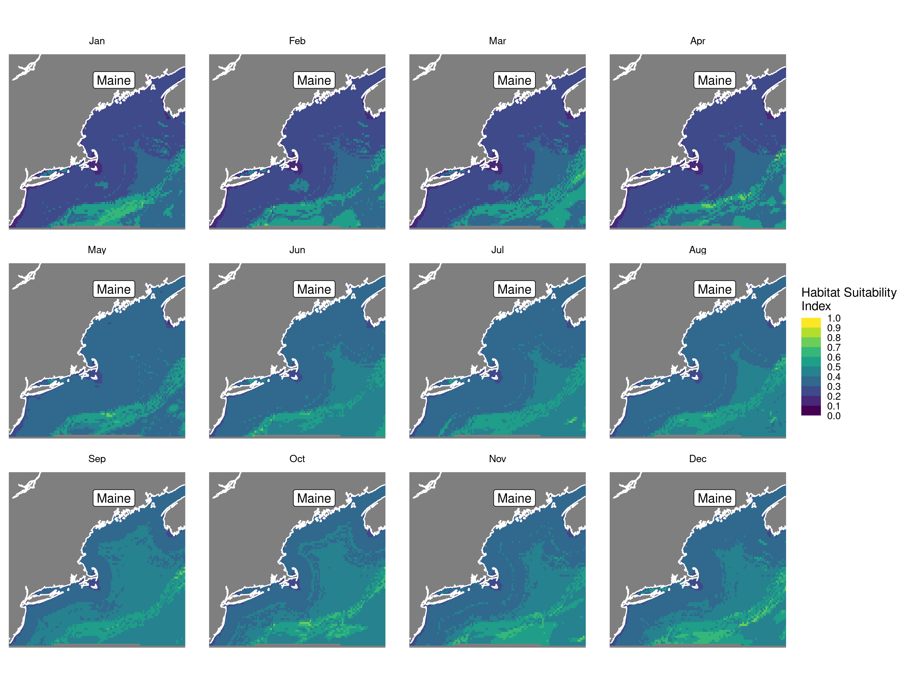 |

Boosted Trees Nowcast and Forecast

| Nowcast | Forecast: RCP 8.5 2075 |
|:--:|:--:|
| 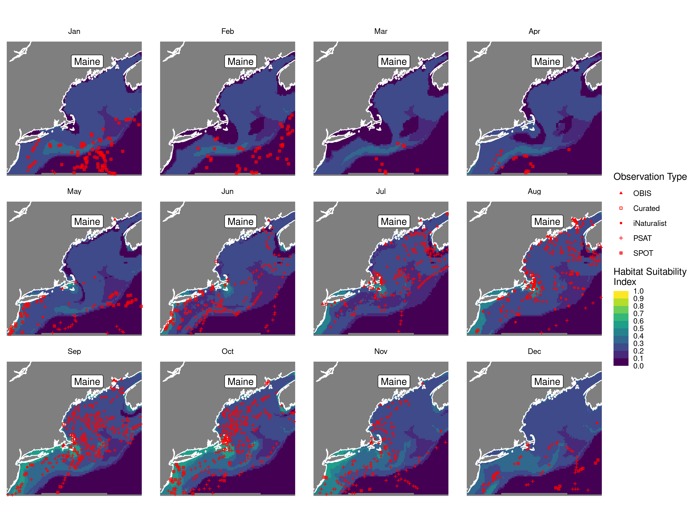 | 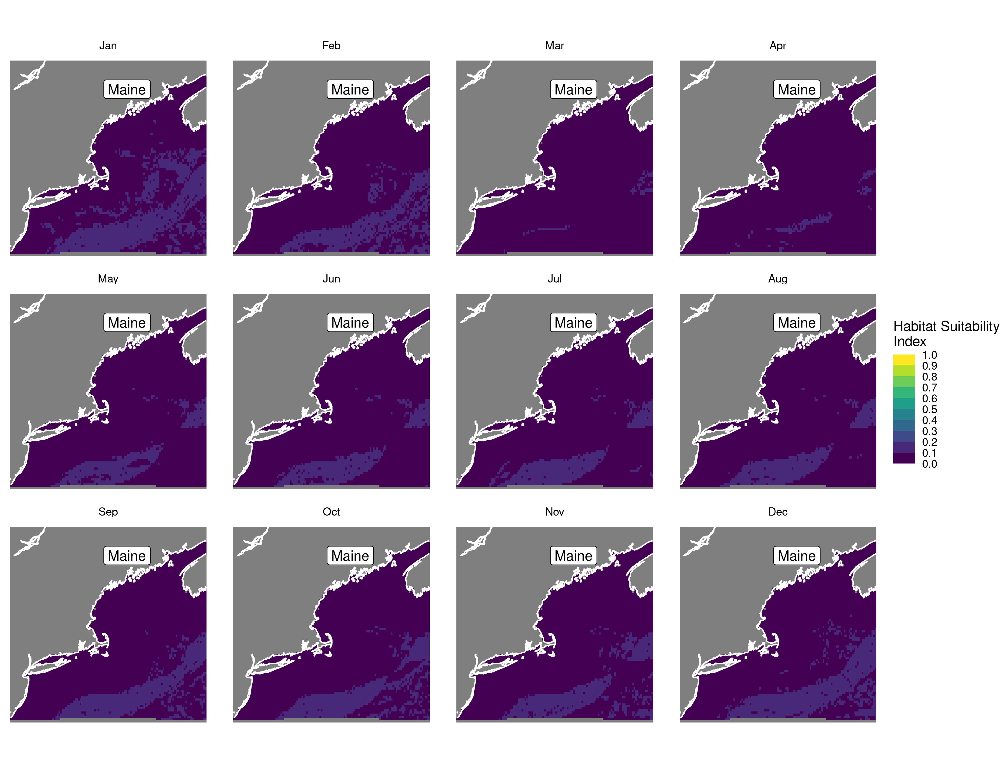 |

Maxnet Trees Nowcast and Forecast

| Nowcast | Forecast: RCP 8.5 2075 |
|:--:|:--:|
| 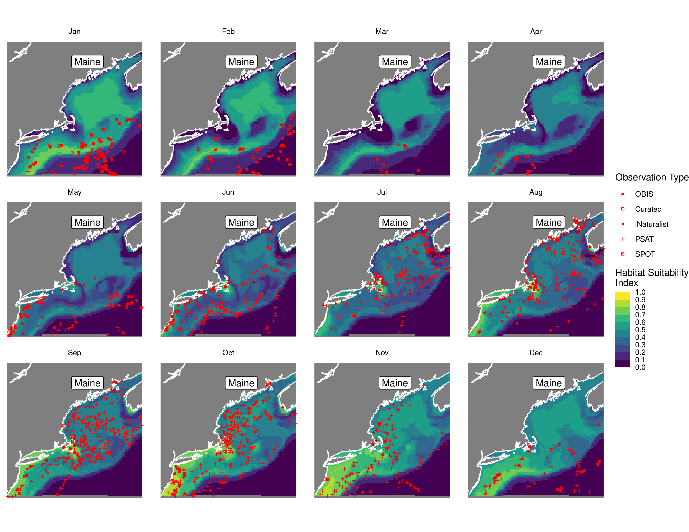 | 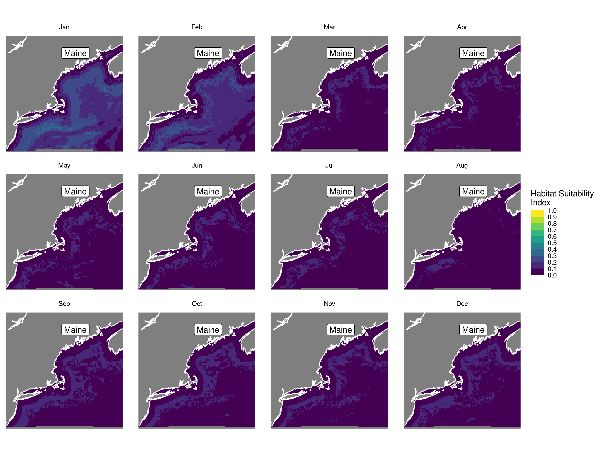 |

GAM Nowcast and Forecast

| Nowcast | Forecast: RCP 8.5 2075 |
|:--:|:--:|
| 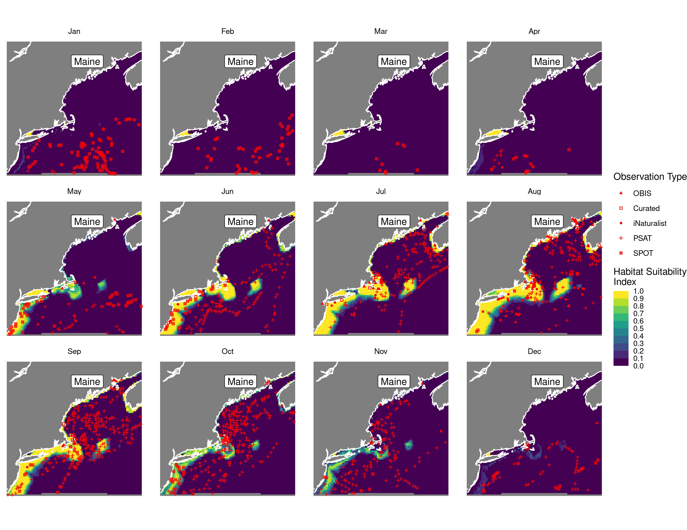 |  |

GLM Nowcast and Forecast

| Nowcast | Forecast: RCP 8.5 2075 |
|:--:|:--:|
| 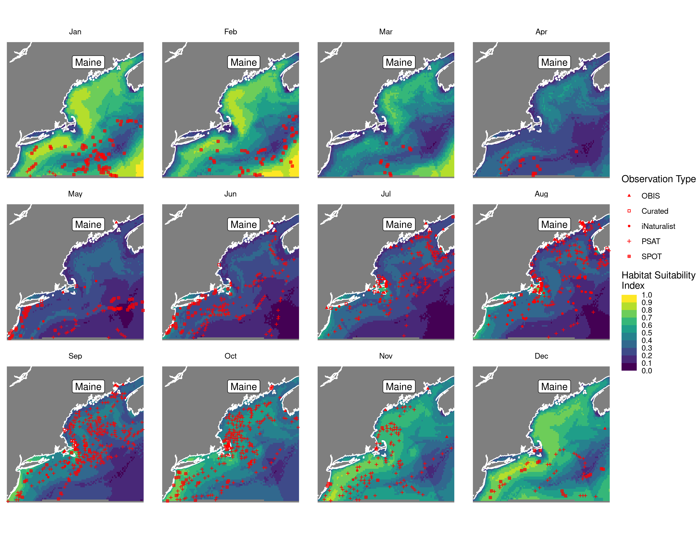 | 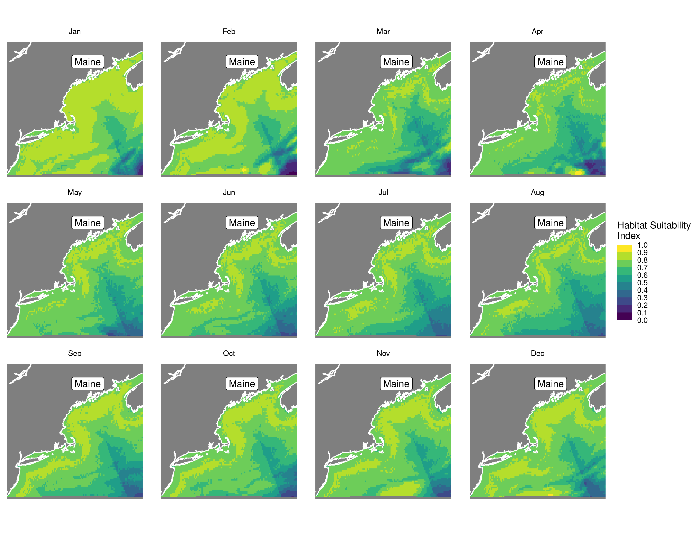 |

## Metrics

| model_type |   roc_auc |
|:-----------|----------:|
| rf         | 0.9930019 |
| bt         | 0.7838214 |
| maxnet     | 0.7689421 |
| gam        | 0.8151071 |
| glm        | 0.7127482 |

Metrics by model type

## Variable Importance

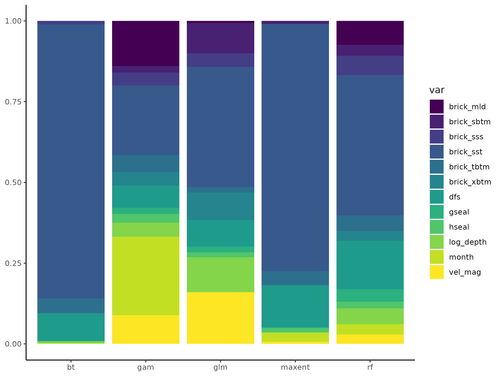

## Partial Dependence

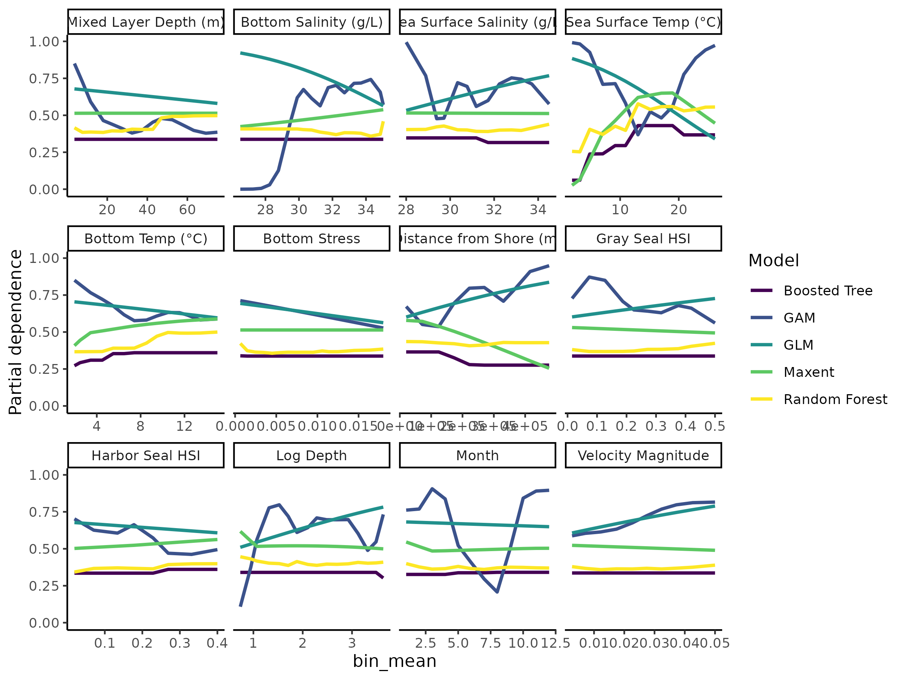
