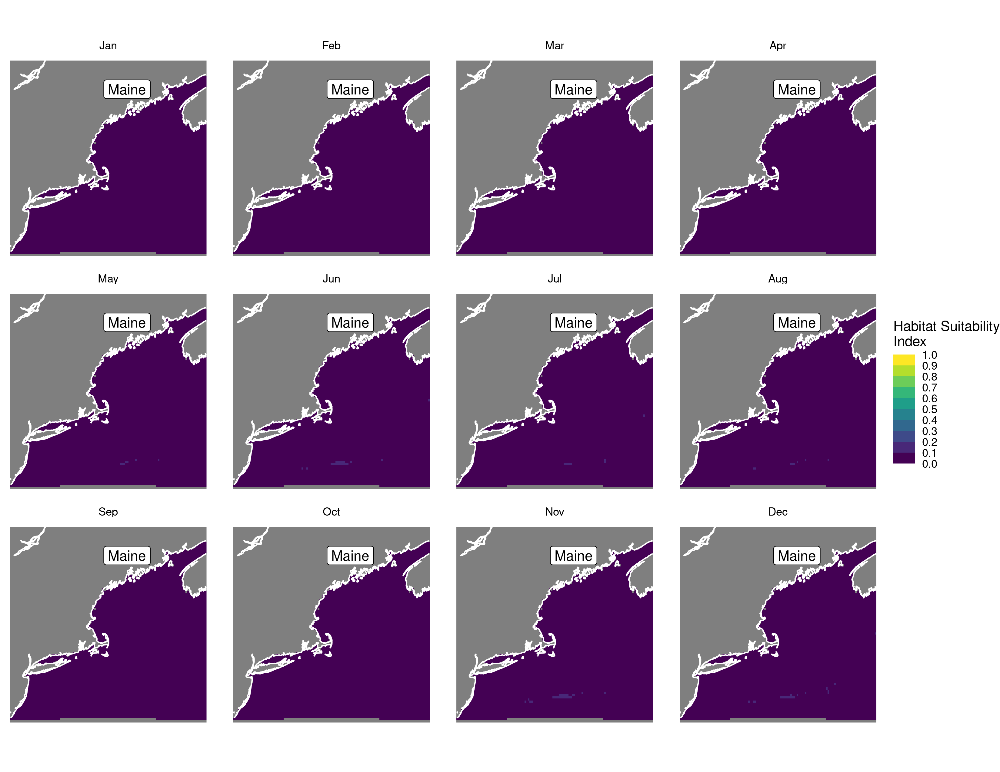
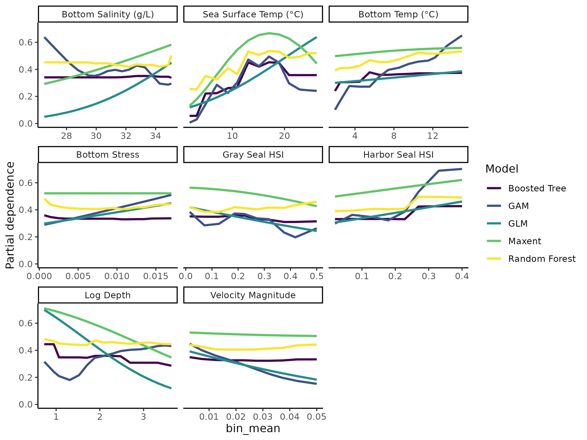

Habitat Suitability Report
================

## Inputs

- Species: White shark (Carcharodon carcharias)
- Thinning: Thinned satellite data (PSAT and SPOT)
- Ratio: 1:2 observation:pseudo-absence ratio
- Spatial extent: Full extent
- Covariates used: non-seal (sst, tbtm, log depth, sbtm, seals, vel_mag,
  xbtm)
- Metrics: evaluated using all metrics

## Nowcast and Forecast Maps

Random Forest Nowcast and Forecast

| Nowcast | Forecast: RCP 8.5 2075 |
|:--:|:--:|
|  |  |

Boosted Trees Nowcast and Forecast

| Nowcast | Forecast: RCP 8.5 2075 |
|:--:|:--:|
|  |  |

Maxnet Trees Nowcast and Forecast

| Nowcast | Forecast: RCP 8.5 2075 |
|:--:|:--:|
|  |  |

GAM Nowcast and Forecast

| Nowcast | Forecast: RCP 8.5 2075 |
|:--:|:--:|
|  |  |

GLM Nowcast and Forecast

| Nowcast | Forecast: RCP 8.5 2075 |
|:--:|:--:|
|  |  |

## Metrics

| model_type |  accuracy |   roc_auc | boyce_cont | brier_class |   tss_max |
|:-----------|----------:|----------:|-----------:|------------:|----------:|
| rf         | 0.9333333 | 0.9913672 |  0.9405742 |   0.0558297 | 0.9395046 |
| bt         | 0.7367816 | 0.8053139 |  0.9866740 |   0.1691403 | 0.4810281 |
| maxnet     | 0.6850575 | 0.7624988 |  0.9257383 |   0.2183151 | 0.4538946 |
| gam        | 0.7321839 | 0.7916846 |  0.9368566 |   0.1712968 | 0.4632732 |
| glm        | 0.6862069 | 0.7225026 |  0.6687406 |   0.1945041 | 0.3890679 |

Metrics by model type

## Variable Importance

## Partial Dependence

