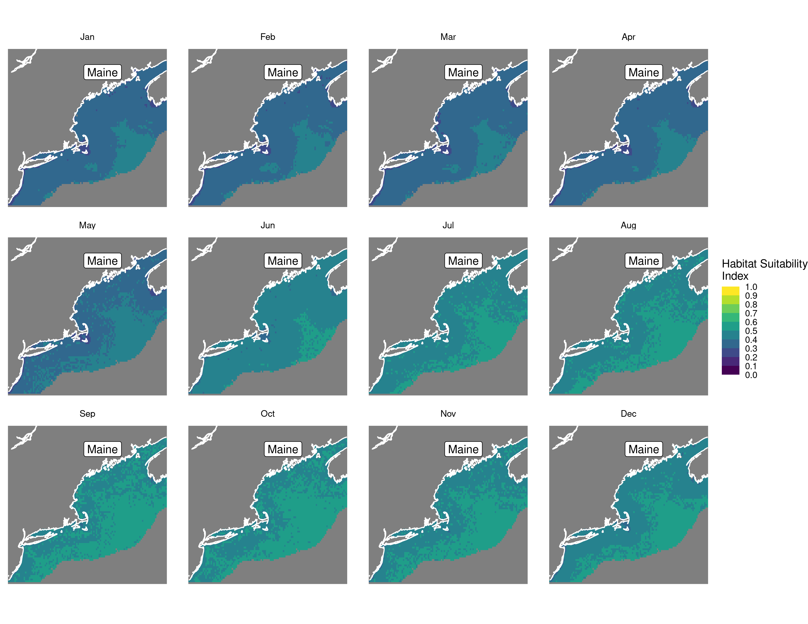
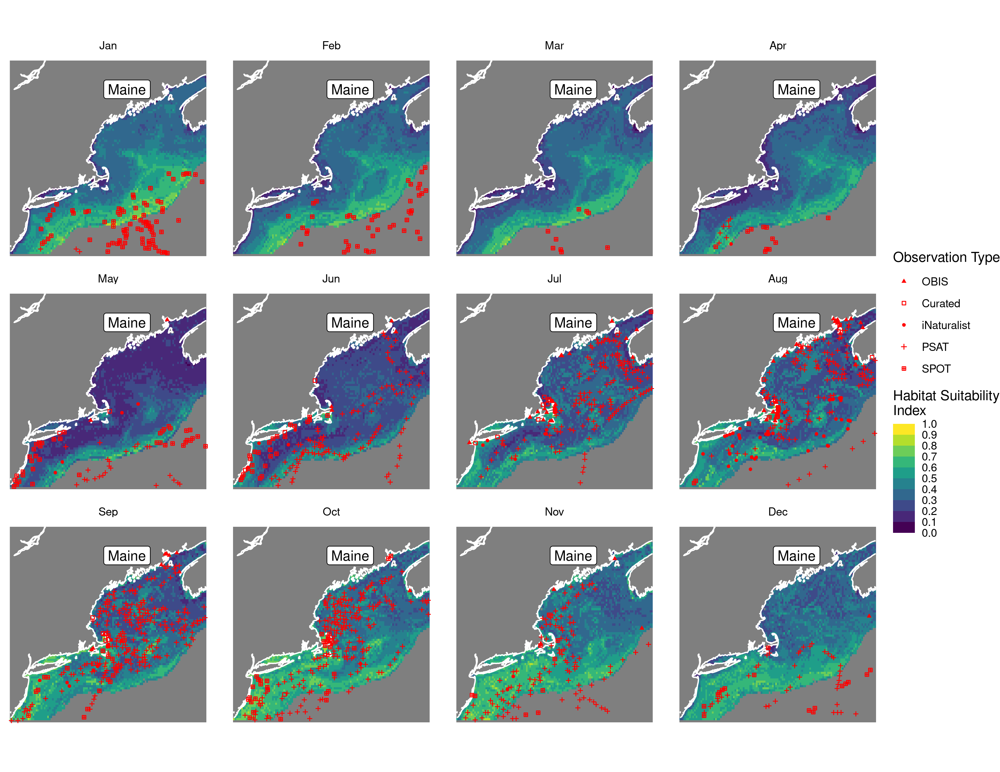
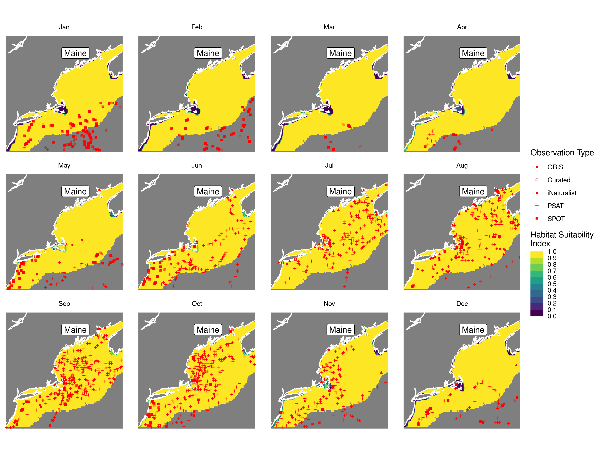
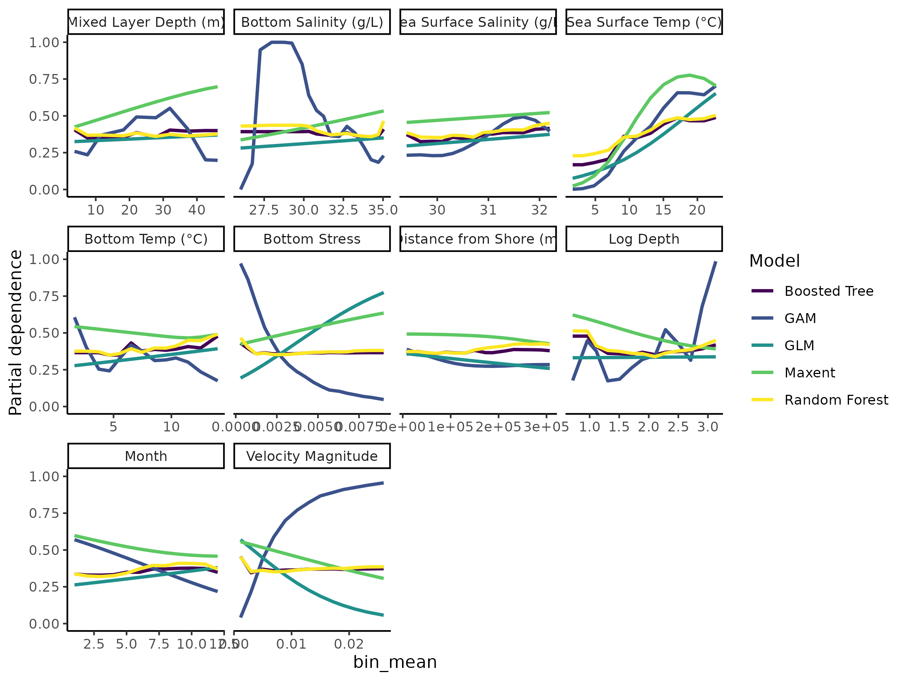

Habitat Suitability Report
================

## Inputs

- Species: White shark (Carcharodon carcharias)
- Thinning: Thinned satellite data (PSAT and SPOT)
- Ratio: 1:2 observation:pseudo-absence ratio
- Spatial extent: Cropped to 750 m isobath
- Covariates used: all covariates (u and v become vel_mag)
- Metrics: evaluated using all metrics

## Nowcast and Forecast Maps

Random Forest Nowcast and Forecast

| Nowcast | Forecast: RCP 8.5 2075 |
|:--:|:--:|
|  |  |

Boosted Trees Nowcast and Forecast

| Nowcast | Forecast: RCP 8.5 2075 |
|:--:|:--:|
|  |  |

Maxnet Trees Nowcast and Forecast

| Nowcast | Forecast: RCP 8.5 2075 |
|:--:|:--:|
|  |  |

GAM Nowcast and Forecast

| Nowcast | Forecast: RCP 8.5 2075 |
|:--:|:--:|
|  |  |

GLM Nowcast and Forecast

| Nowcast | Forecast: RCP 8.5 2075 |
|:--:|:--:|
|  |  |

## Metrics

| model_type |  accuracy |   roc_auc | boyce_cont | brier_class |   tss_max |
|:-----------|----------:|----------:|-----------:|------------:|----------:|
| rf         | 0.9588859 | 0.9897650 |  0.9446056 |   0.0481941 | 0.9441091 |
| bt         | 0.9270557 | 0.9691200 |  0.8657089 |   0.0872998 | 0.8524077 |
| maxnet     | 0.6777188 | 0.7700266 |  0.9644749 |   0.2048399 | 0.4416716 |
| gam        | 0.7122016 | 0.7752435 |  0.9588057 |   0.1744945 | 0.4273967 |
| glm        | 0.6750663 | 0.7430912 |  0.8153274 |   0.1864318 | 0.4406696 |

Metrics by model type

## Variable Importance

## Partial Dependence

