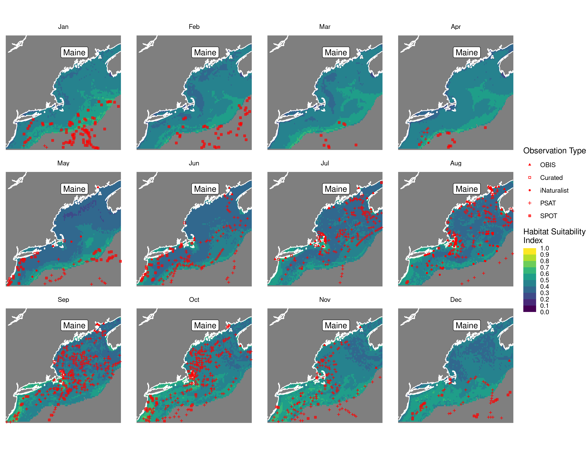
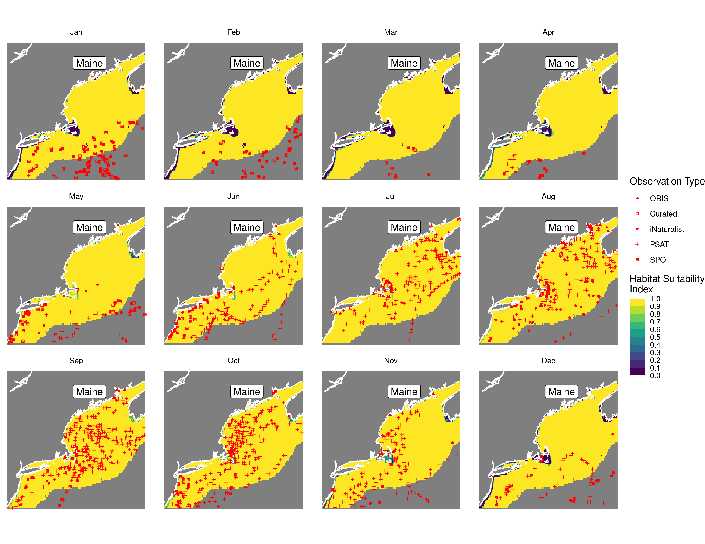
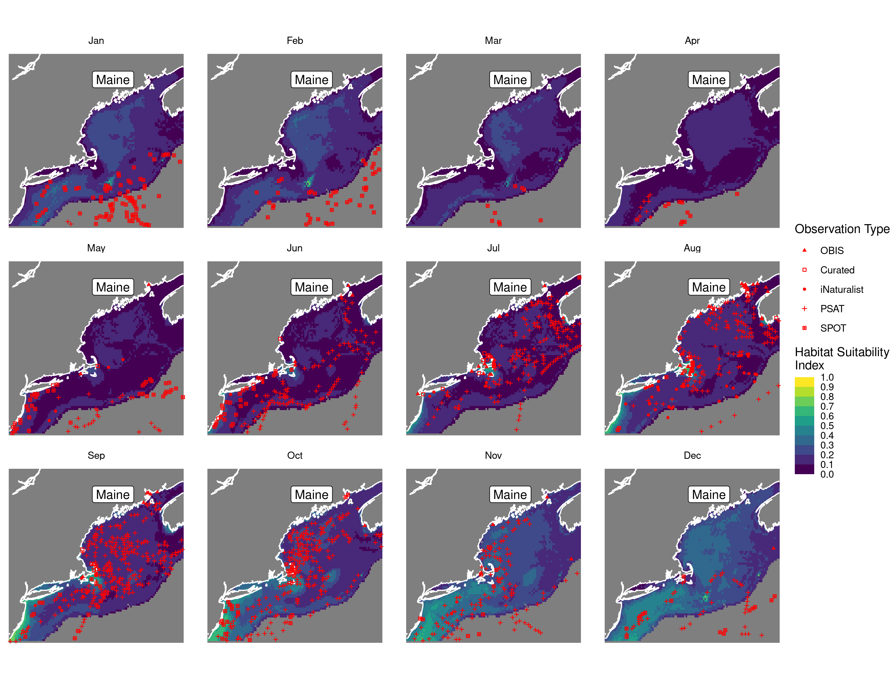

Habitat Suitability Report
================

## Inputs

- Species: White shark (Carcharodon carcharias)
- Thinning: Thinned satellite data (PSAT and SPOT)
- Ratio: 1:2 observation:pseudo-absence ratio
- Spatial extent: Cropped to 750 m isobath
- Covariates used: all covariates (u and v become vel_mag) and seals
- Metrics: evaluated using all metrics

## Nowcast and Forecast Maps

Random Forest Nowcast and Forecast

| Nowcast | Forecast: RCP 8.5 2075 |
|:--:|:--:|
|  |  |

Boosted Trees Nowcast and Forecast

| Nowcast | Forecast: RCP 8.5 2075 |
|:--:|:--:|
|  |  |

Maxnet Trees Nowcast and Forecast

| Nowcast | Forecast: RCP 8.5 2075 |
|:--:|:--:|
|  |  |

GAM Nowcast and Forecast

| Nowcast | Forecast: RCP 8.5 2075 |
|:--:|:--:|
|  |  |

GLM Nowcast and Forecast

| Nowcast | Forecast: RCP 8.5 2075 |
|:--:|:--:|
|  |  |

## Metrics

| model_type |  accuracy |   roc_auc | boyce_cont | brier_class |   tss_max |
|:-----------|----------:|----------:|-----------:|------------:|----------:|
| rf         | 0.9595142 | 0.9913553 |  0.9657607 |   0.0408659 | 0.9432521 |
| bt         | 0.9338731 | 0.9790528 |  0.9488032 |   0.1159461 | 0.9066656 |
| maxnet     | 0.6450742 | 0.7490002 |  0.9768555 |   0.2155335 | 0.4176761 |
| gam        | 0.7152497 | 0.7794067 |  0.9687184 |   0.1742453 | 0.4216014 |
| glm        | 0.6491228 | 0.7206509 |  0.8292078 |   0.1904216 | 0.4155612 |

Metrics by model type

## Variable Importance

## Partial Dependence

