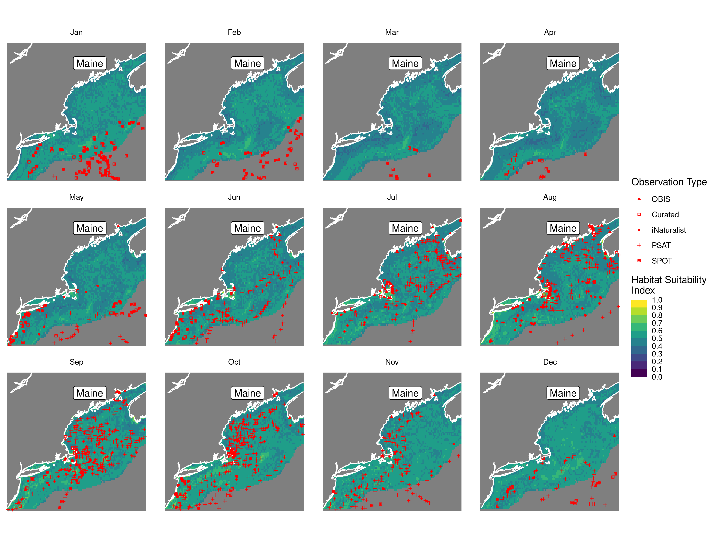
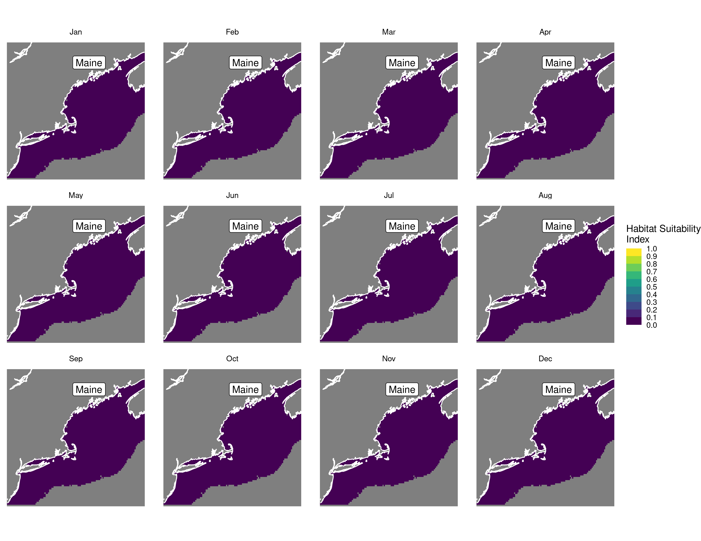

Habitat Suitability Report
================

## Inputs

- Species: White shark (Carcharodon carcharias)
- Thinning: Thinned satellite data (PSAT and SPOT)
- Ratio: 1:2 observation:pseudo-absence ratio
- Spatial extent: Cropped to 750 m isobath
- Covariates used: non-seal (sst, tbtm, log depth, sbtm, seals, vel_mag,
  xbtm)
- Metrics: evaluated using all metrics

## Nowcast and Forecast Maps

Random Forest Nowcast and Forecast

| Nowcast | Forecast: RCP 8.5 2075 |
|:--:|:--:|
|  |  |

Boosted Trees Nowcast and Forecast

| Nowcast | Forecast: RCP 8.5 2075 |
|:--:|:--:|
|  |  |

Maxnet Trees Nowcast and Forecast

| Nowcast | Forecast: RCP 8.5 2075 |
|:--:|:--:|
|  |  |

GAM Nowcast and Forecast

| Nowcast | Forecast: RCP 8.5 2075 |
|:--:|:--:|
|  |  |

GLM Nowcast and Forecast

| Nowcast | Forecast: RCP 8.5 2075 |
|:--:|:--:|
|  |  |

## Metrics

| model_type |  accuracy |   roc_auc | boyce_cont | brier_class |   tss_max |
|:-----------|----------:|----------:|-----------:|------------:|----------:|
| rf         | 0.9275862 | 0.9819886 |  0.9209676 |   0.0623734 | 0.8981601 |
| bt         | 0.7413793 | 0.7984202 |  0.9520584 |   0.1736489 | 0.4487400 |
| maxnet     | 0.6655172 | 0.7537526 |  0.9768640 |   0.2201420 | 0.3994487 |
| gam        | 0.7321839 | 0.7654818 |  0.9631776 |   0.1803512 | 0.3979453 |
| glm        | 0.6885057 | 0.7107436 |  0.8831440 |   0.1950438 | 0.3855956 |

Metrics by model type

## Variable Importance

## Partial Dependence

