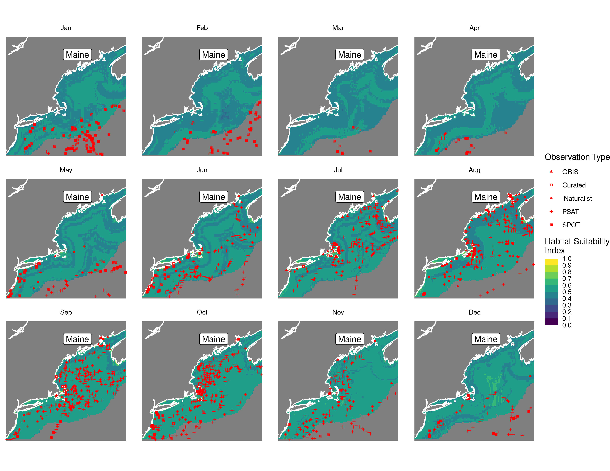
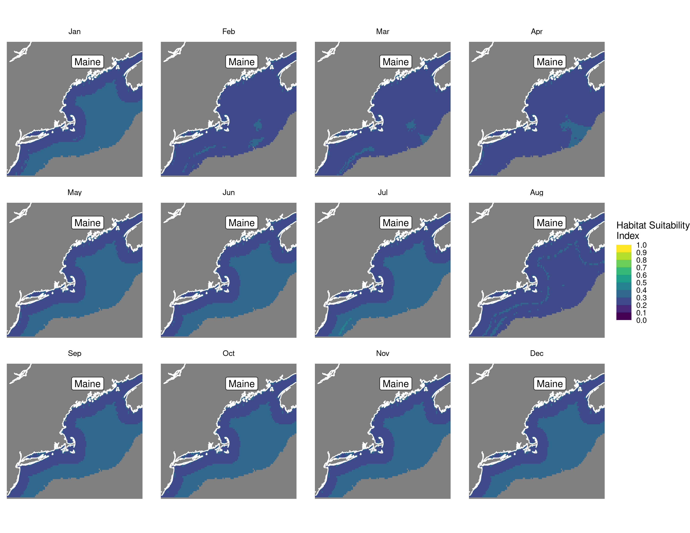
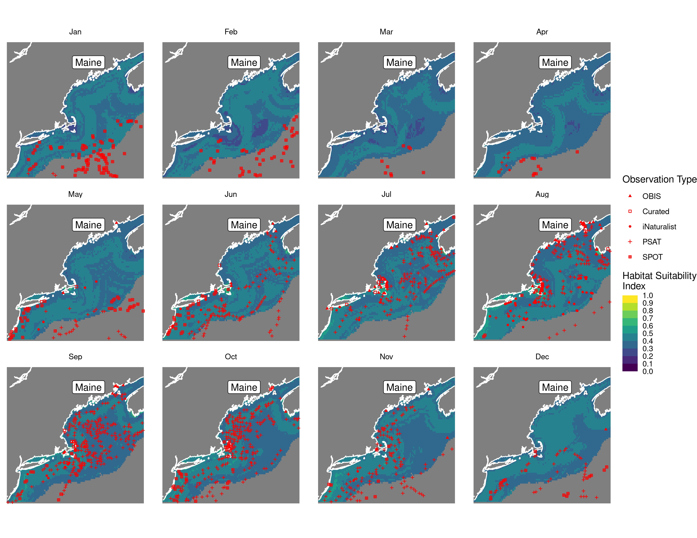
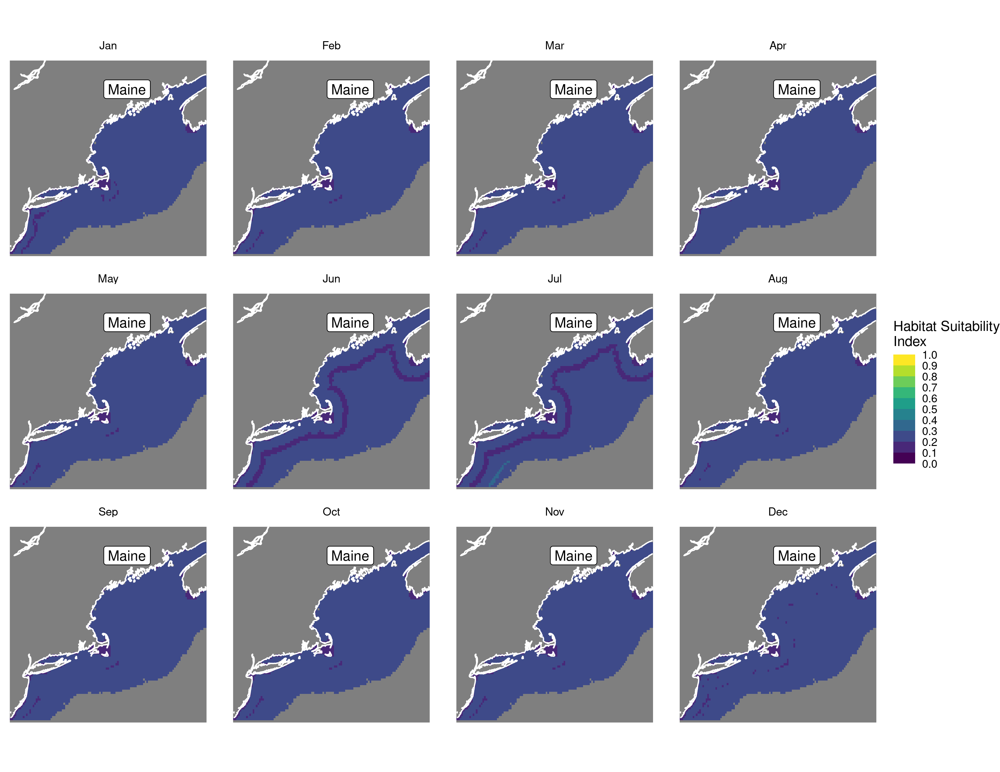
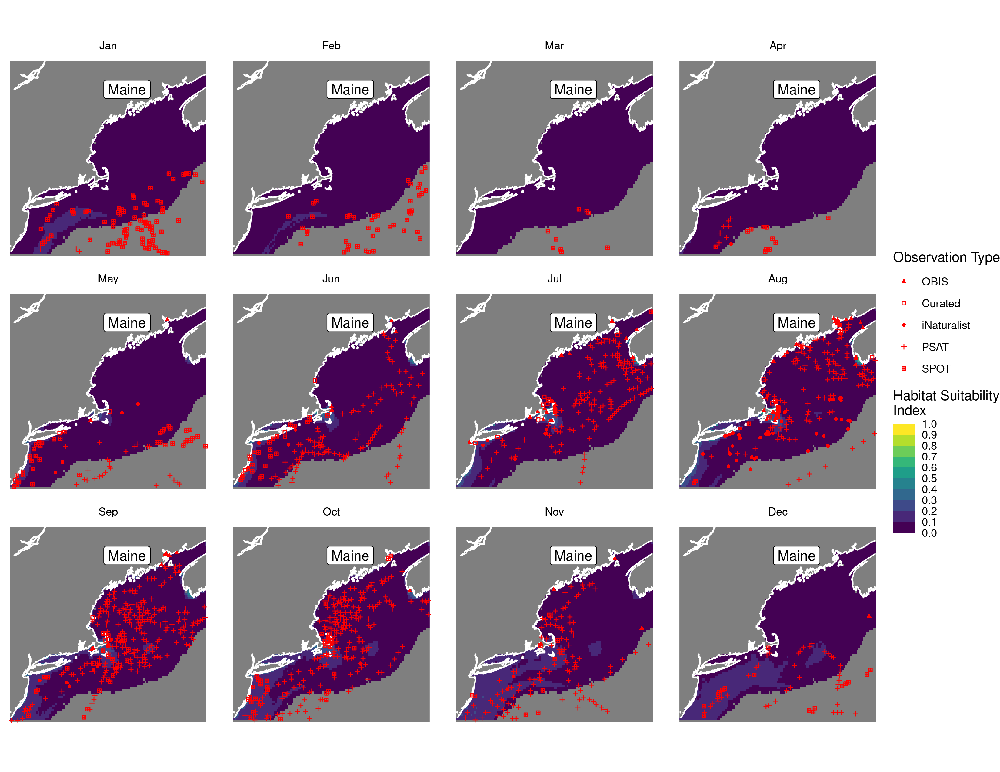
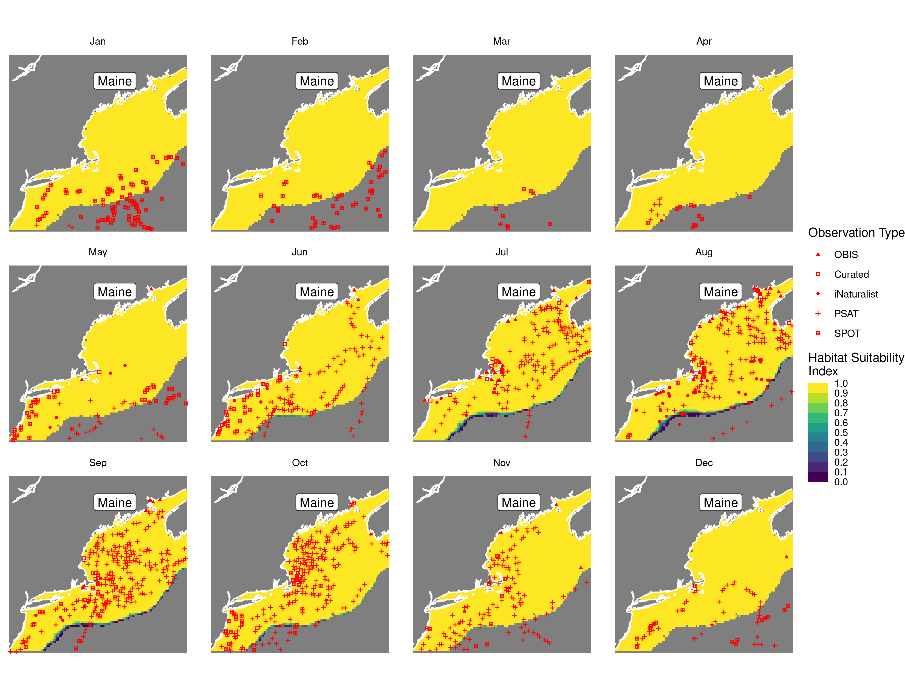
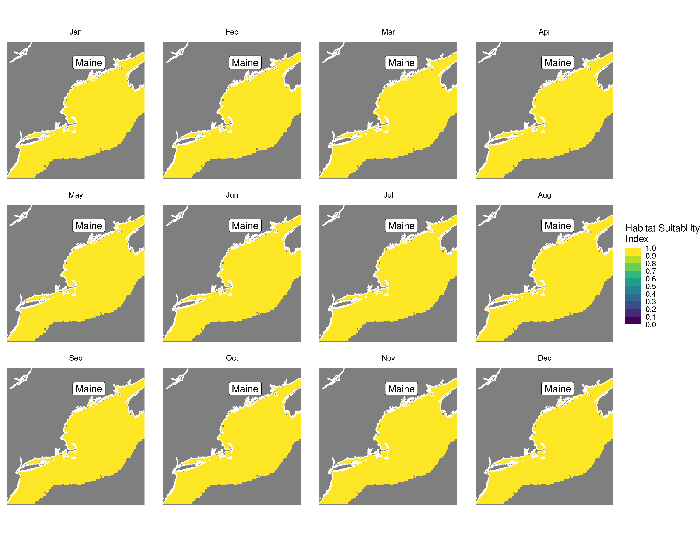
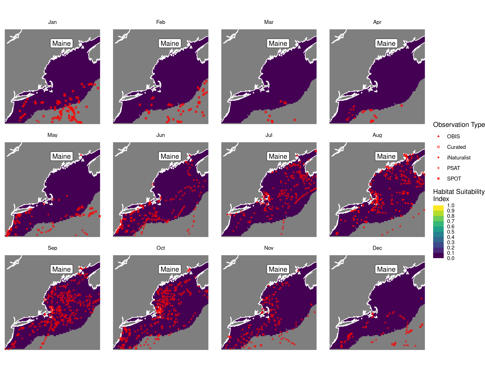
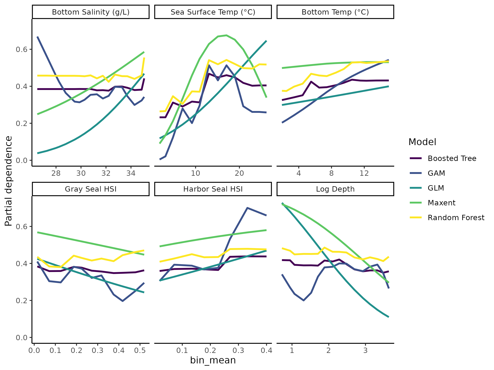

Habitat Suitability Report
================

## Inputs

- Species: White shark (Carcharodon carcharias)
- Thinning: Thinned satellite data (PSAT and SPOT)
- Ratio: 1:2 observation:pseudo-absence ratio
- Spatial extent: Cropped to 750 m isobath
- Covariates used: shark specific v2 (sst, tbtm, sbtm, log depth, and
  seals)
- Metrics: evaluated using all metrics

## Nowcast and Forecast Maps

Random Forest Nowcast and Forecast

| Nowcast | Forecast: RCP 8.5 2075 |
|:--:|:--:|
|  |  |

Boosted Trees Nowcast and Forecast

| Nowcast | Forecast: RCP 8.5 2075 |
|:--:|:--:|
|  |  |

Maxnet Trees Nowcast and Forecast

| Nowcast | Forecast: RCP 8.5 2075 |
|:--:|:--:|
|  |  |

GAM Nowcast and Forecast

| Nowcast | Forecast: RCP 8.5 2075 |
|:--:|:--:|
|  |  |

GLM Nowcast and Forecast

| Nowcast | Forecast: RCP 8.5 2075 |
|:--:|:--:|
|  |  |

## Metrics

| model_type |  accuracy |   roc_auc | boyce_cont | brier_class |   tss_max |
|:-----------|----------:|----------:|-----------:|------------:|----------:|
| rf         | 0.9195402 | 0.9902456 |  0.9615916 |   0.0595412 | 0.9155212 |
| bt         | 0.7885057 | 0.8404568 |  0.9626562 |   0.1644682 | 0.5056916 |
| maxnet     | 0.6620690 | 0.7576007 |  0.9631674 |   0.2192010 | 0.4350301 |
| gam        | 0.7229885 | 0.7649986 |  0.9542073 |   0.1799160 | 0.4102950 |
| glm        | 0.6747126 | 0.7088106 |  0.7607708 |   0.1965111 | 0.3795461 |

Metrics by model type

## Variable Importance

## Partial Dependence

