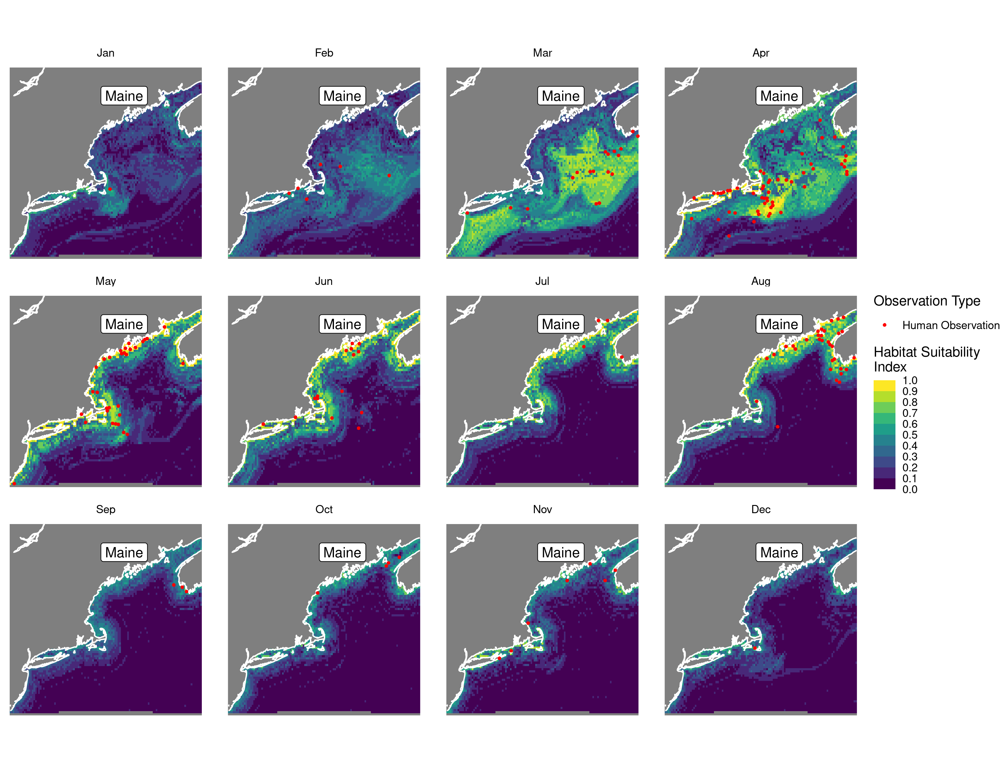
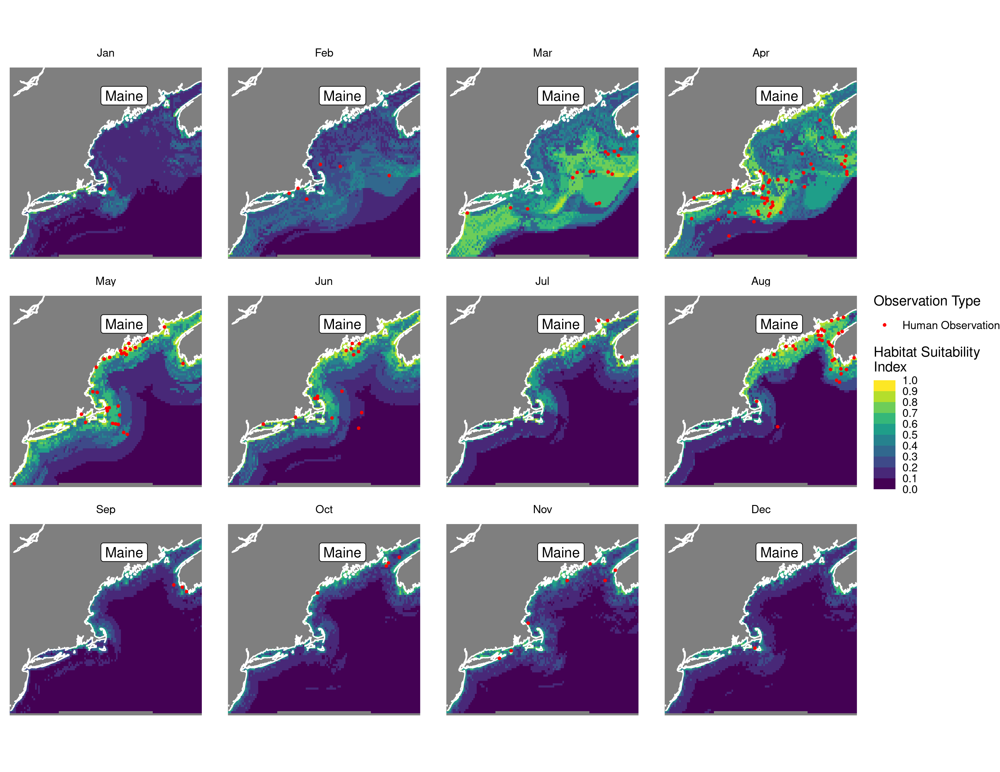
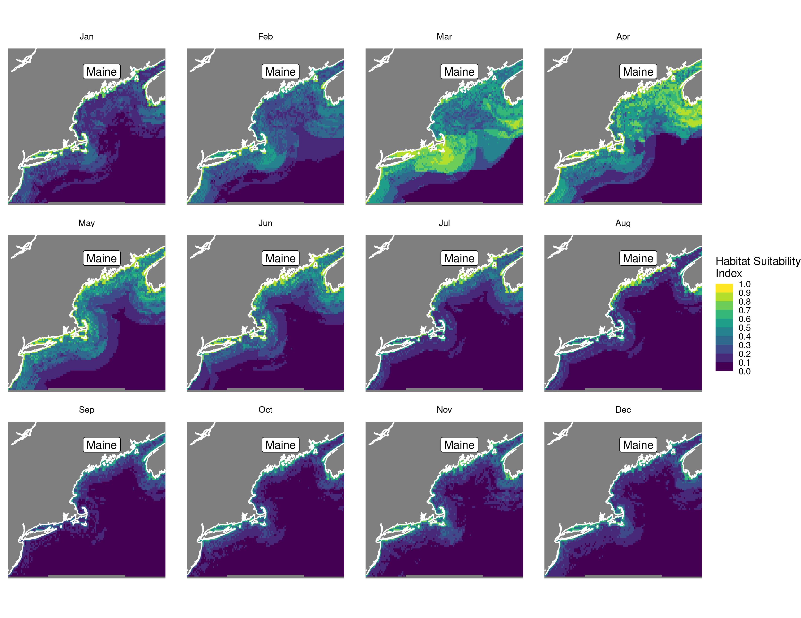
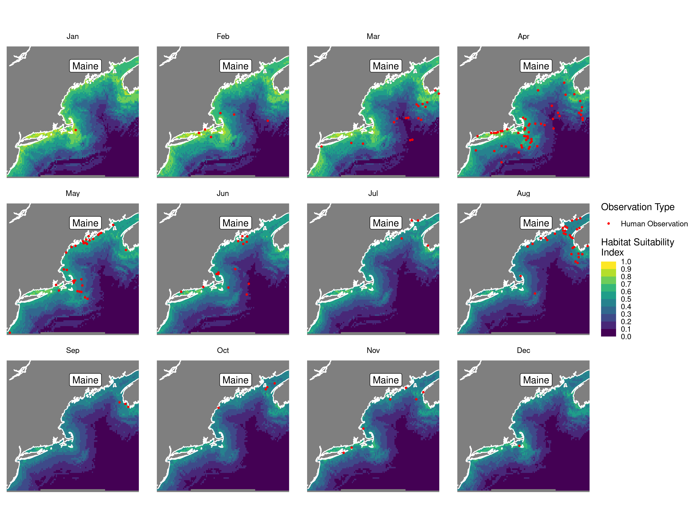
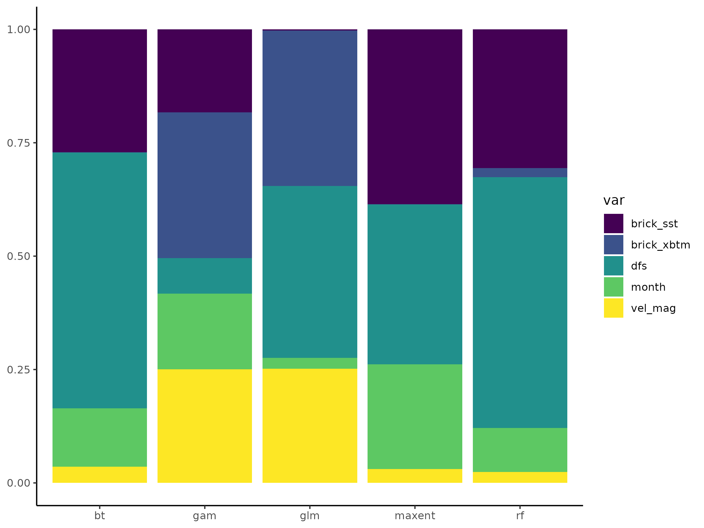

Habitat Suitability Report
================

## Inputs

- Species: Gray seal (Halichoerus grypus)
- Thinning: Thinned observations
- Ratio: 1:2 observation:pseudo-absence ratio
- Spatial extent: Full extent
- Covariates used: seal specific (sst, dfs, velocity magnitude, xbtm)
- Metrics: evaluated using all metrics

## Nowcast and Forecast Maps

Random Forest Nowcast and Forecast

| Nowcast | Forecast: RCP 8.5 2075 |
|:--:|:--:|
|  |  |

Boosted Trees Nowcast and Forecast

| Nowcast | Forecast: RCP 8.5 2075 |
|:--:|:--:|
|  |  |

Maxnet Trees Nowcast and Forecast

| Nowcast | Forecast: RCP 8.5 2075 |
|:--:|:--:|
|  |  |

GAM Nowcast and Forecast

| Nowcast | Forecast: RCP 8.5 2075 |
|:--:|:--:|
|  |  |

GLM Nowcast and Forecast

| Nowcast | Forecast: RCP 8.5 2075 |
|:--:|:--:|
|  |  |

## Metrics

| model_type |  accuracy |   roc_auc | boyce_cont | brier_class |   tss_max |
|:-----------|----------:|----------:|-----------:|------------:|----------:|
| rf         | 0.8301887 | 0.8742063 |  0.8589787 |   0.1334941 | 0.5952381 |
| bt         | 0.8113208 | 0.8654762 |  0.9027293 |   0.1390256 | 0.6063492 |
| maxnet     | 0.8207547 | 0.8769841 |  0.7863620 |   0.1447112 | 0.7174603 |
| gam        | 0.7358491 | 0.8174603 |  0.7543237 |   0.1652348 | 0.5738095 |
| glm        | 0.7641509 | 0.7702381 |  0.4854962 |   0.1827992 | 0.5222222 |

Metrics by model type

## Variable Importance

## Partial Dependence

