Habitat Suitability Report
================

## Inputs

- Species: Gray seal (Halichoerus grypus)
- Thinning: Thinned observations
- Ratio: 1:2 observation:pseudo-absence ratio
- Spatial extent: Full extent
- Covariates used: all covariates (u and v become vel_mag)
- Metrics: evaluated using all metrics

## Nowcast and Forecast Maps

Random Forest Nowcast and Forecast

| Nowcast | Forecast: RCP 8.5 2075 |
|:--:|:--:|
| 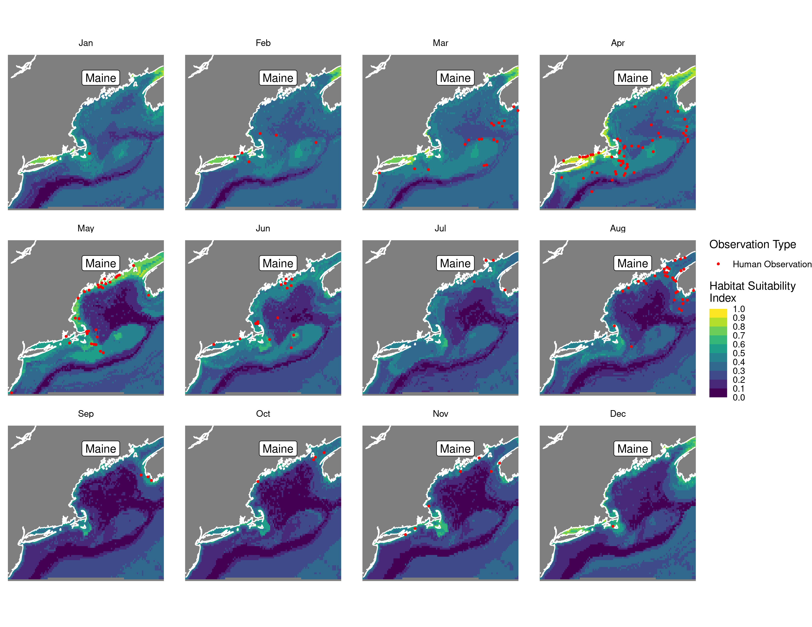 | 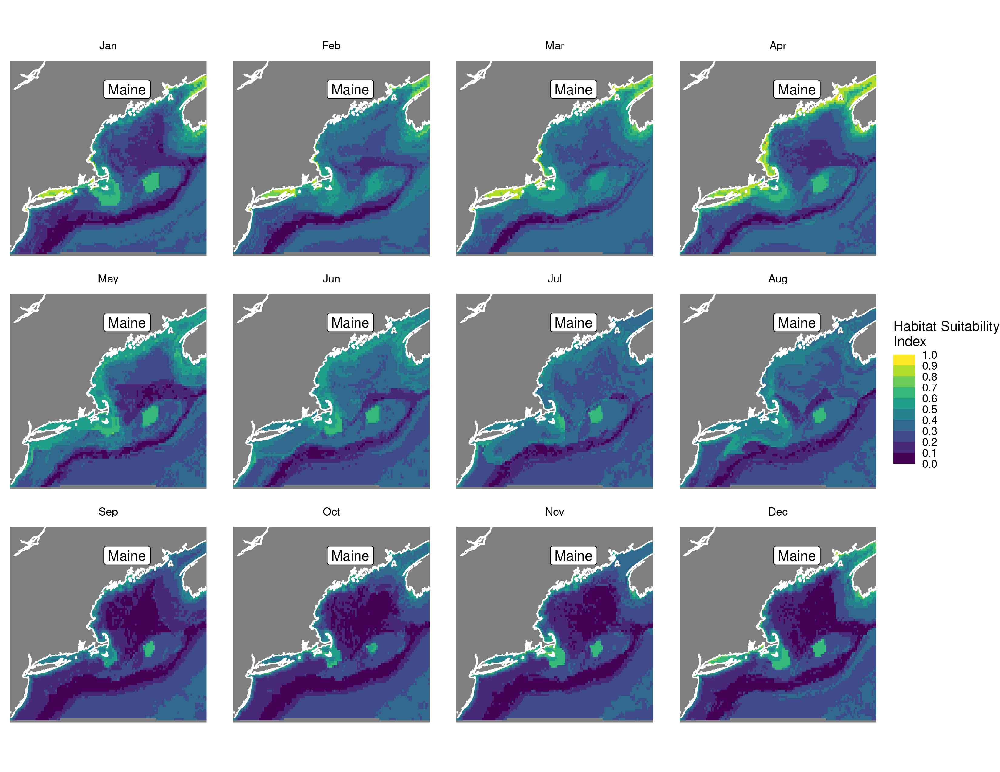 |

Boosted Trees Nowcast and Forecast

| Nowcast | Forecast: RCP 8.5 2075 |
|:--:|:--:|
| 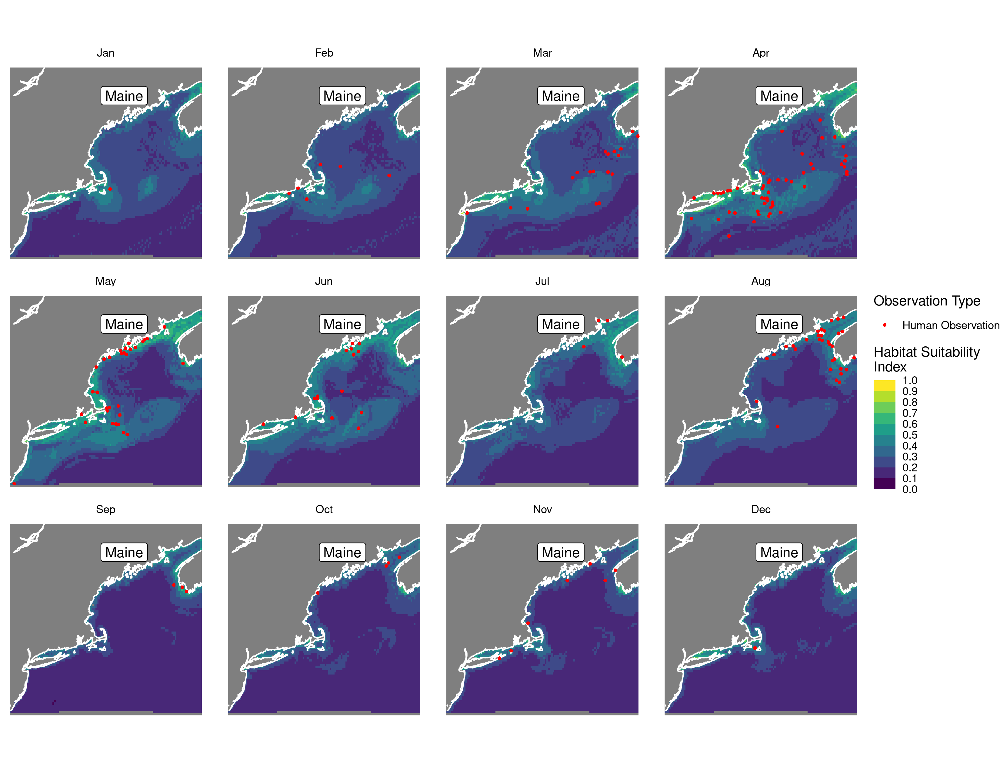 | 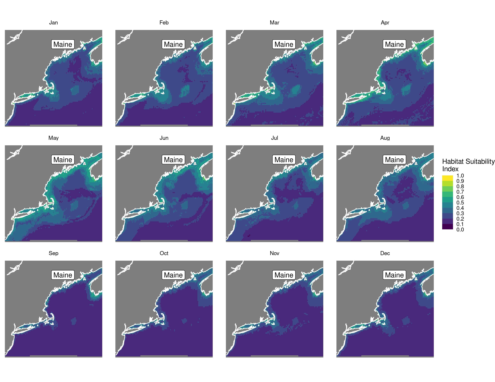 |

Maxnet Trees Nowcast and Forecast

| Nowcast | Forecast: RCP 8.5 2075 |
|:--:|:--:|
| 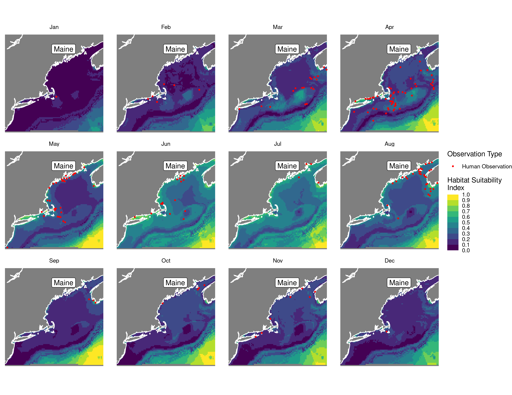 | 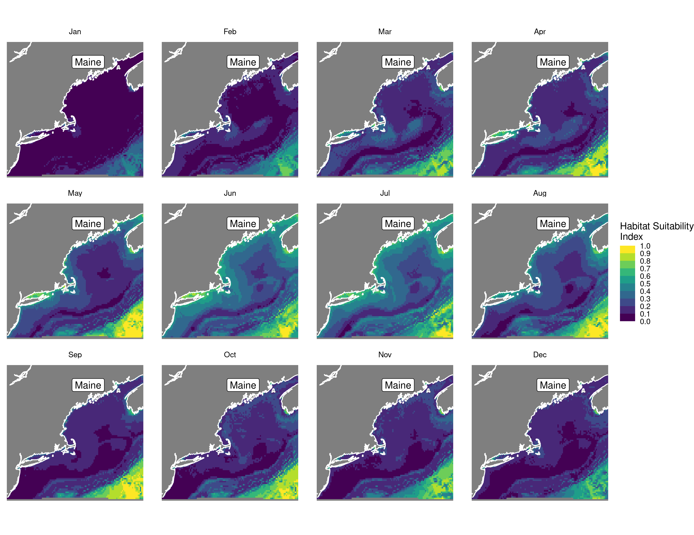 |

GAM Nowcast and Forecast

| Nowcast | Forecast: RCP 8.5 2075 |
|:--:|:--:|
| 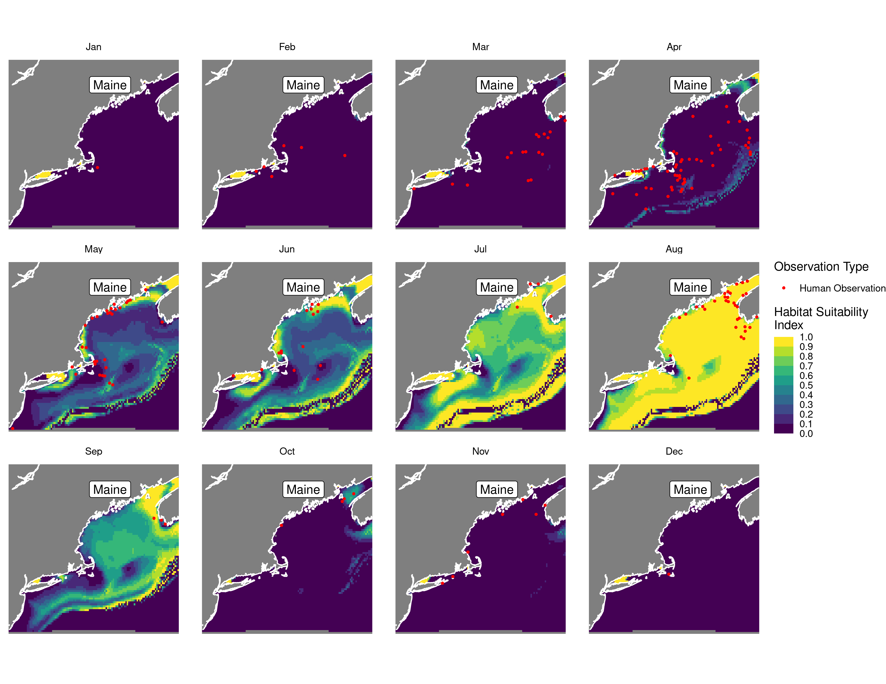 | 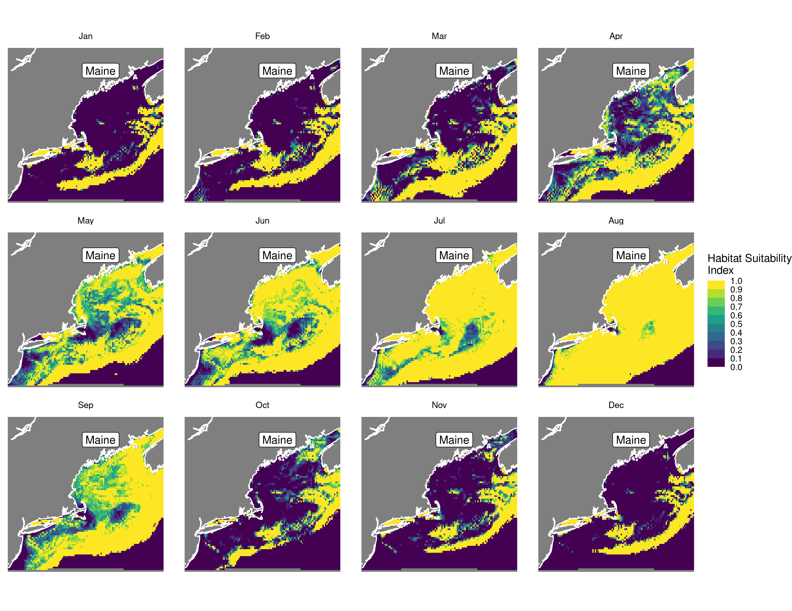 |

GLM Nowcast and Forecast

| Nowcast | Forecast: RCP 8.5 2075 |
|:--:|:--:|
| 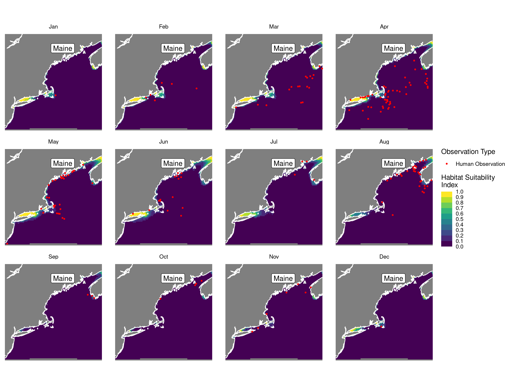 | 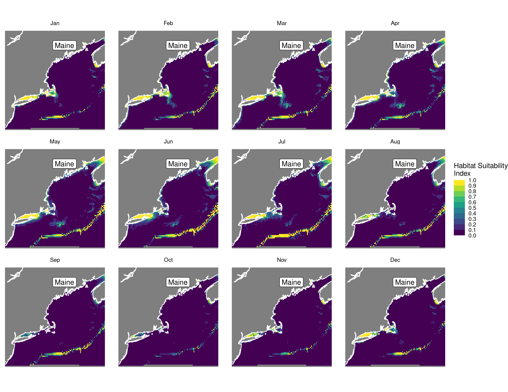 |

## Metrics

| model_type |  accuracy |   roc_auc | boyce_cont | brier_class |   tss_max |
|:-----------|----------:|----------:|-----------:|------------:|----------:|
| rf         | 0.8301887 | 0.9206349 |  0.6882980 |   0.1174493 | 0.7730159 |
| bt         | 0.8396226 | 0.9202381 |  0.8145029 |   0.1214586 | 0.7738095 |
| maxnet     | 0.8396226 | 0.9075397 |  0.8972615 |   0.1211369 | 0.7444444 |
| gam        | 0.8018868 | 0.8742063 |  0.8544495 |   0.1318490 | 0.6468254 |
| glm        | 0.7924528 | 0.8678571 |  0.8289011 |   0.1456031 | 0.5920635 |

Metrics by model type

## Variable Importance

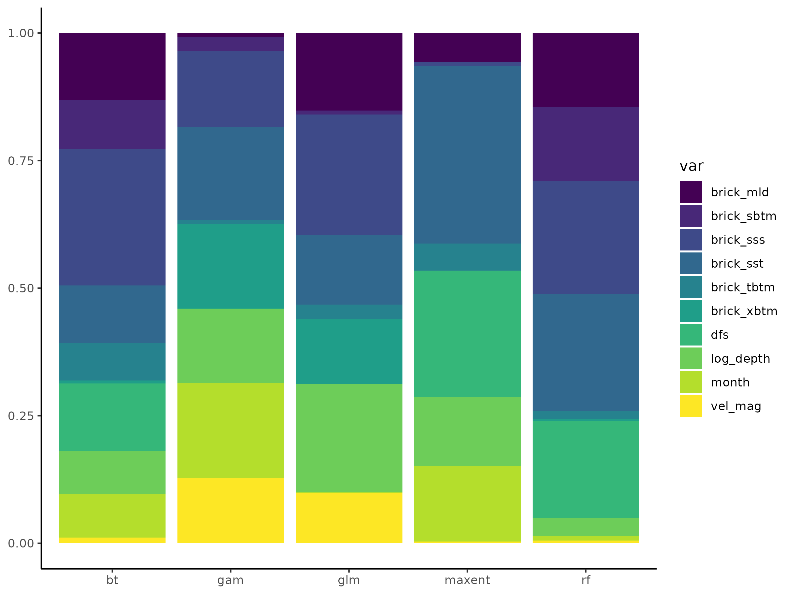

## Partial Dependence

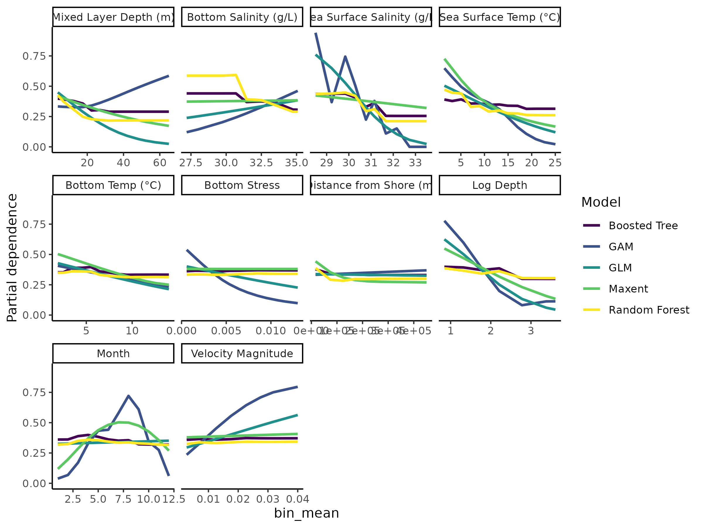
