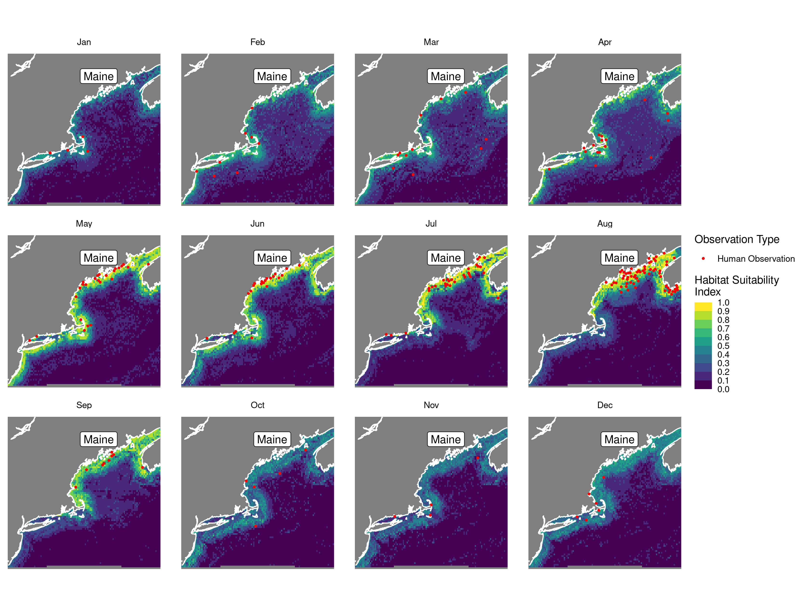
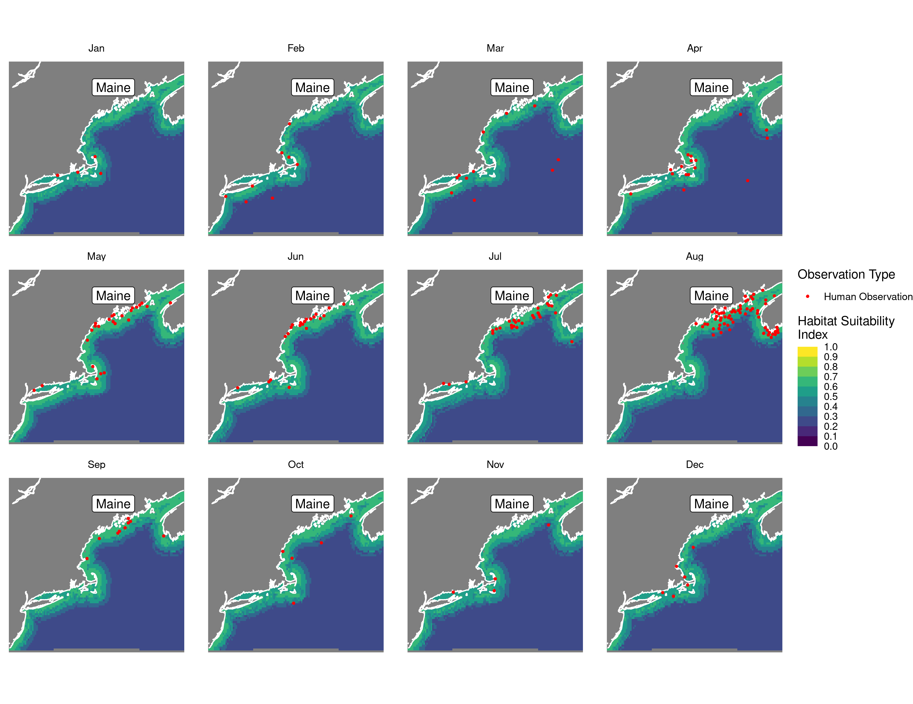
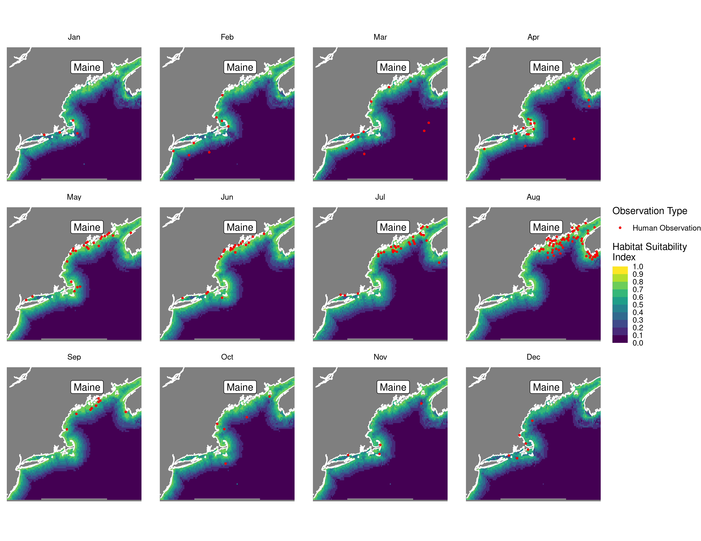

Habitat Suitability Report
================

## Inputs

- Species: Harbor seal (Phoca vitulina)
- Thinning: Thinned observations
- Ratio: 1:2 observation:pseudo-absence ratio
- Spatial extent: Full extent
- Covariates used: seal specific (sst, dfs, velocity magnitude, xbtm)
- Metrics: evaluated using all metrics

## Nowcast and Forecast Maps

Random Forest Nowcast and Forecast

| Nowcast | Forecast: RCP 8.5 2075 |
|:--:|:--:|
|  |  |

Boosted Trees Nowcast and Forecast

| Nowcast | Forecast: RCP 8.5 2075 |
|:--:|:--:|
|  |  |

Maxnet Trees Nowcast and Forecast

| Nowcast | Forecast: RCP 8.5 2075 |
|:--:|:--:|
|  |  |

GAM Nowcast and Forecast

| Nowcast | Forecast: RCP 8.5 2075 |
|:--:|:--:|
|  |  |

GLM Nowcast and Forecast

| Nowcast | Forecast: RCP 8.5 2075 |
|:--:|:--:|
|  |  |

## Metrics

| model_type |  accuracy |   roc_auc | boyce_cont | brier_class |   tss_max |
|:-----------|----------:|----------:|-----------:|------------:|----------:|
| rf         | 0.8512397 | 0.9527439 |  0.7619750 |   0.0904803 | 0.8762195 |
| bt         | 0.8842975 | 0.9134146 |  0.9789808 |   0.1296968 | 0.7774390 |
| maxnet     | 0.8842975 | 0.9420732 |  0.8644226 |   0.1006120 | 0.7512195 |
| gam        | 0.8677686 | 0.9365854 |  0.7779584 |   0.0922342 | 0.7887195 |
| glm        | 0.8760331 | 0.9329268 |  0.9417197 |   0.1016163 | 0.7530488 |

Metrics by model type

## Variable Importance

## Partial Dependence

