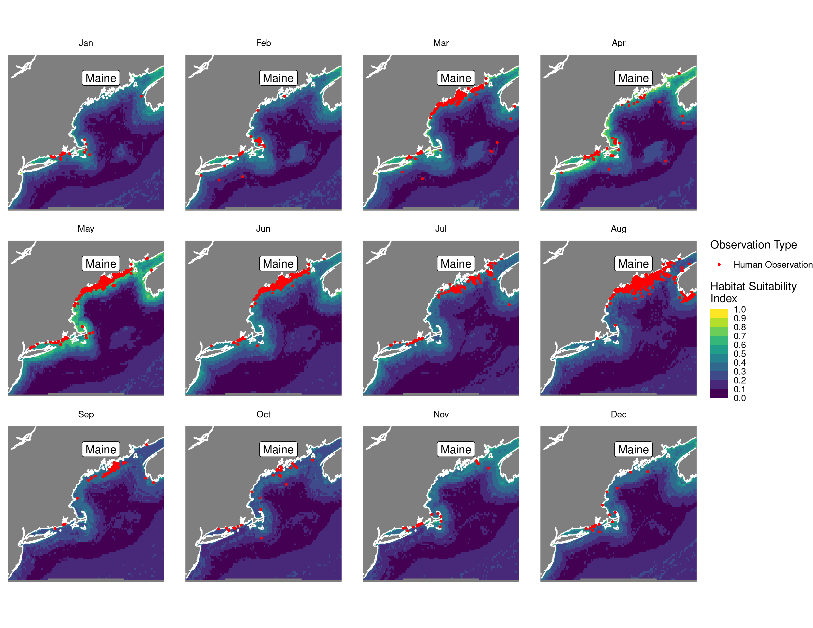
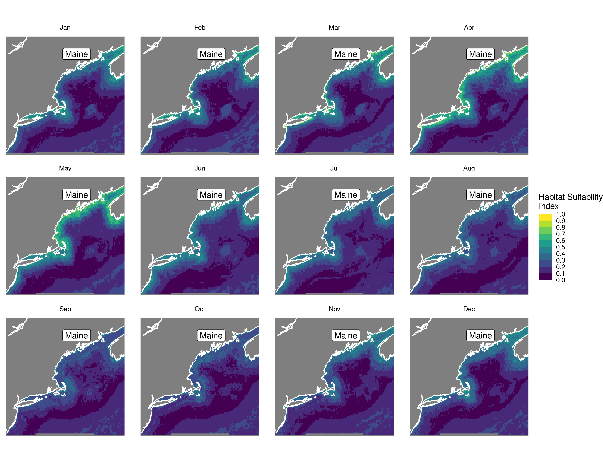
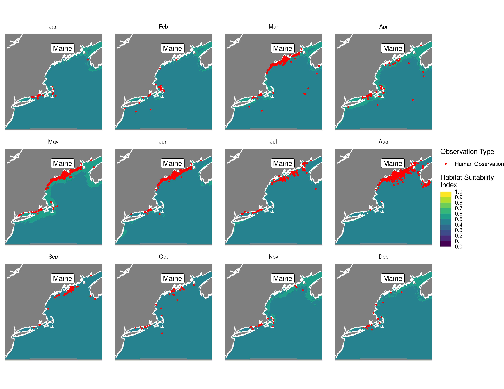
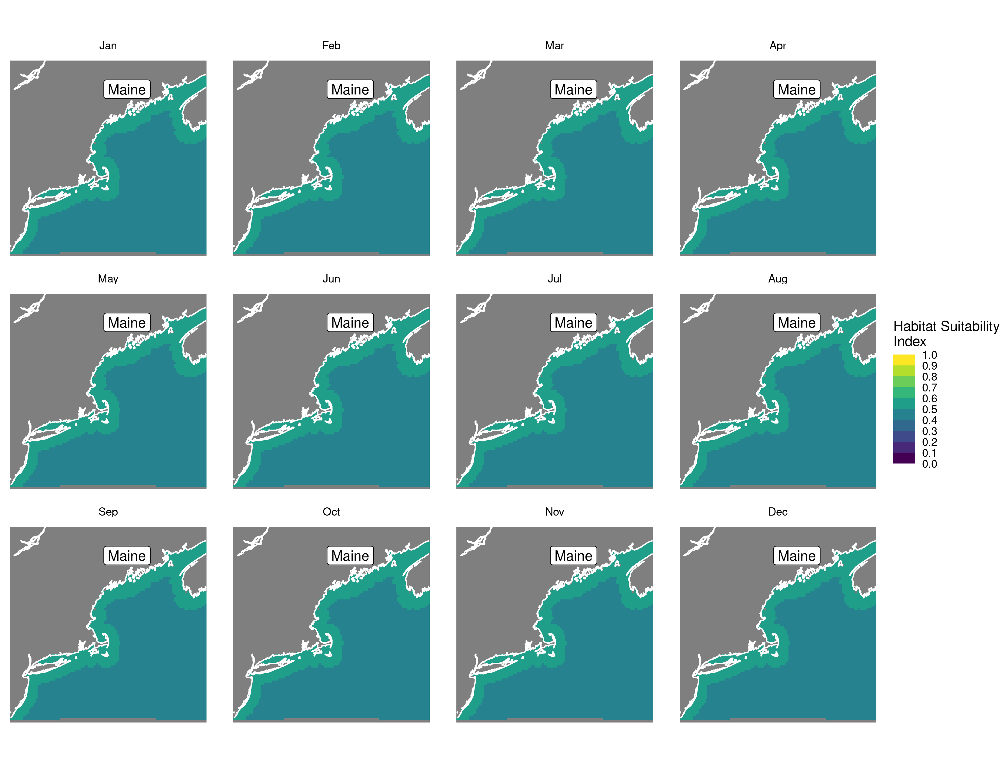
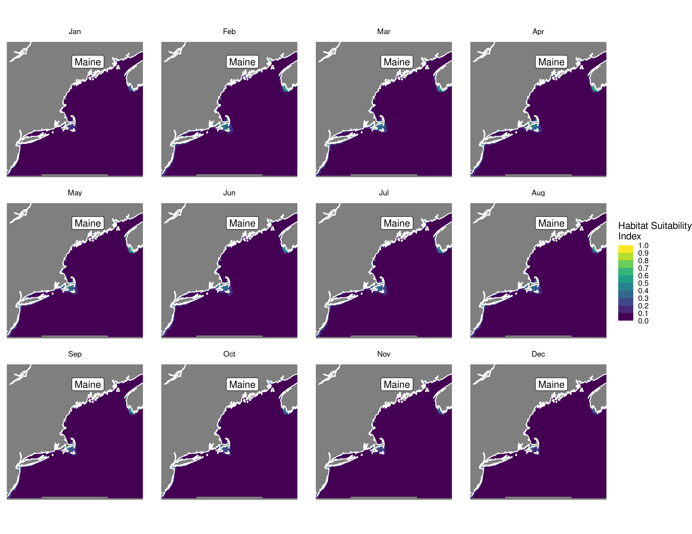
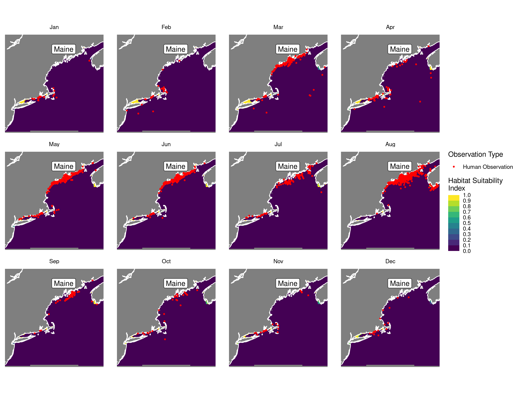
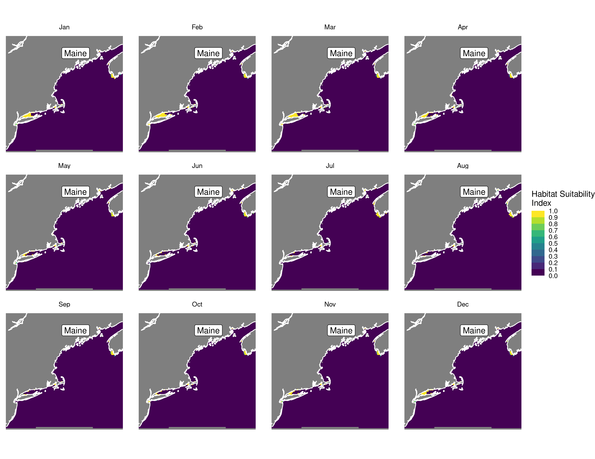
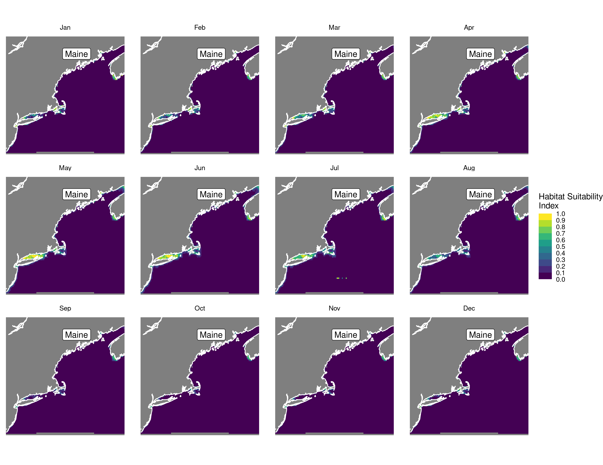
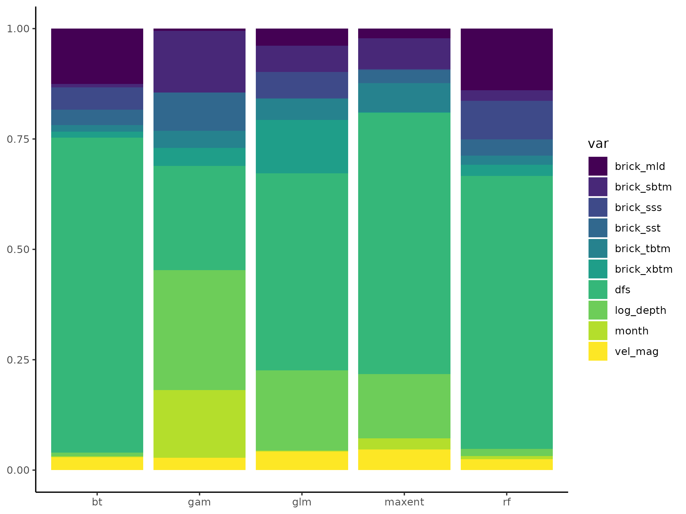

Habitat Suitability Report
================

## Inputs

- Species: Harbor seal (Phoca vitulina)
- Thinning: Thinned observations
- Ratio: 1:2 observation:pseudo-absence ratio
- Spatial extent: Full extent
- Covariates used: all covariates (u and v become vel_mag)
- Metrics: evaluated using all metrics

## Nowcast and Forecast Maps

Random Forest Nowcast and Forecast

| Nowcast | Forecast: RCP 8.5 2075 |
|:--:|:--:|
|  |  |

Boosted Trees Nowcast and Forecast

| Nowcast | Forecast: RCP 8.5 2075 |
|:--:|:--:|
|  |  |

Maxnet Trees Nowcast and Forecast

| Nowcast | Forecast: RCP 8.5 2075 |
|:--:|:--:|
|  |  |

GAM Nowcast and Forecast

| Nowcast | Forecast: RCP 8.5 2075 |
|:--:|:--:|
|  |  |

GLM Nowcast and Forecast

| Nowcast | Forecast: RCP 8.5 2075 |
|:--:|:--:|
|  |  |

## Metrics

| model_type |  accuracy |   roc_auc | boyce_cont | brier_class |   tss_max |
|:-----------|----------:|----------:|-----------:|------------:|----------:|
| rf         | 0.8842975 | 0.9545732 |  0.9404621 |   0.0886146 | 0.7780488 |
| bt         | 0.8842975 | 0.9518293 |  0.8467828 |   0.2077532 | 0.8030488 |
| maxnet     | 0.8842975 | 0.9350610 |  0.8919589 |   0.1031285 | 0.7292683 |
| gam        | 0.8677686 | 0.9237805 |  0.9057029 |   0.0951664 | 0.7786585 |
| glm        | 0.8429752 | 0.9140244 |  0.8639486 |   0.1107249 | 0.6923780 |

Metrics by model type

## Variable Importance

## Partial Dependence

